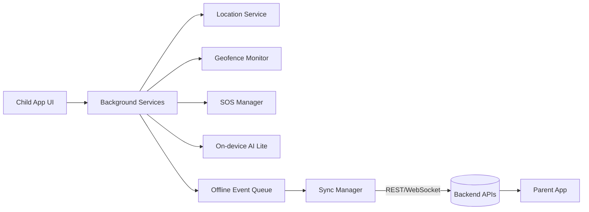
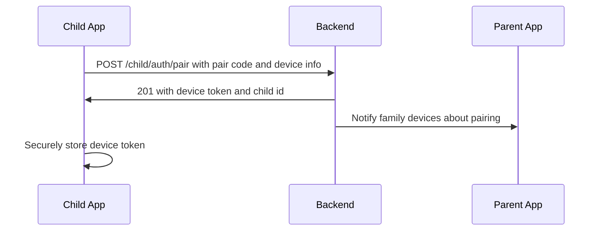
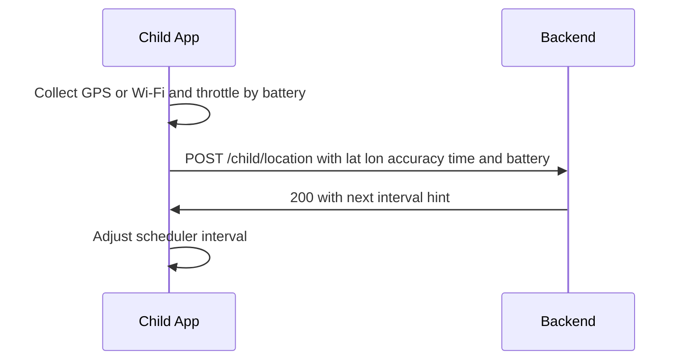
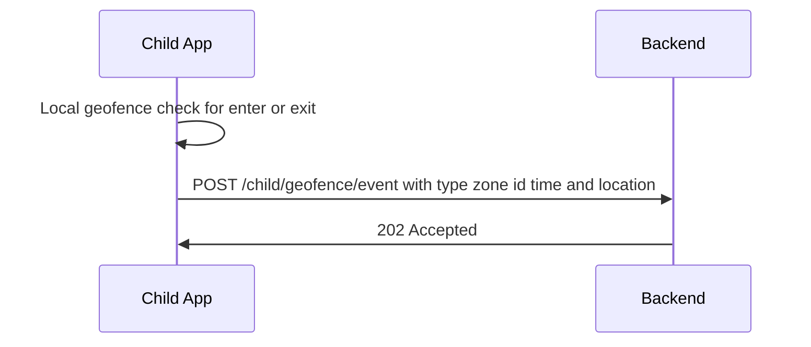
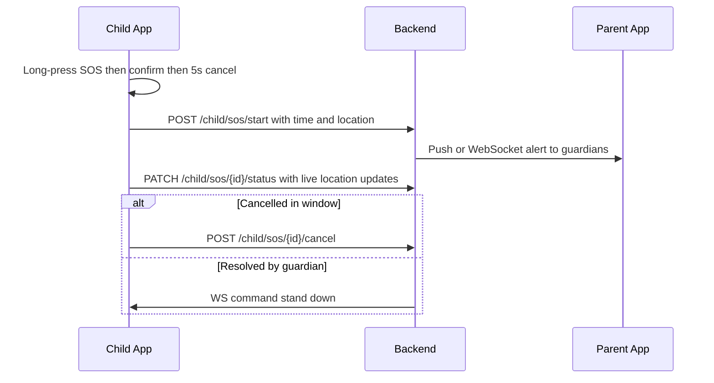
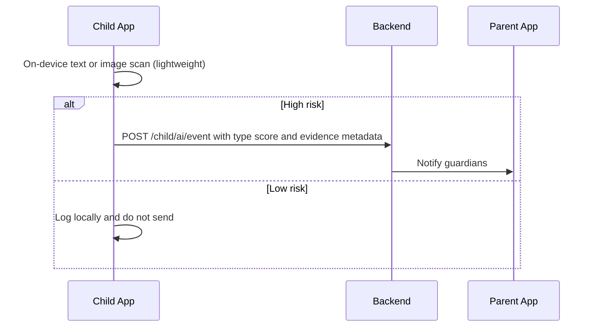

## Child App — Features, Design, Diagrams, Frontend ↔ Backend Mapping

This document defines the Child App scope for your graduation project. It mirrors the depth of the parent app feature docs and provides concrete UI, data, and API guidance so the team knows exactly what to build.

---

### Objectives
- Keep the child safe through continuous location, geofencing, and emergency signaling.
- Enable privacy‑aware AI monitoring for risky content/interactions on the child device.
- Provide a minimal, child‑friendly interface focused on safety, not surveillance.
- Maintain resilient connectivity with low power and low data usage.

---

## Feature Set

- **Account & Device Pairing**: Simple device binding to a family via pairing code/QR.
- **Background Location Tracking**: Periodic GPS/Wi‑Fi updates with battery‑aware intervals.
- **Geofencing & Safe Zones**: Local geofence checks; emit enter/exit events.
- **Emergency SOS**: Hold/long‑press SOS with cancel window; sends high‑priority alert.
- **AI‑Powered Monitoring (On‑device preferred)**:
  - Toxic text, bullying, self‑harm keywords (lightweight NLP or keyword rules with on‑device model if available)
  - Inappropriate image detection (very lightweight classifier or server‑side fallback)
  - App usage anomalies (optional, OS‑permissions dependent)
- **Trusted Face/Guardian Unlock (Optional)**: Quick verification for SOS cancel or restricted actions.
- **Parent Messaging (Minimal)**: Receive critical instructions from parent app; acknowledge.
- **Schedules/Quiet Hours**: Respect Do‑Not‑Disturb windows set by parents.
- **Notifications**: Non‑intrusive to child, high signal for safety events.
- **Offline Resilience**: Queue pings/events; sync when back online.

---

## Non‑Functional Requirements
- **Privacy**: Process as much as possible locally; send only risk signals/metadata.
- **Security**: TLS everywhere, signed requests, device tokens, certificate pinning (if feasible).
- **Reliability**: Retry with backoff, local queue, watchdog for background services.
- **Performance**: Lightweight ML, throttled sensors, efficient batching.
- **Accessibility**: Large tap targets, simple text; minimal reading required.

---

## IA/Navigation (Child‑Friendly)
- Splash → Pairing → Main (Home)
- From Home: SOS, Status (Location Permission, Battery, Connectivity), Messages, Settings (guarded)

---

## Frontend Screens/Components Mapping
Linking to existing components in `src/components`:

- `SplashScreen.tsx`: App boot, permissions prompts, bootstrap checks
- `PairingScreen.tsx`: Enter pairing code / scan QR; device registration
- `MainScreen.tsx`: Home dashboard (status tiles, quick SOS)
- `SOSScreen.tsx`: SOS hold/slide to confirm, 5s cancel window, live status
- `SmartwatchScreen.tsx`: Wearable view (reduced UI)
- `ScheduleScreen.tsx`: Displays quiet hours; child view only
- `TrustedFaceScanScreen.tsx`: Optional face verification during SOS cancel or settings access
- `ConnectedParentsScreen.tsx`: Shows linked guardians
- `SettingsScreen.tsx`: Child‑safe settings; pairing info, permissions, diagnostics
- `ProfileScreen.tsx`: Child profile avatar/name
- `ChatModal.tsx`: Receive critical messages; acknowledge
- `AIAlertModal.tsx`: Shows local AI risk detections surfaced to child (if appropriate)
- `FloatingNotification.tsx`: In‑app non‑intrusive toasts
- UI kit under `components/ui/*`: Buttons, dialogs, forms, etc.

---

## High‑Level Architecture

---

## Core Flows (Sequence Diagrams)

### Device Pairing

### Periodic Location Ping

### Geofence Event

### SOS

### AI Risk Detection

---

## Data Models (Conceptual)

- **ChildDevice**: `{ deviceId, childId, platform, osVersion, appVersion, fcmToken, lastSeenAt }`
- **LocationPing**: `{ pingId, childId, lat, lon, accuracy, speed, heading, batteryPct, ts, source }`
- **GeofenceZone (server‑authored)**: `{ zoneId, childId|familyId, name, center: {lat, lon}, radiusM, schedule }`
- **GeofenceEvent**: `{ eventId, childId, zoneId, type: enter|exit, ts, location }`
- **SOSEvent**: `{ sosId, childId, startedAt, status: active|cancelled|resolved, lastLocation }`
- **AIRiskEvent**: `{ aiId, childId, category, score, evidenceMeta, occurredAt }`
- **ScheduleRule**: `{ ruleId, childId|familyId, quietHours: [{day, start, end}], appRestrictions? }`
- **Message**: `{ msgId, childId, type, title, body, action?, sentAt, readAt? }`

Note: On device, maintain a secure keystore entry for `deviceToken` and a local queue: `[ {type, payload, ts} ]`.

---

## Backend Contracts (Child‑facing)

Base: `/api/v1`

- **POST `/child/auth/pair`** — Pair device
  - Body: `{ pairCode, deviceInfo }`
  - Res: `{ deviceToken, childId }`
- **POST `/child/auth/refresh`** — Refresh device token
  - Body: `{ refreshToken }`
  - Res: `{ deviceToken }`
- **POST `/child/location`** — Send location ping
  - Body: `LocationPing`
  - Res: `{ nextIntervalHint?: number }`
- **POST `/child/geofence/event`** — Report enter/exit
  - Body: `GeofenceEvent`
  - Res: `202`
- **GET `/child/geofence/zones`** — Pull zones + schedules
  - Res: `{ zones: GeofenceZone[] }`
- **POST `/child/sos/start`** — Start SOS
  - Body: `{ location?, note? }`
  - Res: `{ sosId }`
- **POST `/child/sos/{sosId}/cancel`** — Cancel
- **PATCH `/child/sos/{sosId}/status`** — Update live status/location
- **POST `/child/ai/event`** — Report AI risk (metadata only; media only if explicitly allowed)
- **GET `/child/schedule`** — Pull quiet hours
- **POST `/child/message/ack`** — Acknowledge inbound message

WebSocket (or SSE): `wss /child/realtime`
- Topics: `commands` (stand_down, request_location), `message` (guardian instructions)

Auth: Bearer `deviceToken`; pin to `deviceId` via claims. Consider rotating tokens and short TTLs.

---

## Frontend Implementation Guide (React + Vite)

- **App bootstrap** (`SplashScreen.tsx`):
  - Check secure storage for `deviceToken` → route to `MainScreen` or `PairingScreen`.
  - Request permissions (location, notifications, camera if face scan enabled).
- **Pairing** (`PairingScreen.tsx`):
  - Form for pair code; show QR option.
  - On success, save `deviceToken` securely; register push token.
- **Location Service** (hook or service file):
  - Background task: collect location; obey `nextIntervalHint` and battery.
  - Use `navigator.geolocation` fallback for web POC; native APIs for mobile.
- **Geofence monitor**:
  - Pull zones; compute distance locally; raise enter/exit and POST.
- **SOS** (`SOSScreen.tsx` + global button):
  - Long‑press gesture; countdown cancel; background updates until resolved.
- **AI monitoring**:
  - Lightweight keyword match; optional tiny model; debounce; send high‑risk only.
- **Schedules** (`ScheduleScreen.tsx`):
  - Read‑only display; service suppresses non‑critical notifications during quiet hours.
- **Messaging** (`ChatModal.tsx`, `FloatingNotification.tsx`):
  - Subscribe to WS; show actionable banner; persist acknowledgements.

State: central store (Redux/Zustand/Context) for `device`, `sos`, `zones`, `schedule`, `messages`.

---

## Error Handling & Resilience
- Queue requests offline; flush with exponential backoff.
- Classify errors: auth (re‑pair), network (retry), validation (drop+log).
- Watchdog to restart background workers if suspended (platform‑specific).

---

## Security & Privacy Notes
- Minimize PII; do not transmit raw message content unless required.
- Encrypt at rest where possible; secure storage for tokens.
- Provide in‑app privacy explainer suitable for children.

---

## Test Plan (High‑level)
- Pairing happy/edge cases (invalid/expired code, re‑pair flow)
- Location accuracy tiers; battery impact; offline queue flush
- Geofence enter/exit correctness near boundaries
- SOS start/cancel; guardian stand‑down command
- AI event thresholds; false positive/negative sampling
- WS reconnect and message ordering

---

## Deliverables Checklist
- Screens wired and navigable
- Background services (location, geofence, SOS)
- API client with retries + queue
- WS client for commands/messages
- AI lite detectors (configurable thresholds)
- Settings honoring schedules/privacy

---

## Future Enhancements
- Bluetooth beacon support for indoor positioning
- On‑device federated learning for AI models
- Wearable deep integration (battery, sensors)
- End‑to‑end encrypted child‑to‑parent chat
