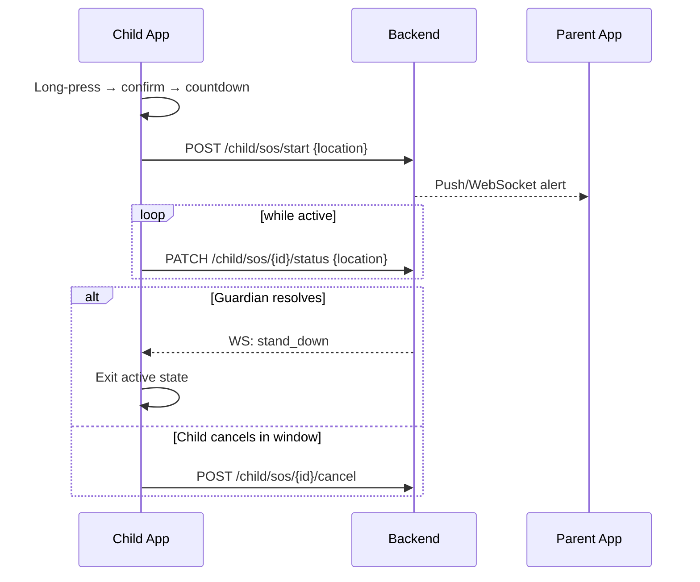

## Feature 04 — SOS Emergency

### Overview
One-gesture SOS that alerts guardians and streams live status until resolved.

### User Stories
- As a child, I can long-press SOS to request help with a short cancel window.
- As a guardian, I receive real-time alerts and can stand down the SOS.

### UI/UX
- Screens: `MainScreen` quick SOS; `SOSScreen.tsx` full flow
- Patterns: Long-press → confirm → 5s cancel → active state with live location

### Frontend Mapping
- Components: `SOSScreen`, `FloatingNotification`, `AIAlertModal` (if AI-triggered SOS)
- State: `sos: { sosId?, status: 'idle'|'active'|'cancelled'|'resolved', startedAt, lastLocation }`

### API Contracts
- POST `/api/v1/child/sos/start` → `{ sosId }`
- PATCH `/api/v1/child/sos/{id}/status` → live updates
- POST `/api/v1/child/sos/{id}/cancel`
- WS `wss /child/realtime` topic `commands` → `stand_down`

### Sequence Diagram

### Acceptance Criteria
- SOS start <1s network latency target
- Live updates at configured interval until resolved
