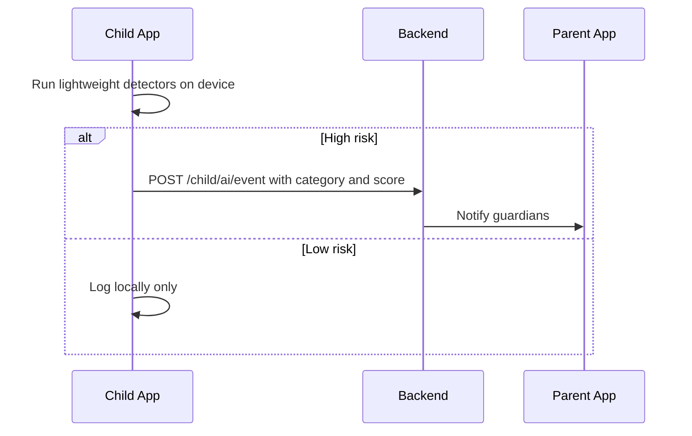

## Feature 05 — AI-Powered Monitoring (Lite)

### Overview
On-device first, privacy-preserving detection of risky content. Send only risk signals/metadata; optionally request redacted evidence.

### Categories
- Toxicity/Bullying keywords (text)
- Self-harm/suicidal ideation
- Inappropriate imagery (very lightweight model or server fallback)
- App usage anomalies (optional)

### UI/UX
- Child-visible alerts minimal: `AIAlertModal.tsx` only when action required
- Guardian receives detailed alert via parent app

### Frontend Mapping
- Service: `aiDetectionService` with pluggable detectors
- State: `ai: { lastEvents: AIRiskEvent[], thresholds }`

### Data Models
- `AIRiskEvent`: `{ category, score, evidenceMeta, occurredAt }`

### API Contracts
- POST `/api/v1/child/ai/event` -> report high-risk detections
- Optional: media upload endpoint guarded by consent flags

### Sequence Diagram

### Privacy & Performance
- Local processing by default; no raw content uploaded without consent
- Debounce events; jitter to avoid traffic fingerprinting

### Acceptance Criteria
- False positive rate below agreed threshold in test corpus
- No noticeable UI lag; CPU usage within budget
