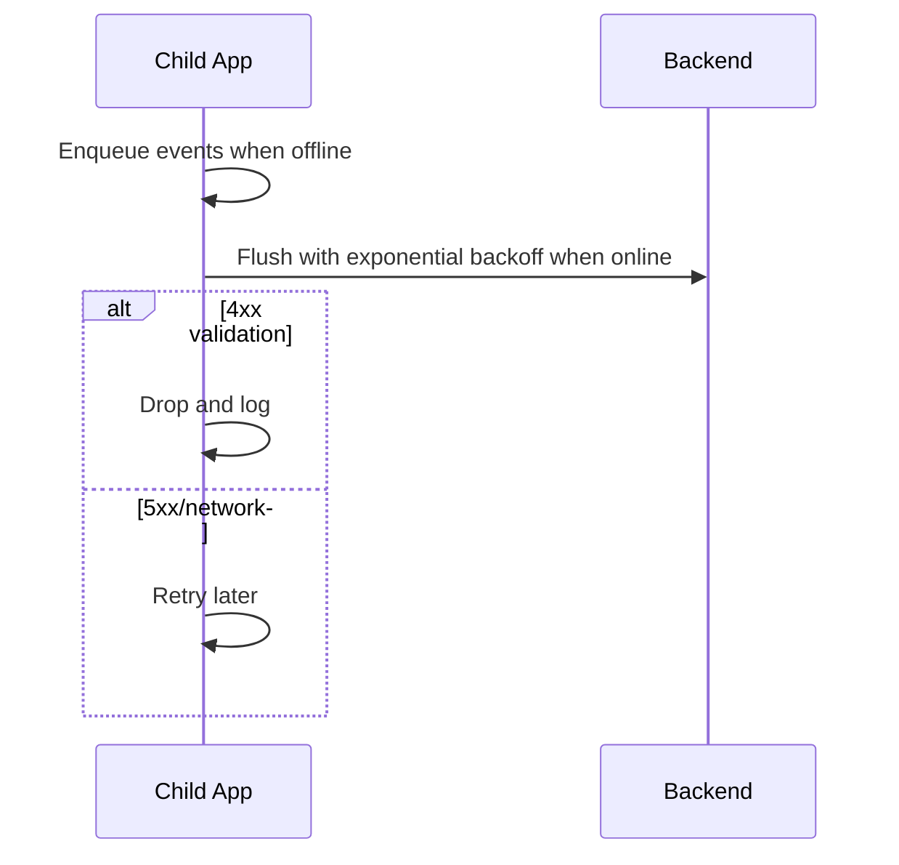

## Feature 09 — Offline Resilience & Sync

### Overview
Ensure the app continues functioning without connectivity; queue events and flush reliably.

### User Stories
- As a guardian, I still receive events after the child goes back online.
- As a child app, I never lose critical events.

### Frontend Mapping
- Service: `syncService` with local persistent queue
- State: `network: { isOnline, lastSyncAt }`, `queue: QueuedEvent[]`

### Data Models
- `QueuedEvent`: `{ id, type, payload, ts, attempts }`

### API Contracts
- Uses existing endpoints; adds retry and backoff policy

### Sequence Diagram

### Acceptance Criteria
- Zero event loss in airplane-mode test (up to local storage limit)
- Backoff policy prevents server overload
