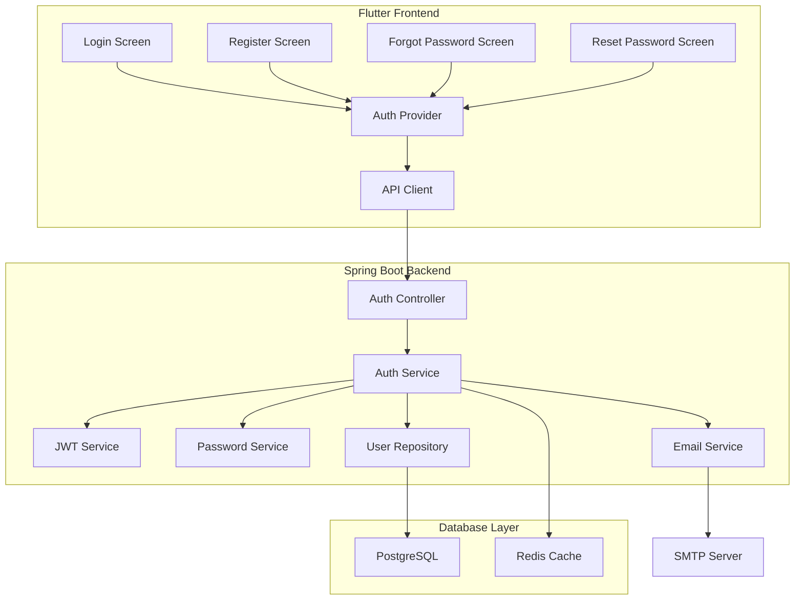
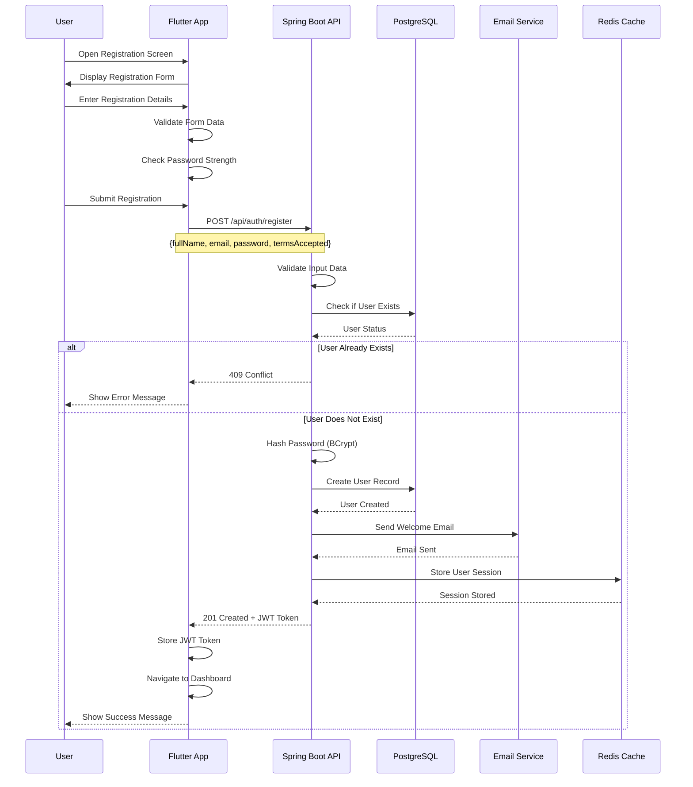
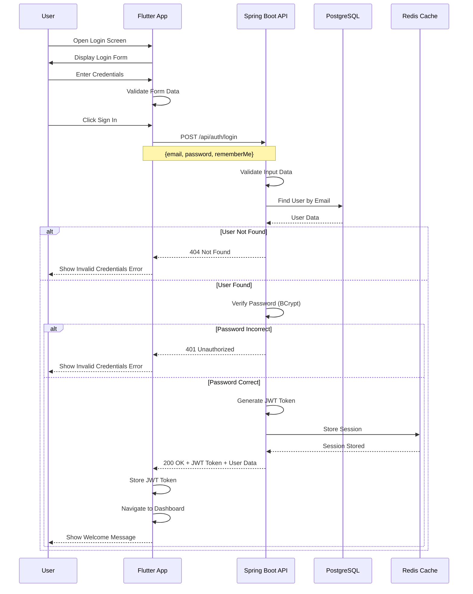
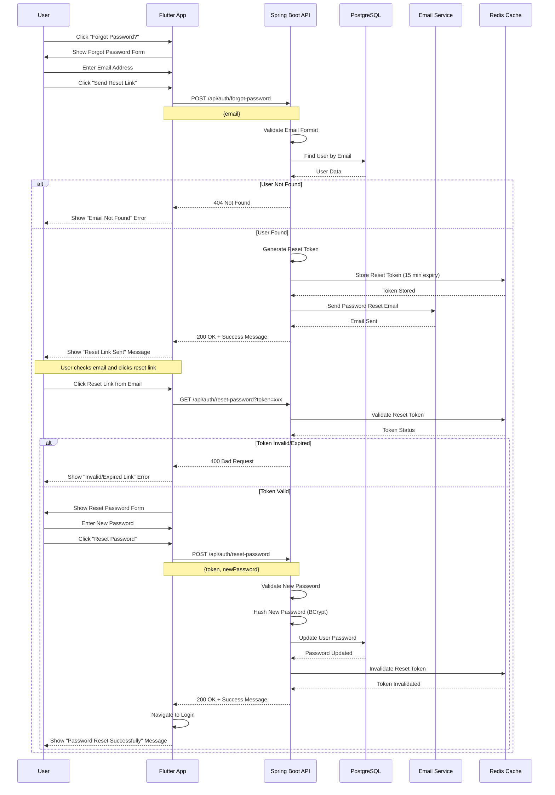
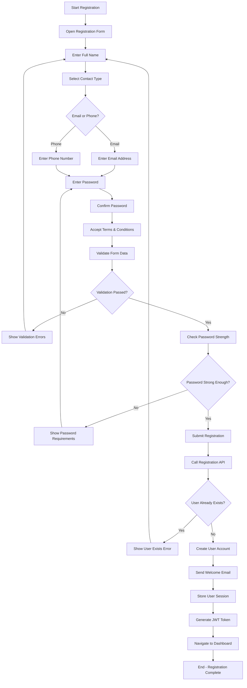
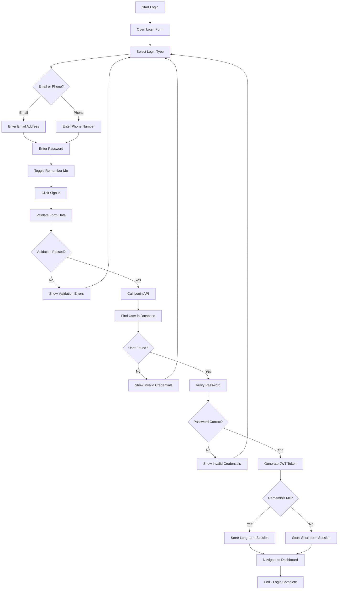
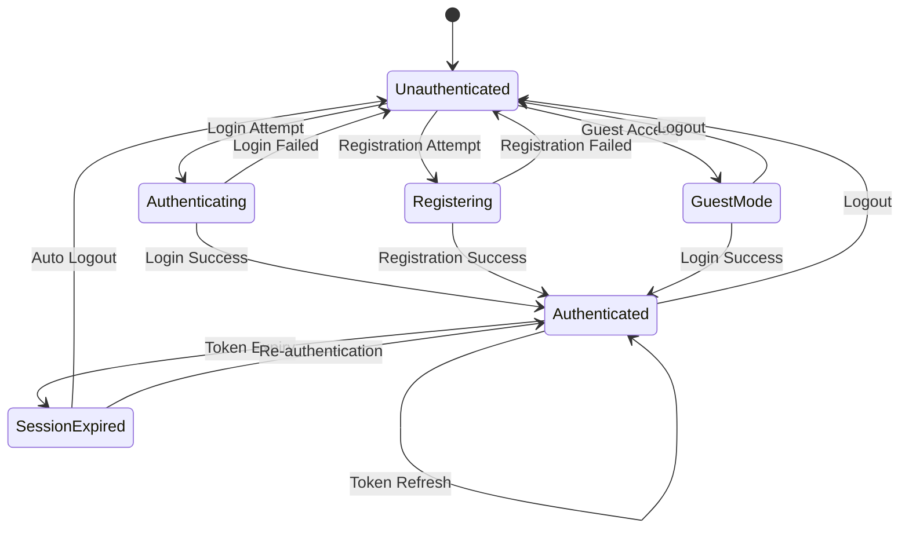
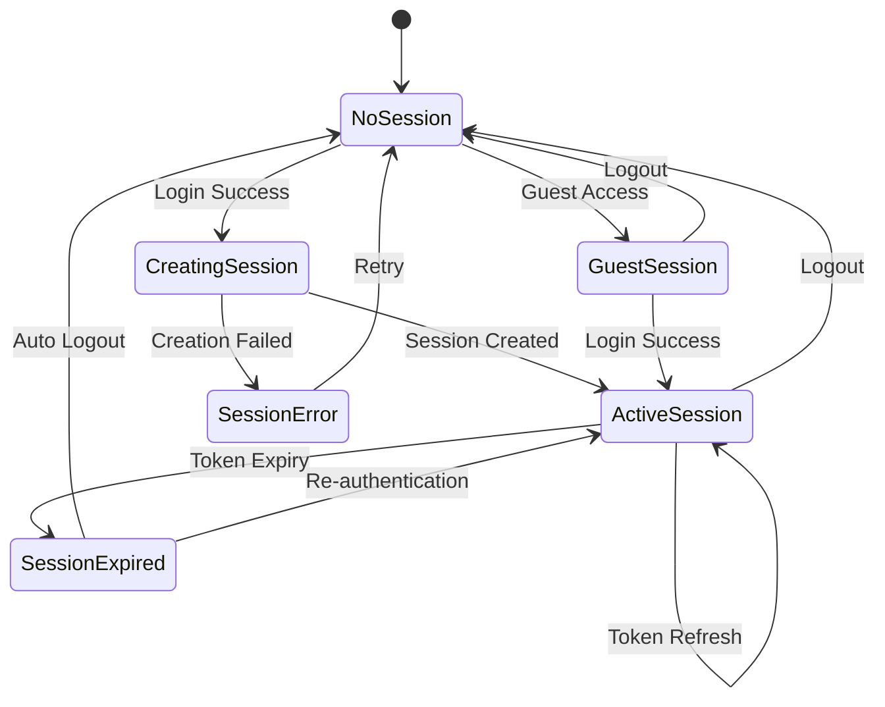

# Feature 01: User Registration & Authentication

## Overview
This feature handles user registration, login, password management, and session handling for the SafeGuard Parent App. It provides secure authentication mechanisms and user account management.

## Table of Contents
1. [Feature Requirements](#feature-requirements)
2. [System Architecture](#system-architecture)
3. [Sequence Diagrams](#sequence-diagrams)
4. [Activity Diagrams](#activity-diagrams)
5. [State Diagrams](#state-diagrams)
6. [API Specifications](#api-specifications)
7. [Database Design](#database-design)
8. [Frontend Implementation (Flutter)](#frontend-implementation-flutter)
9. [Backend Implementation (Spring Boot)](#backend-implementation-spring-boot)
10. [Security Considerations](#security-considerations)
11. [Testing Strategy](#testing-strategy)

---

## Feature Requirements

### Functional Requirements
- **FR-01**: Users can register with email or phone number
- **FR-02**: Users can login with email/phone and password
- **FR-03**: Users can reset forgotten passwords via email
- **FR-04**: Users can change their passwords when authenticated
- **FR-05**: Users can verify their email addresses
- **FR-06**: Users can logout and invalidate sessions

- **FR-08**: System validates password strength
- **FR-09**: System prevents duplicate account creation
- **FR-10**: System supports social login (Google, Apple)

### Non-Functional Requirements
- **NFR-01**: Authentication response time < 2 seconds
- **NFR-02**: Password hashing using BCrypt
- **NFR-03**: JWT tokens with 24-hour expiration
- **NFR-04**: Rate limiting: 5 login attempts per minute
- **NFR-05**: Password reset tokens expire in 15 minutes
- **NFR-06**: System supports 10,000+ concurrent users
- **NFR-07**: 99.9% uptime for authentication services

---

## System Architecture

### High-Level Architecture
```
┌─────────────────┐    ┌─────────────────┐    ┌─────────────────┐
│   Flutter App   │    │  Spring Boot    │    │   PostgreSQL    │
│   (Frontend)    │◄──►│   (Backend)     │◄──►│   (Database)    │
└─────────────────┘    └─────────────────┘    └─────────────────┘
         │                       │                       │
         │                       │                       │
         ▼                       ▼                       ▼
┌─────────────────┐    ┌─────────────────┐    ┌─────────────────┐
│  SharedPrefs    │    │   Redis Cache   │    │   SMTP Server   │
│  (Local Storage)│    │   (Sessions)    │    │   (Email)       │
└─────────────────┘    └─────────────────┘    └─────────────────┘
```

### Component Diagram


---

## Sequence Diagrams

### User Registration Flow


### User Login Flow


### Forgot Password Flow


---

## Activity Diagrams

### Registration Process


### Login Process


---

## State Diagrams

### Authentication State Management


### User Session States


---

## API Specifications

### Endpoints Table
| Method | Endpoint | Description | Request Body | Response | Status Codes | Auth Required |
|--------|----------|-------------|--------------|----------|--------------|---------------|
| POST | `/api/auth/register` | Register new user | `RegisterRequest` | `AuthResponse` | 201, 400, 409 | No |
| POST | `/api/auth/login` | User login | `LoginRequest` | `AuthResponse` | 200, 401, 400 | No |
| POST | `/api/auth/forgot-password` | Send reset email | `ForgotPasswordRequest` | `MessageResponse` | 200, 404, 400 | No |
| POST | `/api/auth/reset-password` | Reset password | `ResetPasswordRequest` | `MessageResponse` | 200, 400, 401 | No |
| POST | `/api/auth/refresh` | Refresh JWT token | `RefreshTokenRequest` | `TokenResponse` | 200, 401 | No |
| POST | `/api/auth/logout` | User logout | `LogoutRequest` | `MessageResponse` | 200, 401 | Yes |
| GET | `/api/auth/verify-email` | Verify email | Query: `token` | `MessageResponse` | 200, 400 | No |
| POST | `/api/auth/resend-verification` | Resend verification | `ResendVerificationRequest` | `MessageResponse` | 200, 400 | No |
| GET | `/api/auth/profile` | Get user profile | None | `UserProfileResponse` | 200, 401 | Yes |
| PUT | `/api/auth/profile` | Update profile | `UpdateProfileRequest` | `UserProfileResponse` | 200, 400, 401 | Yes |
| POST | `/api/auth/change-password` | Change password | `ChangePasswordRequest` | `MessageResponse` | 200, 400, 401 | Yes |

### Request/Response Models

#### RegisterRequest
```json
{
  "fullName": "string",
  "email": "string",
  "phone": "string",
  "password": "string",
  "contactType": "EMAIL | PHONE",
  "termsAccepted": boolean
}
```

#### LoginRequest
```json
{
  "email": "string",
  "phone": "string",
  "password": "string",
  "loginType": "EMAIL | PHONE",
  "rememberMe": boolean
}
```

#### AuthResponse
```json
{
  "success": boolean,
  "message": "string",
  "data": {
    "user": {
      "id": "string",
      "fullName": "string",
      "email": "string",
      "phone": "string",
      "isActive": boolean,
      "emailVerified": boolean,
      "phoneVerified": boolean,
      "createdAt": "datetime",
      "lastLoginAt": "datetime"
    },
    "token": "string",
    "refreshToken": "string",
    "expiresIn": number,
    "tokenType": "Bearer"
  }
}
```

---

## Database Design

### User Table
```sql
CREATE TABLE users (
    id BIGSERIAL PRIMARY KEY,
    full_name VARCHAR(100) NOT NULL,
    email VARCHAR(100) UNIQUE NOT NULL,
    phone VARCHAR(20) UNIQUE,
    password_hash VARCHAR(255) NOT NULL,
    contact_type VARCHAR(10) NOT NULL CHECK (contact_type IN ('EMAIL', 'PHONE')),
    is_active BOOLEAN NOT NULL DEFAULT true,
    email_verified BOOLEAN NOT NULL DEFAULT false,
    phone_verified BOOLEAN NOT NULL DEFAULT false,
    created_at TIMESTAMP NOT NULL DEFAULT CURRENT_TIMESTAMP,
    updated_at TIMESTAMP NOT NULL DEFAULT CURRENT_TIMESTAMP,
    last_login_at TIMESTAMP
);

CREATE INDEX idx_users_email ON users(email);
CREATE INDEX idx_users_phone ON users(phone);
CREATE INDEX idx_users_active ON users(is_active);
```

### User Sessions Table
```sql
CREATE TABLE user_sessions (
    id BIGSERIAL PRIMARY KEY,
    user_id BIGINT NOT NULL REFERENCES users(id) ON DELETE CASCADE,
    session_token VARCHAR(255) UNIQUE NOT NULL,
    refresh_token VARCHAR(255) UNIQUE NOT NULL,
    device_info TEXT,
    ip_address INET,
    is_active BOOLEAN NOT NULL DEFAULT true,
    expires_at TIMESTAMP NOT NULL,
    created_at TIMESTAMP NOT NULL DEFAULT CURRENT_TIMESTAMP,
    last_accessed_at TIMESTAMP NOT NULL DEFAULT CURRENT_TIMESTAMP
);

CREATE INDEX idx_user_sessions_user_id ON user_sessions(user_id);
CREATE INDEX idx_user_sessions_token ON user_sessions(session_token);
CREATE INDEX idx_user_sessions_active ON user_sessions(is_active);
```

### Password Reset Tokens Table
```sql
CREATE TABLE password_reset_tokens (
    id BIGSERIAL PRIMARY KEY,
    user_id BIGINT NOT NULL REFERENCES users(id) ON DELETE CASCADE,
    token VARCHAR(255) UNIQUE NOT NULL,
    expires_at TIMESTAMP NOT NULL,
    used BOOLEAN NOT NULL DEFAULT false,
    created_at TIMESTAMP NOT NULL DEFAULT CURRENT_TIMESTAMP
);

CREATE INDEX idx_password_reset_tokens_token ON password_reset_tokens(token);
CREATE INDEX idx_password_reset_tokens_user_id ON password_reset_tokens(user_id);
CREATE INDEX idx_password_reset_tokens_expires ON password_reset_tokens(expires_at);
```

---

## Frontend Implementation (Flutter)

### Project Structure
```
lib/features/authentication/
├── data/
│   ├── datasources/
│   │   ├── auth_local_datasource.dart
│   │   └── auth_remote_datasource.dart
│   ├── models/
│   │   ├── user_model.dart
│   │   ├── auth_response_model.dart
│   │   └── login_request_model.dart
│   └── repositories/
│       └── auth_repository_impl.dart
├── domain/
│   ├── entities/
│   │   ├── user.dart
│   │   └── auth_response.dart
│   ├── repositories/
│   │   └── auth_repository.dart
│   └── usecases/
│       ├── login_usecase.dart
│       ├── register_usecase.dart
│       ├── forgot_password_usecase.dart
│       └── reset_password_usecase.dart
└── presentation/
    ├── pages/
    │   ├── login_page.dart
    │   ├── register_page.dart
    │   ├── forgot_password_page.dart
    │   └── reset_password_page.dart
    ├── widgets/
    │   ├── custom_text_field.dart
    │   ├── password_field.dart
    │   └── loading_button.dart
    └── providers/
        └── auth_provider.dart
```

### Key Dependencies
```yaml
dependencies:
  # State Management
  provider: ^6.0.5
  flutter_riverpod: ^2.4.0
  
  # HTTP Client
  dio: ^5.3.2
  retrofit: ^4.0.3
  
  # Local Storage
  shared_preferences: ^2.2.2
  secure_storage: ^9.0.0
  
  # Form Validation
  form_builder_validators: ^9.1.0
  flutter_form_builder: ^9.1.1
  
  # UI Components
  flutter_screenutil: ^5.9.0
  google_fonts: ^6.1.0
```

### Core Implementation Files

#### Auth Provider (Riverpod)
```dart
class AuthNotifier extends StateNotifier<AuthState> {
  final LoginUsecase _loginUsecase;
  final RegisterUsecase _registerUsecase;
  final ForgotPasswordUsecase _forgotPasswordUsecase;
  final ResetPasswordUsecase _resetPasswordUsecase;

  AuthNotifier(
    this._loginUsecase,
    this._registerUsecase,
    this._forgotPasswordUsecase,
    this._resetPasswordUsecase,
  ) : super(AuthInitial());

  Future<void> login(String email, String password, bool rememberMe) async {
    state = AuthLoading();
    
    final result = await _loginUsecase(LoginParams(
      email: email,
      password: password,
      rememberMe: rememberMe,
    ));

    result.fold(
      (failure) => state = AuthError(failure.message),
      (authResponse) {
        state = AuthAuthenticated(authResponse.user);
        _saveToken(authResponse.token);
      },
    );
  }

  Future<void> register(RegisterParams params) async {
    state = AuthLoading();
    
    final result = await _registerUsecase(params);

    result.fold(
      (failure) => state = AuthError(failure.message),
      (authResponse) {
        state = AuthAuthenticated(authResponse.user);
        _saveToken(authResponse.token);
      },
    );
  }

  Future<void> forgotPassword(String email) async {
    state = AuthLoading();
    
    final result = await _forgotPasswordUsecase(ForgotPasswordParams(email: email));

    result.fold(
      (failure) => state = AuthError(failure.message),
      (message) => state = AuthMessage(message),
    );
  }

  Future<void> resetPassword(String token, String newPassword) async {
    state = AuthLoading();
    
    final result = await _resetPasswordUsecase(ResetPasswordParams(
      token: token,
      newPassword: newPassword,
    ));

    result.fold(
      (failure) => state = AuthError(failure.message),
      (message) => state = AuthMessage(message),
    );
  }

  Future<void> logout() async {
    state = AuthLoading();
    
    final result = await _logoutUsecase();
    
    result.fold(
      (failure) => state = AuthError(failure.message),
      (_) {
        state = AuthUnauthenticated();
        _clearToken();
      },
    );
  }

  Future<void> _saveToken(String token) async {
    final prefs = await SharedPreferences.getInstance();
    await prefs.setString('auth_token', token);
  }

  Future<void> _clearToken() async {
    final prefs = await SharedPreferences.getInstance();
    await prefs.remove('auth_token');
  }
}
```

#### Login Page Implementation
```dart
class LoginPage extends ConsumerStatefulWidget {
  const LoginPage({Key? key}) : super(key: key);

  @override
  ConsumerState<LoginPage> createState() => _LoginPageState();
}

class _LoginPageState extends ConsumerState<LoginPage> {
  final _formKey = GlobalKey<FormBuilderState>();
  bool _rememberMe = false;
  bool _isPasswordVisible = false;
  String _loginType = 'email';

  @override
  Widget build(BuildContext context) {
    final authState = ref.watch(authProvider);

    ref.listen<AuthState>(authProvider, (previous, next) {
      if (next is AuthError) {
        ScaffoldMessenger.of(context).showSnackBar(
          SnackBar(content: Text(next.message)),
        );
      } else if (next is AuthAuthenticated) {
        Navigator.pushReplacementNamed(context, '/dashboard');
      }
    });

    return Scaffold(
      body: SafeArea(
        child: Padding(
          padding: const EdgeInsets.all(24.0),
          child: FormBuilder(
            key: _formKey,
            child: Column(
              crossAxisAlignment: CrossAxisAlignment.stretch,
              children: [
                const SizedBox(height: 40),
                const Text(
                  'Welcome Back',
                  style: TextStyle(fontSize: 32, fontWeight: FontWeight.bold),
                  textAlign: TextAlign.center,
                ),
                const SizedBox(height: 8),
                const Text(
                  'Sign in to your SafeGuard account',
                  style: TextStyle(fontSize: 16, color: Colors.grey),
                  textAlign: TextAlign.center,
                ),
                const SizedBox(height: 40),
                
                // Login Type Toggle
                _buildLoginTypeToggle(),
                const SizedBox(height: 24),
                
                // Email/Phone Field
                _buildEmailPhoneField(),
                const SizedBox(height: 16),
                
                // Password Field
                _buildPasswordField(),
                const SizedBox(height: 16),
                
                // Remember Me & Forgot Password
                _buildRememberMeAndForgotPassword(),
                const SizedBox(height: 24),
                
                // Login Button
                LoadingButton(
                  onPressed: _handleLogin,
                  isLoading: authState is AuthLoading,
                  text: 'Sign In',
                ),
                const SizedBox(height: 24),
                
                // Sign Up Link
                _buildSignUpLink(),
              ],
            ),
          ),
        ),
      ),
    );
  }

  void _handleLogin() {
    if (_formKey.currentState?.saveAndValidate() ?? false) {
      final formData = _formKey.currentState!.value;
      
      ref.read(authProvider.notifier).login(
        formData[_loginType] ?? '',
        formData['password'] ?? '',
        _rememberMe,
      );
    }
  }
}
```

---

## Backend Implementation (Spring Boot)

### Project Structure
```
src/main/java/com/safeguard/parentapp/
├── config/
│   ├── SecurityConfig.java
│   ├── JwtConfig.java
│   └── RedisConfig.java
├── controller/
│   └── AuthController.java
├── dto/
│   ├── request/
│   │   ├── LoginRequest.java
│   │   ├── RegisterRequest.java
│   │   ├── ForgotPasswordRequest.java
│   │   └── ResetPasswordRequest.java
│   └── response/
│       ├── AuthResponse.java
│       └── MessageResponse.java
├── entity/
│   ├── User.java
│   ├── UserSession.java
│   └── PasswordResetToken.java
├── repository/
│   ├── UserRepository.java
│   ├── UserSessionRepository.java
│   └── PasswordResetTokenRepository.java
├── service/
│   ├── AuthService.java
│   ├── JwtService.java
│   ├── PasswordService.java
│   └── EmailService.java
└── security/
    ├── JwtAuthenticationFilter.java
    └── JwtAuthorizationFilter.java
```

### Key Dependencies
```xml
<dependencies>
    <dependency>
        <groupId>org.springframework.boot</groupId>
        <artifactId>spring-boot-starter-web</artifactId>
    </dependency>
    <dependency>
        <groupId>org.springframework.boot</groupId>
        <artifactId>spring-boot-starter-security</artifactId>
    </dependency>
    <dependency>
        <groupId>org.springframework.boot</groupId>
        <artifactId>spring-boot-starter-data-jpa</artifactId>
    </dependency>
    <dependency>
        <groupId>org.springframework.boot</groupId>
        <artifactId>spring-boot-starter-data-redis</artifactId>
    </dependency>
    <dependency>
        <groupId>org.springframework.boot</groupId>
        <artifactId>spring-boot-starter-mail</artifactId>
    </dependency>
    <dependency>
        <groupId>org.postgresql</groupId>
        <artifactId>postgresql</artifactId>
    </dependency>
    <dependency>
        <groupId>io.jsonwebtoken</groupId>
        <artifactId>jjwt-api</artifactId>
        <version>0.12.3</version>
    </dependency>
</dependencies>
```

### Core Implementation Files

#### Auth Controller
```java
@RestController
@RequestMapping("/auth")
@RequiredArgsConstructor
@CrossOrigin(origins = "*")
public class AuthController {
    
    private final AuthService authService;
    
    @PostMapping("/register")
    public ResponseEntity<AuthResponse> register(@Valid @RequestBody RegisterRequest request) {
        AuthResponse response = authService.register(request);
        return ResponseEntity.status(HttpStatus.CREATED).body(response);
    }
    
    @PostMapping("/login")
    public ResponseEntity<AuthResponse> login(@Valid @RequestBody LoginRequest request) {
        AuthResponse response = authService.login(request);
        return ResponseEntity.ok(response);
    }
    
    @PostMapping("/forgot-password")
    public ResponseEntity<MessageResponse> forgotPassword(@Valid @RequestBody ForgotPasswordRequest request) {
        MessageResponse response = authService.forgotPassword(request.getEmail());
        return ResponseEntity.ok(response);
    }
    
    @PostMapping("/reset-password")
    public ResponseEntity<MessageResponse> resetPassword(@Valid @RequestBody ResetPasswordRequest request) {
        MessageResponse response = authService.resetPassword(request);
        return ResponseEntity.ok(response);
    }
    
    @PostMapping("/logout")
    public ResponseEntity<MessageResponse> logout(@RequestHeader("Authorization") String token) {
        MessageResponse response = authService.logout(token);
        return ResponseEntity.ok(response);
    }
}
```

#### Auth Service
```java
@Service
@RequiredArgsConstructor
@Transactional
public class AuthService {
    
    private final UserRepository userRepository;
    private final JwtService jwtService;
    private final PasswordService passwordService;
    private final EmailService emailService;
    private final SessionService sessionService;
    
    public AuthResponse register(RegisterRequest request) {
        // Check if user already exists
        if (userRepository.existsByEmail(request.getEmail())) {
            throw new RuntimeException("User with this email already exists");
        }
        
        // Create new user
        User user = User.builder()
                .fullName(request.getFullName())
                .email(request.getEmail())
                .phone(request.getPhone())
                .passwordHash(passwordService.hashPassword(request.getPassword()))
                .contactType(request.getContactType())
                .isActive(true)
                .emailVerified(false)
                .phoneVerified(false)
                .build();
        
        User savedUser = userRepository.save(user);
        
        // Send welcome email
        emailService.sendWelcomeEmail(savedUser);
        
        // Generate tokens
        String token = jwtService.generateToken(savedUser);
        String refreshToken = jwtService.generateRefreshToken(savedUser);
        
        // Create session
        sessionService.createSession(savedUser.getId(), request.getRememberMe());
        
        return AuthResponse.builder()
                .success(true)
                .message("Account created successfully")
                .user(savedUser)
                .token(token)
                .refreshToken(refreshToken)
                .expiresIn(86400)
                .tokenType("Bearer")
                .build();
    }
    
    public AuthResponse login(LoginRequest request) {
        User user = userRepository.findByEmail(request.getEmail())
                .orElseThrow(() -> new RuntimeException("Invalid credentials"));
        
        if (!passwordService.verifyPassword(request.getPassword(), user.getPasswordHash())) {
            throw new RuntimeException("Invalid credentials");
        }
        
        if (!user.getIsActive()) {
            throw new RuntimeException("Account is deactivated");
        }
        
        // Update last login
        user.setLastLoginAt(LocalDateTime.now());
        userRepository.save(user);
        
        // Generate tokens
        String token = jwtService.generateToken(user);
        String refreshToken = jwtService.generateRefreshToken(user);
        
        // Create session
        sessionService.createSession(user.getId(), request.getRememberMe());
        
        return AuthResponse.builder()
                .success(true)
                .message("Login successful")
                .user(user)
                .token(token)
                .refreshToken(refreshToken)
                .expiresIn(86400)
                .tokenType("Bearer")
                .build();
    }
}
```

#### JWT Service
```java
@Service
@Slf4j
public class JwtService {
    
    @Value("${jwt.secret}")
    private String secret;
    
    @Value("${jwt.expiration}")
    private Long expiration;
    
    private SecretKey getSigningKey() {
        return Keys.hmacShaKeyFor(secret.getBytes());
    }
    
    public String generateToken(User user) {
        Map<String, Object> claims = new HashMap<>();
        claims.put("userId", user.getId());
        claims.put("email", user.getEmail());
        claims.put("role", "USER");
        
        return createToken(claims, user.getEmail(), expiration);
    }
    
    public String generateRefreshToken(User user) {
        Map<String, Object> claims = new HashMap<>();
        claims.put("userId", user.getId());
        claims.put("email", user.getEmail());
        claims.put("type", "refresh");
        
        return createToken(claims, user.getEmail(), 604800000); // 7 days
    }
    
    private String createToken(Map<String, Object> claims, String subject, Long expiration) {
        return Jwts.builder()
                .setClaims(claims)
                .setSubject(subject)
                .setIssuedAt(new Date(System.currentTimeMillis()))
                .setExpiration(new Date(System.currentTimeMillis() + expiration))
                .signWith(getSigningKey(), SignatureAlgorithm.HS256)
                .compact();
    }
    
    public Boolean validateToken(String token) {
        try {
            Jwts.parserBuilder()
                    .setSigningKey(getSigningKey())
                    .build()
                    .parseClaimsJws(token);
            return true;
        } catch (JwtException | IllegalArgumentException e) {
            log.error("JWT token validation failed: {}", e.getMessage());
            return false;
        }
    }
    
    public String getEmailFromToken(String token) {
        Claims claims = Jwts.parserBuilder()
                .setSigningKey(getSigningKey())
                .build()
                .parseClaimsJws(token)
                .getBody();
        
        return claims.getSubject();
    }
}
```

---

## Security Considerations

### Password Security
- **BCrypt Hashing**: Passwords are hashed using BCrypt with salt
- **Password Strength**: Minimum 8 characters, mixed case, numbers, special characters
- **Password History**: Prevent reuse of last 5 passwords
- **Account Lockout**: Lock account after 5 failed login attempts

### JWT Security
- **Secret Key**: Strong secret key (256-bit minimum)
- **Token Expiration**: 24 hours for access tokens, 7 days for refresh tokens
- **Token Rotation**: Refresh tokens are rotated on each use
- **Secure Storage**: Tokens stored securely on client side

### API Security
- **Rate Limiting**: 5 requests per minute per IP for auth endpoints
- **CORS Configuration**: Restricted to allowed origins
- **Input Validation**: All inputs validated and sanitized
- **SQL Injection Prevention**: Parameterized queries only

### Session Management
- **Session Invalidation**: Sessions invalidated on logout
- **Concurrent Sessions**: Limit to 5 active sessions per user
- **Session Timeout**: Inactive sessions expire after 30 minutes
- **Device Tracking**: Track and manage sessions by device

---

## Testing Strategy

### Unit Tests
- **Service Layer**: Test all business logic
- **Repository Layer**: Test data access methods
- **Utility Classes**: Test password hashing, JWT operations
- **Validation**: Test input validation logic

### Integration Tests
- **API Endpoints**: Test complete request/response cycles
- **Database Operations**: Test CRUD operations
- **Email Service**: Test email sending functionality
- **Cache Operations**: Test Redis integration

### Security Tests
- **Authentication**: Test login/logout flows
- **Authorization**: Test protected endpoints
- **Password Security**: Test password hashing and validation
- **JWT Security**: Test token generation and validation

### Performance Tests
- **Load Testing**: Test with 1000+ concurrent users
- **Response Time**: Ensure < 2 second response times
- **Database Performance**: Test query performance
- **Memory Usage**: Monitor memory consumption

---

## Implementation Checklist

### Frontend (Flutter)
- [ ] Set up project structure with clean architecture
- [ ] Implement authentication screens (Login, Register, Forgot Password)
- [ ] Create form validation and error handling
- [ ] Implement state management with Riverpod
- [ ] Set up API client with Dio and Retrofit
- [ ] Implement local storage for tokens
- [ ] Add loading states and user feedback
- [ ] Implement navigation between screens
- [ ] Add password strength indicator
- [ ] Implement social login (Google, Apple)

### Backend (Spring Boot)
- [ ] Set up Spring Boot project with required dependencies
- [ ] Configure database connection and JPA entities
- [ ] Implement JWT service for token management
- [ ] Create authentication service with business logic
- [ ] Implement password service with BCrypt
- [ ] Set up email service for notifications
- [ ] Configure Spring Security
- [ ] Implement rate limiting
- [ ] Add input validation and error handling
- [ ] Set up Redis for session management

### Database
- [ ] Create user table with proper indexes
- [ ] Create user sessions table
- [ ] Create password reset tokens table
- [ ] Set up database migrations
- [ ] Configure connection pooling
- [ ] Set up database monitoring

### Security
- [ ] Implement password hashing with BCrypt
- [ ] Set up JWT token management
- [ ] Configure CORS properly
- [ ] Implement rate limiting
- [ ] Add input validation
- [ ] Set up secure headers
- [ ] Implement session management
- [ ] Add audit logging

### Testing
- [ ] Write unit tests for all services
- [ ] Create integration tests for API endpoints
- [ ] Implement security tests
- [ ] Add performance tests
- [ ] Set up test data and fixtures
- [ ] Configure test environment

This comprehensive feature documentation provides everything needed to implement the User Registration & Authentication feature for the SafeGuard Parent App.
