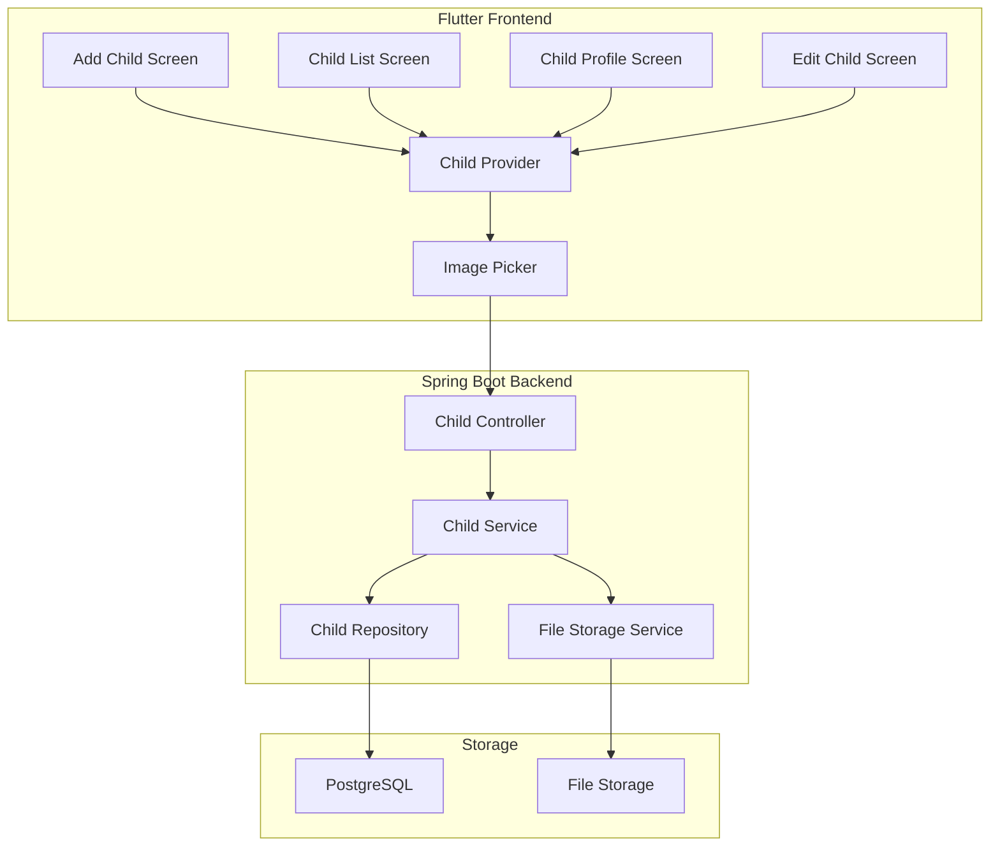
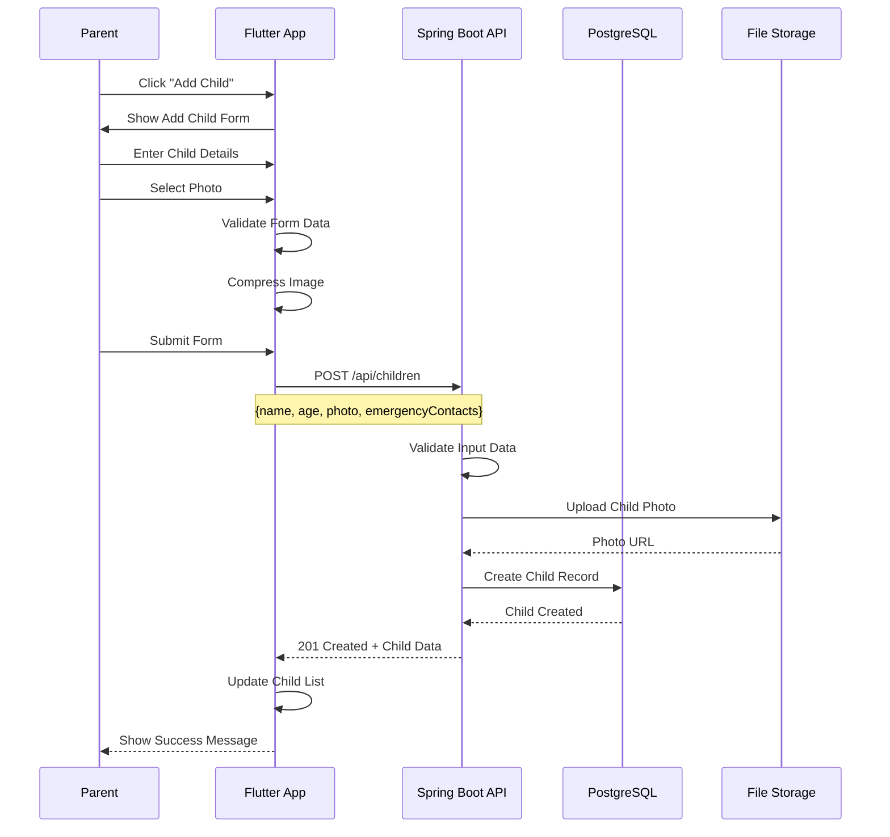
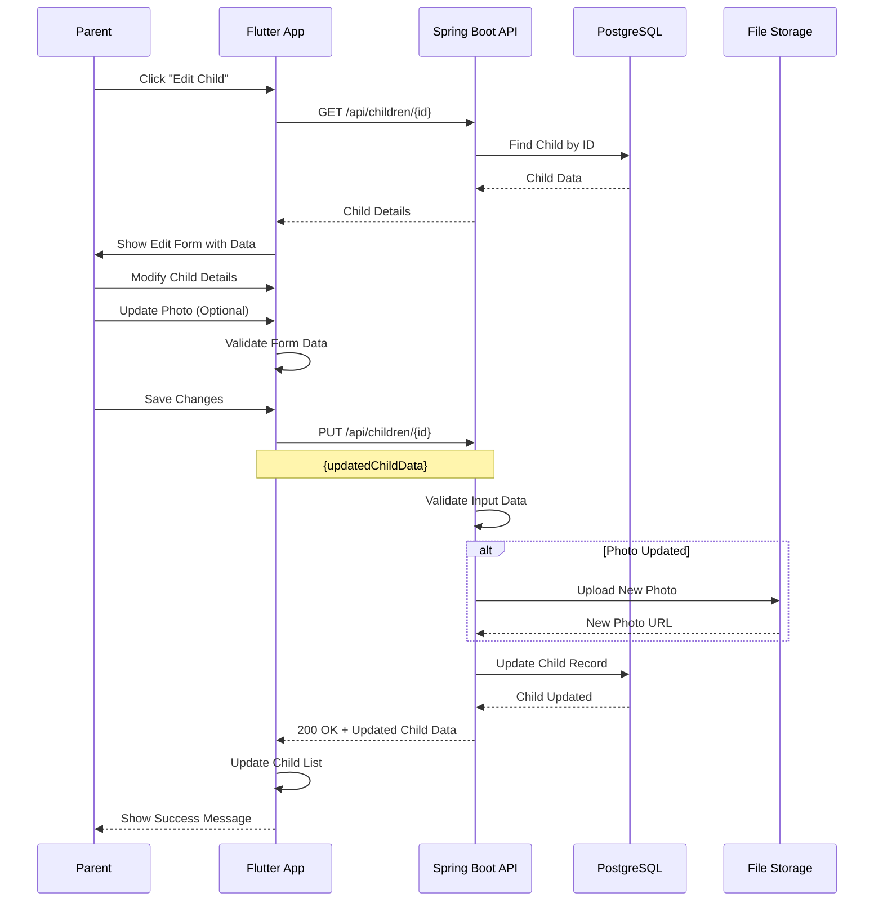

# Feature 02: Child Management

## Overview
This feature handles adding, editing, and managing child profiles in the SafeGuard Parent App. Parents can create detailed profiles for their children with photos, emergency contacts, and safety settings.

## Table of Contents
1. [Feature Requirements](#feature-requirements)
2. [System Architecture](#system-architecture)
3. [Sequence Diagrams](#sequence-diagrams)
4. [API Specifications](#api-specifications)
5. [Database Design](#database-design)
6. [Frontend Implementation](#frontend-implementation)
7. [Backend Implementation](#backend-implementation)

---

## Feature Requirements

### Functional Requirements
- **FR-01**: Parents can add new child profiles
- **FR-02**: Parents can edit existing child information
- **FR-03**: Parents can upload and manage child photos
- **FR-04**: Parents can set emergency contacts for each child
- **FR-05**: Parents can configure safety settings per child
- **FR-06**: Parents can view child profile details
- **FR-07**: Parents can delete child profiles
- **FR-08**: System validates child information
- **FR-09**: System supports multiple children per parent
- **FR-10**: System tracks child activity history

### Non-Functional Requirements
- **NFR-01**: Profile creation response time < 3 seconds
- **NFR-02**: Photo upload supports JPEG/PNG up to 5MB
- **NFR-03**: System supports up to 10 children per parent
- **NFR-04**: Data encryption for sensitive child information
- **NFR-05**: 99.9% uptime for child management services

---

## System Architecture

### Component Diagram


---

## Sequence Diagrams

### Add Child Profile Flow


### Edit Child Profile Flow


---

## API Specifications

### Endpoints Table
| Method | Endpoint | Description | Request Body | Response | Status Codes | Auth Required |
|--------|----------|-------------|--------------|----------|--------------|---------------|
| GET | `/api/children` | Get all children | None | `List<ChildResponse>` | 200, 401 | Yes |
| GET | `/api/children/{id}` | Get child by ID | None | `ChildResponse` | 200, 404, 401 | Yes |
| POST | `/api/children` | Create new child | `CreateChildRequest` | `ChildResponse` | 201, 400, 401 | Yes |
| PUT | `/api/children/{id}` | Update child | `UpdateChildRequest` | `ChildResponse` | 200, 400, 404, 401 | Yes |
| DELETE | `/api/children/{id}` | Delete child | None | `MessageResponse` | 200, 404, 401 | Yes |
| POST | `/api/children/{id}/photo` | Upload child photo | `MultipartFile` | `PhotoResponse` | 200, 400, 401 | Yes |

### Request/Response Models

#### CreateChildRequest
```json
{
  "name": "string",
  "age": "integer",
  "dateOfBirth": "date",
  "gender": "MALE | FEMALE | OTHER",
  "allergies": "string",
  "medicalConditions": "string",
  "emergencyContacts": [
    {
      "name": "string",
      "phone": "string",
      "relationship": "string"
    }
  ],
  "safetySettings": {
    "allowLocationTracking": "boolean",
    "allowAudioMonitoring": "boolean",
    "allowVideoMonitoring": "boolean",
    "geofenceAlerts": "boolean"
  }
}
```

#### ChildResponse
```json
{
  "id": "string",
  "name": "string",
  "age": "integer",
  "dateOfBirth": "date",
  "gender": "string",
  "photoUrl": "string",
  "allergies": "string",
  "medicalConditions": "string",
  "emergencyContacts": [
    {
      "id": "string",
      "name": "string",
      "phone": "string",
      "relationship": "string"
    }
  ],
  "safetySettings": {
    "allowLocationTracking": "boolean",
    "allowAudioMonitoring": "boolean",
    "allowVideoMonitoring": "boolean",
    "geofenceAlerts": "boolean"
  },
  "createdAt": "datetime",
  "updatedAt": "datetime"
}
```

---

## Database Design

### Children Table
```sql
CREATE TABLE children (
    id BIGSERIAL PRIMARY KEY,
    parent_id BIGINT NOT NULL REFERENCES users(id) ON DELETE CASCADE,
    name VARCHAR(100) NOT NULL,
    age INTEGER NOT NULL,
    date_of_birth DATE NOT NULL,
    gender VARCHAR(10) NOT NULL CHECK (gender IN ('MALE', 'FEMALE', 'OTHER')),
    photo_url VARCHAR(500),
    allergies TEXT,
    medical_conditions TEXT,
    is_active BOOLEAN NOT NULL DEFAULT true,
    created_at TIMESTAMP NOT NULL DEFAULT CURRENT_TIMESTAMP,
    updated_at TIMESTAMP NOT NULL DEFAULT CURRENT_TIMESTAMP
);

CREATE INDEX idx_children_parent_id ON children(parent_id);
CREATE INDEX idx_children_active ON children(is_active);
```

### Emergency Contacts Table
```sql
CREATE TABLE emergency_contacts (
    id BIGSERIAL PRIMARY KEY,
    child_id BIGINT NOT NULL REFERENCES children(id) ON DELETE CASCADE,
    name VARCHAR(100) NOT NULL,
    phone VARCHAR(20) NOT NULL,
    relationship VARCHAR(50) NOT NULL,
    is_primary BOOLEAN NOT NULL DEFAULT false,
    created_at TIMESTAMP NOT NULL DEFAULT CURRENT_TIMESTAMP
);

CREATE INDEX idx_emergency_contacts_child_id ON emergency_contacts(child_id);
```

### Child Safety Settings Table
```sql
CREATE TABLE child_safety_settings (
    id BIGSERIAL PRIMARY KEY,
    child_id BIGINT NOT NULL REFERENCES children(id) ON DELETE CASCADE,
    allow_location_tracking BOOLEAN NOT NULL DEFAULT true,
    allow_audio_monitoring BOOLEAN NOT NULL DEFAULT false,
    allow_video_monitoring BOOLEAN NOT NULL DEFAULT false,
    geofence_alerts BOOLEAN NOT NULL DEFAULT true,
    created_at TIMESTAMP NOT NULL DEFAULT CURRENT_TIMESTAMP,
    updated_at TIMESTAMP NOT NULL DEFAULT CURRENT_TIMESTAMP
);

CREATE UNIQUE INDEX idx_child_safety_settings_child_id ON child_safety_settings(child_id);
```

---

## Frontend Implementation (Flutter)

### Project Structure
```
lib/features/child_management/
├── data/
│   ├── datasources/
│   │   ├── child_local_datasource.dart
│   │   └── child_remote_datasource.dart
│   ├── models/
│   │   ├── child_model.dart
│   │   └── emergency_contact_model.dart
│   └── repositories/
│       └── child_repository_impl.dart
├── domain/
│   ├── entities/
│   │   ├── child.dart
│   │   └── emergency_contact.dart
│   ├── repositories/
│   │   └── child_repository.dart
│   └── usecases/
│       ├── add_child_usecase.dart
│       ├── update_child_usecase.dart
│       └── delete_child_usecase.dart
└── presentation/
    ├── pages/
    │   ├── add_child_page.dart
    │   ├── child_list_page.dart
    │   ├── child_profile_page.dart
    │   └── edit_child_page.dart
    ├── widgets/
    │   ├── child_card.dart
    │   ├── emergency_contact_form.dart
    │   └── safety_settings_form.dart
    └── providers/
        └── child_provider.dart
```

### Key Dependencies
```yaml
dependencies:
  # Image handling
  image_picker: ^1.0.4
  cached_network_image: ^3.3.0
  
  # File handling
  path_provider: ^2.1.1
  mime: ^1.0.4
  
  # State management
  flutter_riverpod: ^2.4.0
  
  # UI components
  flutter_form_builder: ^9.1.1
  form_builder_validators: ^9.1.0
```

### Core Implementation

#### Child Provider (Riverpod)
```dart
class ChildNotifier extends StateNotifier<ChildState> {
  final AddChildUsecase _addChildUsecase;
  final UpdateChildUsecase _updateChildUsecase;
  final DeleteChildUsecase _deleteChildUsecase;

  ChildNotifier(
    this._addChildUsecase,
    this._updateChildUsecase,
    this._deleteChildUsecase,
  ) : super(ChildInitial());

  Future<void> addChild(AddChildParams params) async {
    state = ChildLoading();
    
    final result = await _addChildUsecase(params);

    result.fold(
      (failure) => state = ChildError(failure.message),
      (child) {
        state = ChildLoaded([child]);
        _refreshChildrenList();
      },
    );
  }

  Future<void> updateChild(UpdateChildParams params) async {
    state = ChildLoading();
    
    final result = await _updateChildUsecase(params);

    result.fold(
      (failure) => state = ChildError(failure.message),
      (child) => _refreshChildrenList(),
    );
  }

  Future<void> deleteChild(String childId) async {
    state = ChildLoading();
    
    final result = await _deleteChildUsecase(DeleteChildParams(childId: childId));

    result.fold(
      (failure) => state = ChildError(failure.message),
      (_) => _refreshChildrenList(),
    );
  }

  Future<void> _refreshChildrenList() async {
    // Refresh children list logic
  }
}
```

#### Add Child Page
```dart
class AddChildPage extends ConsumerStatefulWidget {
  const AddChildPage({Key? key}) : super(key: key);

  @override
  ConsumerState<AddChildPage> createState() => _AddChildPageState();
}

class _AddChildPageState extends ConsumerState<AddChildPage> {
  final _formKey = GlobalKey<FormBuilderState>();
  File? _selectedImage;
  List<EmergencyContact> _emergencyContacts = [];

  @override
  Widget build(BuildContext context) {
    return Scaffold(
      appBar: AppBar(title: const Text('Add Child')),
      body: FormBuilder(
        key: _formKey,
        child: SingleChildScrollView(
          padding: const EdgeInsets.all(16),
          child: Column(
            children: [
              // Photo Section
              _buildPhotoSection(),
              const SizedBox(height: 20),
              
              // Basic Information
              _buildBasicInfoSection(),
              const SizedBox(height: 20),
              
              // Emergency Contacts
              _buildEmergencyContactsSection(),
              const SizedBox(height: 20),
              
              // Safety Settings
              _buildSafetySettingsSection(),
              const SizedBox(height: 30),
              
              // Save Button
              ElevatedButton(
                onPressed: _saveChild,
                child: const Text('Save Child'),
              ),
            ],
          ),
        ),
      ),
    );
  }

  Widget _buildPhotoSection() {
    return Column(
      children: [
        CircleAvatar(
          radius: 60,
          backgroundImage: _selectedImage != null 
              ? FileImage(_selectedImage!) 
              : null,
          child: _selectedImage == null 
              ? const Icon(Icons.person, size: 60) 
              : null,
        ),
        const SizedBox(height: 10),
        ElevatedButton.icon(
          onPressed: _pickImage,
          icon: const Icon(Icons.camera_alt),
          label: const Text('Add Photo'),
        ),
      ],
    );
  }

  Future<void> _pickImage() async {
    final picker = ImagePicker();
    final pickedFile = await picker.pickImage(source: ImageSource.gallery);
    
    if (pickedFile != null) {
      setState(() {
        _selectedImage = File(pickedFile.path);
      });
    }
  }

  void _saveChild() {
    if (_formKey.currentState?.saveAndValidate() ?? false) {
      final formData = _formKey.currentState!.value;
      
      final params = AddChildParams(
        name: formData['name'],
        age: formData['age'],
        dateOfBirth: formData['dateOfBirth'],
        gender: formData['gender'],
        allergies: formData['allergies'],
        medicalConditions: formData['medicalConditions'],
        emergencyContacts: _emergencyContacts,
        photo: _selectedImage,
      );
      
      ref.read(childProvider.notifier).addChild(params);
    }
  }
}
```

---

## Backend Implementation (Spring Boot)

### Project Structure
```
src/main/java/com/safeguard/parentapp/child/
├── controller/
│   └── ChildController.java
├── dto/
│   ├── request/
│   │   ├── CreateChildRequest.java
│   │   └── UpdateChildRequest.java
│   └── response/
│       ├── ChildResponse.java
│       └── EmergencyContactResponse.java
├── entity/
│   ├── Child.java
│   ├── EmergencyContact.java
│   └── ChildSafetySettings.java
├── repository/
│   ├── ChildRepository.java
│   ├── EmergencyContactRepository.java
│   └── ChildSafetySettingsRepository.java
└── service/
    ├── ChildService.java
    └── FileStorageService.java
```

### Core Implementation

#### Child Controller
```java
@RestController
@RequestMapping("/children")
@RequiredArgsConstructor
@CrossOrigin(origins = "*")
public class ChildController {
    
    private final ChildService childService;
    
    @GetMapping
    public ResponseEntity<List<ChildResponse>> getAllChildren(
            @RequestHeader("Authorization") String token) {
        List<ChildResponse> children = childService.getAllChildren(token);
        return ResponseEntity.ok(children);
    }
    
    @GetMapping("/{id}")
    public ResponseEntity<ChildResponse> getChildById(
            @PathVariable Long id,
            @RequestHeader("Authorization") String token) {
        ChildResponse child = childService.getChildById(id, token);
        return ResponseEntity.ok(child);
    }
    
    @PostMapping
    public ResponseEntity<ChildResponse> createChild(
            @Valid @RequestBody CreateChildRequest request,
            @RequestHeader("Authorization") String token) {
        ChildResponse child = childService.createChild(request, token);
        return ResponseEntity.status(HttpStatus.CREATED).body(child);
    }
    
    @PutMapping("/{id}")
    public ResponseEntity<ChildResponse> updateChild(
            @PathVariable Long id,
            @Valid @RequestBody UpdateChildRequest request,
            @RequestHeader("Authorization") String token) {
        ChildResponse child = childService.updateChild(id, request, token);
        return ResponseEntity.ok(child);
    }
    
    @DeleteMapping("/{id}")
    public ResponseEntity<MessageResponse> deleteChild(
            @PathVariable Long id,
            @RequestHeader("Authorization") String token) {
        MessageResponse response = childService.deleteChild(id, token);
        return ResponseEntity.ok(response);
    }
    
    @PostMapping("/{id}/photo")
    public ResponseEntity<PhotoResponse> uploadPhoto(
            @PathVariable Long id,
            @RequestParam("file") MultipartFile file,
            @RequestHeader("Authorization") String token) {
        PhotoResponse response = childService.uploadPhoto(id, file, token);
        return ResponseEntity.ok(response);
    }
}
```

#### Child Service
```java
@Service
@RequiredArgsConstructor
@Transactional
public class ChildService {
    
    private final ChildRepository childRepository;
    private final EmergencyContactRepository emergencyContactRepository;
    private final ChildSafetySettingsRepository safetySettingsRepository;
    private final FileStorageService fileStorageService;
    private final JwtService jwtService;
    
    public List<ChildResponse> getAllChildren(String token) {
        Long parentId = jwtService.getUserIdFromToken(token);
        
        List<Child> children = childRepository.findByParentIdAndIsActiveTrue(parentId);
        
        return children.stream()
                .map(this::mapToChildResponse)
                .collect(Collectors.toList());
    }
    
    public ChildResponse getChildById(Long id, String token) {
        Long parentId = jwtService.getUserIdFromToken(token);
        
        Child child = childRepository.findByIdAndParentIdAndIsActiveTrue(id, parentId)
                .orElseThrow(() -> new ChildNotFoundException("Child not found"));
        
        return mapToChildResponse(child);
    }
    
    public ChildResponse createChild(CreateChildRequest request, String token) {
        Long parentId = jwtService.getUserIdFromToken(token);
        
        // Check if parent has reached maximum children limit
        long childCount = childRepository.countByParentIdAndIsActiveTrue(parentId);
        if (childCount >= 10) {
            throw new RuntimeException("Maximum number of children reached");
        }
        
        Child child = Child.builder()
                .parentId(parentId)
                .name(request.getName())
                .age(request.getAge())
                .dateOfBirth(request.getDateOfBirth())
                .gender(request.getGender())
                .allergies(request.getAllergies())
                .medicalConditions(request.getMedicalConditions())
                .isActive(true)
                .build();
        
        Child savedChild = childRepository.save(child);
        
        // Create emergency contacts
        if (request.getEmergencyContacts() != null) {
            List<EmergencyContact> emergencyContacts = request.getEmergencyContacts()
                    .stream()
                    .map(contact -> EmergencyContact.builder()
                            .childId(savedChild.getId())
                            .name(contact.getName())
                            .phone(contact.getPhone())
                            .relationship(contact.getRelationship())
                            .isPrimary(contact.getIsPrimary())
                            .build())
                    .collect(Collectors.toList());
            
            emergencyContactRepository.saveAll(emergencyContacts);
        }
        
        // Create safety settings
        ChildSafetySettings safetySettings = ChildSafetySettings.builder()
                .childId(savedChild.getId())
                .allowLocationTracking(request.getSafetySettings().getAllowLocationTracking())
                .allowAudioMonitoring(request.getSafetySettings().getAllowAudioMonitoring())
                .allowVideoMonitoring(request.getSafetySettings().getAllowVideoMonitoring())
                .geofenceAlerts(request.getSafetySettings().getGeofenceAlerts())
                .build();
        
        safetySettingsRepository.save(safetySettings);
        
        return mapToChildResponse(savedChild);
    }
    
    public ChildResponse updateChild(Long id, UpdateChildRequest request, String token) {
        Long parentId = jwtService.getUserIdFromToken(token);
        
        Child child = childRepository.findByIdAndParentIdAndIsActiveTrue(id, parentId)
                .orElseThrow(() -> new ChildNotFoundException("Child not found"));
        
        // Update child information
        child.setName(request.getName());
        child.setAge(request.getAge());
        child.setDateOfBirth(request.getDateOfBirth());
        child.setGender(request.getGender());
        child.setAllergies(request.getAllergies());
        child.setMedicalConditions(request.getMedicalConditions());
        
        Child updatedChild = childRepository.save(child);
        
        return mapToChildResponse(updatedChild);
    }
    
    public MessageResponse deleteChild(Long id, String token) {
        Long parentId = jwtService.getUserIdFromToken(token);
        
        Child child = childRepository.findByIdAndParentIdAndIsActiveTrue(id, parentId)
                .orElseThrow(() -> new ChildNotFoundException("Child not found"));
        
        // Soft delete
        child.setIsActive(false);
        childRepository.save(child);
        
        return MessageResponse.builder()
                .success(true)
                .message("Child deleted successfully")
                .timestamp(LocalDateTime.now())
                .build();
    }
    
    public PhotoResponse uploadPhoto(Long id, MultipartFile file, String token) {
        Long parentId = jwtService.getUserIdFromToken(token);
        
        Child child = childRepository.findByIdAndParentIdAndIsActiveTrue(id, parentId)
                .orElseThrow(() -> new ChildNotFoundException("Child not found"));
        
        // Validate file
        if (file.isEmpty()) {
            throw new RuntimeException("File is empty");
        }
        
        if (file.getSize() > 5 * 1024 * 1024) { // 5MB limit
            throw new RuntimeException("File size too large");
        }
        
        String contentType = file.getContentType();
        if (contentType == null || (!contentType.equals("image/jpeg") && !contentType.equals("image/png"))) {
            throw new RuntimeException("Invalid file type");
        }
        
        // Upload file
        String fileName = "child_" + id + "_" + System.currentTimeMillis() + ".jpg";
        String fileUrl = fileStorageService.uploadFile(file, fileName);
        
        // Update child photo URL
        child.setPhotoUrl(fileUrl);
        childRepository.save(child);
        
        return PhotoResponse.builder()
                .success(true)
                .message("Photo uploaded successfully")
                .photoUrl(fileUrl)
                .build();
    }
    
    private ChildResponse mapToChildResponse(Child child) {
        List<EmergencyContact> emergencyContacts = emergencyContactRepository
                .findByChildId(child.getId());
        
        ChildSafetySettings safetySettings = safetySettingsRepository
                .findByChildId(child.getId())
                .orElse(ChildSafetySettings.builder().build());
        
        return ChildResponse.builder()
                .id(child.getId())
                .name(child.getName())
                .age(child.getAge())
                .dateOfBirth(child.getDateOfBirth())
                .gender(child.getGender())
                .photoUrl(child.getPhotoUrl())
                .allergies(child.getAllergies())
                .medicalConditions(child.getMedicalConditions())
                .emergencyContacts(emergencyContacts.stream()
                        .map(this::mapToEmergencyContactResponse)
                        .collect(Collectors.toList()))
                .safetySettings(mapToSafetySettingsResponse(safetySettings))
                .createdAt(child.getCreatedAt())
                .updatedAt(child.getUpdatedAt())
                .build();
    }
}
```

---

## Security Considerations

### Data Protection
- **Encryption**: Sensitive child data encrypted at rest
- **Access Control**: Parents can only access their own children
- **Photo Security**: Child photos stored securely with access controls
- **Data Validation**: All input data validated and sanitized

### Privacy Compliance
- **COPPA Compliance**: Follows children's online privacy guidelines
- **Data Retention**: Clear data retention policies
- **Consent Management**: Proper consent for data collection
- **Right to Delete**: Parents can delete child data

---

## Testing Strategy

### Unit Tests
- **Service Layer**: Test child management business logic
- **Repository Layer**: Test data access methods
- **Validation**: Test input validation and constraints

### Integration Tests
- **API Endpoints**: Test complete CRUD operations
- **File Upload**: Test photo upload functionality
- **Database Operations**: Test data persistence

### Security Tests
- **Authorization**: Test access control mechanisms
- **Data Validation**: Test input sanitization
- **File Upload Security**: Test file type and size validation

This comprehensive feature documentation provides everything needed to implement the Child Management feature for the SafeGuard Parent App.
