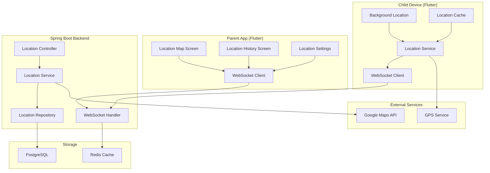
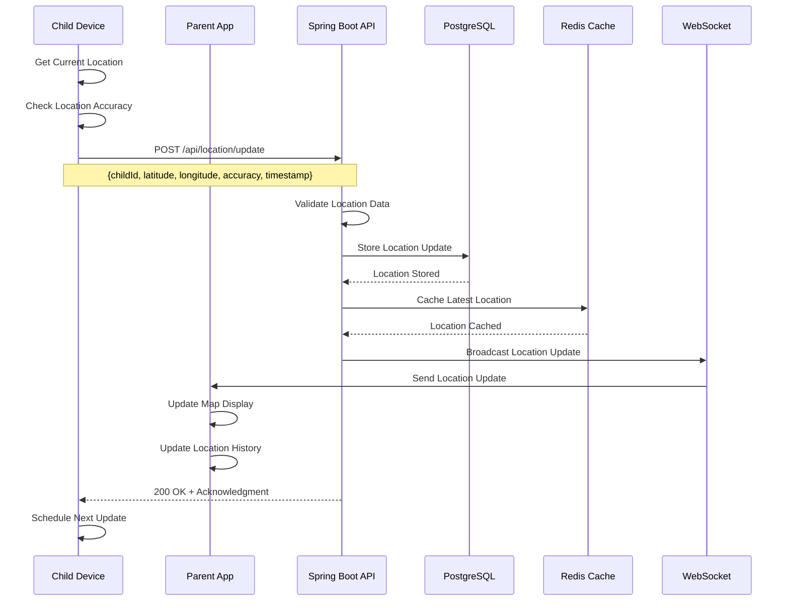
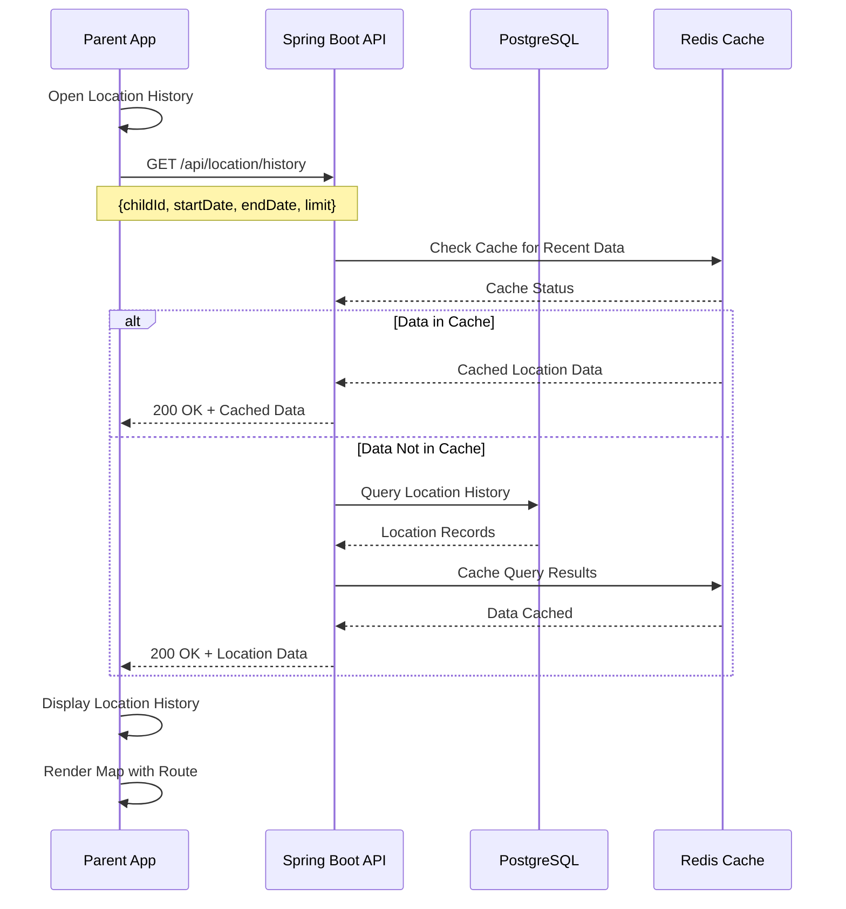
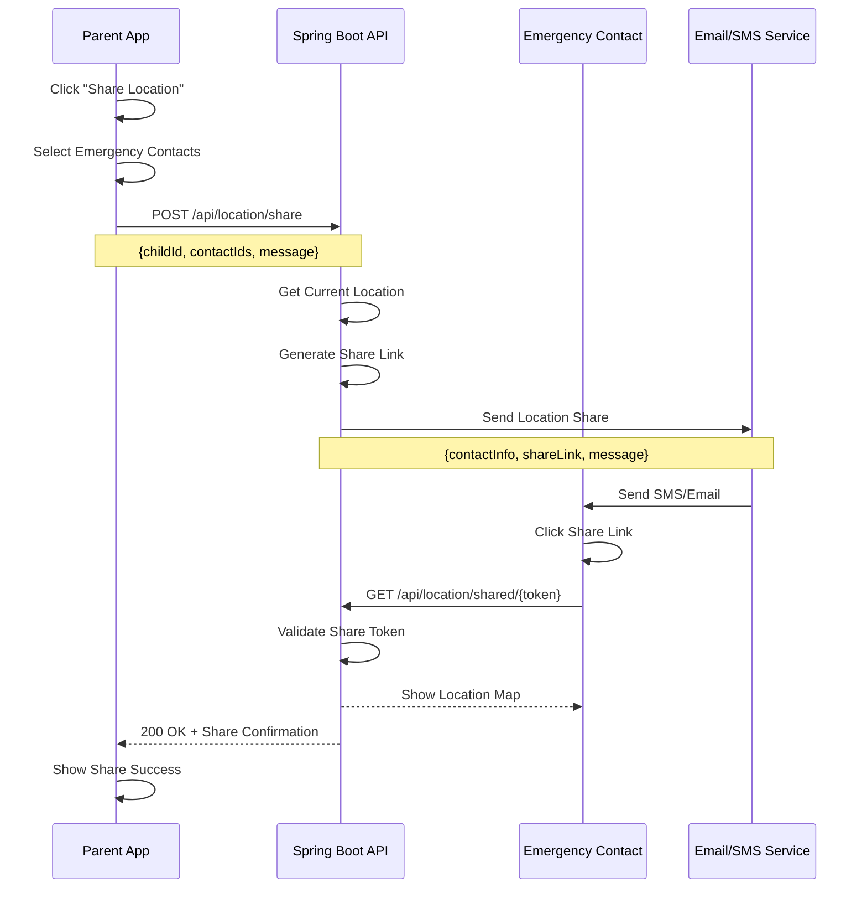

# Feature 03: Real-Time Location Tracking

## Overview
This feature provides real-time location tracking for children, allowing parents to monitor their children's whereabouts with live updates, location history, and safety alerts.

## Table of Contents
1. [Feature Requirements](#feature-requirements)
2. [System Architecture](#system-architecture)
3. [Sequence Diagrams](#sequence-diagrams)
4. [API Specifications](#api-specifications)
5. [Database Design](#database-design)
6. [Frontend Implementation](#frontend-implementation)
7. [Backend Implementation](#backend-implementation)

---

## Feature Requirements

### Functional Requirements
- **FR-01**: Parents can view real-time location of their children
- **FR-02**: System tracks location updates every 30 seconds
- **FR-03**: Parents can view location history
- **FR-04**: System shows location on interactive map
- **FR-05**: Parents can set location update frequency
- **FR-06**: System provides location accuracy indicators
- **FR-07**: Parents can share location with emergency contacts
- **FR-08**: System tracks movement patterns and routes
- **FR-09**: Parents can set location-based alerts
- **FR-10**: System works in background when app is closed

### Non-Functional Requirements
- **NFR-01**: Location update response time < 5 seconds
- **NFR-02**: System supports GPS, WiFi, and cellular positioning
- **NFR-03**: Location accuracy within 10 meters
- **NFR-04**: Battery usage optimization for child devices
- **NFR-05**: Offline location caching for 24 hours
- **NFR-06**: Real-time updates via WebSocket connection

---

## System Architecture

### Component Diagram


---

## Sequence Diagrams

### Real-Time Location Update Flow


### Location History Retrieval Flow


### Emergency Location Sharing Flow


---

## API Specifications

### Endpoints Table
| Method | Endpoint | Description | Request Body | Response | Status Codes | Auth Required |
|--------|----------|-------------|--------------|----------|--------------|---------------|
| POST | `/api/location/update` | Update child location | `LocationUpdateRequest` | `LocationResponse` | 200, 400, 401 | Yes |
| GET | `/api/location/current/{childId}` | Get current location | None | `LocationResponse` | 200, 404, 401 | Yes |
| GET | `/api/location/history` | Get location history | Query params | `List<LocationResponse>` | 200, 401 | Yes |
| POST | `/api/location/share` | Share location | `LocationShareRequest` | `MessageResponse` | 200, 400, 401 | Yes |
| GET | `/api/location/shared/{token}` | View shared location | None | `LocationResponse` | 200, 404 | No |
| PUT | `/api/location/settings` | Update tracking settings | `LocationSettingsRequest` | `MessageResponse` | 200, 400, 401 | Yes |
| GET | `/api/location/geofences/{childId}` | Get geofences | None | `List<GeofenceResponse>` | 200, 401 | Yes |

### Request/Response Models

#### LocationUpdateRequest
```json
{
  "childId": "string",
  "latitude": "number",
  "longitude": "number",
  "accuracy": "number",
  "altitude": "number",
  "speed": "number",
  "heading": "number",
  "timestamp": "datetime",
  "batteryLevel": "number",
  "locationSource": "GPS | NETWORK | PASSIVE"
}
```

#### LocationResponse
```json
{
  "id": "string",
  "childId": "string",
  "latitude": "number",
  "longitude": "number",
  "accuracy": "number",
  "altitude": "number",
  "speed": "number",
  "heading": "number",
  "timestamp": "datetime",
  "batteryLevel": "number",
  "locationSource": "string",
  "address": {
    "street": "string",
    "city": "string",
    "state": "string",
    "country": "string",
    "postalCode": "string"
  }
}
```

#### LocationShareRequest
```json
{
  "childId": "string",
  "contactIds": ["string"],
  "message": "string",
  "expiryHours": "number",
  "includeHistory": "boolean"
}
```

---

## Database Design

### Location Updates Table
```sql
CREATE TABLE location_updates (
    id BIGSERIAL PRIMARY KEY,
    child_id BIGINT NOT NULL REFERENCES children(id) ON DELETE CASCADE,
    latitude DECIMAL(10, 8) NOT NULL,
    longitude DECIMAL(11, 8) NOT NULL,
    accuracy DECIMAL(8, 2),
    altitude DECIMAL(8, 2),
    speed DECIMAL(8, 2),
    heading DECIMAL(8, 2),
    timestamp TIMESTAMP NOT NULL,
    battery_level INTEGER,
    location_source VARCHAR(20) NOT NULL,
    address_street VARCHAR(255),
    address_city VARCHAR(100),
    address_state VARCHAR(100),
    address_country VARCHAR(100),
    address_postal_code VARCHAR(20),
    created_at TIMESTAMP NOT NULL DEFAULT CURRENT_TIMESTAMP
);

CREATE INDEX idx_location_updates_child_id ON location_updates(child_id);
CREATE INDEX idx_location_updates_timestamp ON location_updates(timestamp);
CREATE INDEX idx_location_updates_location ON location_updates(latitude, longitude);
```

### Location Settings Table
```sql
CREATE TABLE location_settings (
    id BIGSERIAL PRIMARY KEY,
    child_id BIGINT NOT NULL REFERENCES children(id) ON DELETE CASCADE,
    update_frequency_seconds INTEGER NOT NULL DEFAULT 30,
    accuracy_threshold_meters INTEGER NOT NULL DEFAULT 10,
    battery_optimization BOOLEAN NOT NULL DEFAULT true,
    background_tracking BOOLEAN NOT NULL DEFAULT true,
    wifi_tracking BOOLEAN NOT NULL DEFAULT true,
    cellular_tracking BOOLEAN NOT NULL DEFAULT true,
    created_at TIMESTAMP NOT NULL DEFAULT CURRENT_TIMESTAMP,
    updated_at TIMESTAMP NOT NULL DEFAULT CURRENT_TIMESTAMP
);

CREATE UNIQUE INDEX idx_location_settings_child_id ON location_settings(child_id);
```

### Location Shares Table
```sql
CREATE TABLE location_shares (
    id BIGSERIAL PRIMARY KEY,
    child_id BIGINT NOT NULL REFERENCES children(id) ON DELETE CASCADE,
    share_token VARCHAR(255) UNIQUE NOT NULL,
    contact_phone VARCHAR(20),
    contact_email VARCHAR(255),
    message TEXT,
    expires_at TIMESTAMP NOT NULL,
    is_active BOOLEAN NOT NULL DEFAULT true,
    created_at TIMESTAMP NOT NULL DEFAULT CURRENT_TIMESTAMP
);

CREATE INDEX idx_location_shares_token ON location_shares(share_token);
CREATE INDEX idx_location_shares_child_id ON location_shares(child_id);
```

---

## Frontend Implementation (Flutter)

### Project Structure
```
lib/features/location_tracking/
├── data/
│   ├── datasources/
│   │   ├── location_local_datasource.dart
│   │   └── location_remote_datasource.dart
│   ├── models/
│   │   ├── location_model.dart
│   │   └── location_settings_model.dart
│   └── repositories/
│       └── location_repository_impl.dart
├── domain/
│   ├── entities/
│   │   ├── location.dart
│   │   └── location_settings.dart
│   ├── repositories/
│   │   └── location_repository.dart
│   └── usecases/
│       ├── update_location_usecase.dart
│       ├── get_location_history_usecase.dart
│       └── share_location_usecase.dart
└── presentation/
    ├── pages/
    │   ├── location_map_page.dart
    │   ├── location_history_page.dart
    │   └── location_settings_page.dart
    ├── widgets/
    │   ├── location_map_widget.dart
    │   ├── location_history_widget.dart
    │   └── location_share_widget.dart
    └── providers/
        └── location_provider.dart
```

### Key Dependencies
```yaml
dependencies:
  # Location services
  geolocator: ^10.1.0
  geocoding: ^2.1.1
  location: ^5.0.3
  
  # Maps
  google_maps_flutter: ^2.5.0
  google_polyline_algorithm: ^3.1.0
  
  # WebSocket
  web_socket_channel: ^2.4.0
  
  # Background tasks
  workmanager: ^0.5.1
  
  # State management
  flutter_riverpod: ^2.4.0
```

### Core Implementation

#### Location Service (Background)
```dart
class LocationService {
  static const String _locationChannel = 'location_channel';
  static const String _locationMethod = 'updateLocation';
  
  static Future<void> initialize() async {
    const MethodChannel channel = MethodChannel(_locationChannel);
    
    channel.setMethodCallHandler((call) async {
      if (call.method == _locationMethod) {
        await _handleLocationUpdate(call.arguments);
      }
    });
  }
  
  static Future<void> startLocationTracking(String childId) async {
    await Workmanager().registerPeriodicTask(
      "location_tracking_$childId",
      "locationTracking",
      frequency: const Duration(minutes: 1),
      inputData: {"childId": childId},
    );
  }
  
  static Future<void> stopLocationTracking(String childId) async {
    await Workmanager().cancelByUniqueName("location_tracking_$childId");
  }
  
  static Future<void> _handleLocationUpdate(Map<String, dynamic> data) async {
    try {
      final position = await Geolocator.getCurrentPosition(
        desiredAccuracy: LocationAccuracy.high,
      );
      
      final locationUpdate = LocationUpdateRequest(
        childId: data['childId'],
        latitude: position.latitude,
        longitude: position.longitude,
        accuracy: position.accuracy,
        altitude: position.altitude,
        speed: position.speed,
        heading: position.heading,
        timestamp: DateTime.now(),
        batteryLevel: await _getBatteryLevel(),
        locationSource: 'GPS',
      );
      
      await LocationRepository().updateLocation(locationUpdate);
    } catch (e) {
      print('Location update failed: $e');
    }
  }
  
  static Future<int> _getBatteryLevel() async {
    // Implementation to get battery level
    return 100; // Placeholder
  }
}
```

#### Location Provider (Riverpod)
```dart
class LocationNotifier extends StateNotifier<LocationState> {
  final UpdateLocationUsecase _updateLocationUsecase;
  final GetLocationHistoryUsecase _getLocationHistoryUsecase;
  final ShareLocationUsecase _shareLocationUsecase;
  final WebSocketChannel _webSocketChannel;

  LocationNotifier(
    this._updateLocationUsecase,
    this._getLocationHistoryUsecase,
    this._shareLocationUsecase,
  ) : super(LocationInitial()) {
    _initializeWebSocket();
  }

  void _initializeWebSocket() {
    _webSocketChannel = WebSocketChannel.connect(
      Uri.parse('ws://your-api-domain.com/ws/location'),
    );

    _webSocketChannel.stream.listen((data) {
      final locationData = jsonDecode(data);
      _handleLocationUpdate(locationData);
    });
  }

  void _handleLocationUpdate(Map<String, dynamic> data) {
    if (state is LocationLoaded) {
      final currentState = state as LocationLoaded;
      final updatedLocations = List<Location>.from(currentState.locations);
      
      // Update or add location
      final locationIndex = updatedLocations.indexWhere(
        (loc) => loc.childId == data['childId'],
      );
      
      if (locationIndex != -1) {
        updatedLocations[locationIndex] = Location.fromJson(data);
      } else {
        updatedLocations.add(Location.fromJson(data));
      }
      
      state = LocationLoaded(updatedLocations);
    }
  }

  Future<void> getLocationHistory(String childId, DateTime startDate, DateTime endDate) async {
    state = LocationLoading();
    
    final result = await _getLocationHistoryUsecase(GetLocationHistoryParams(
      childId: childId,
      startDate: startDate,
      endDate: endDate,
    ));

    result.fold(
      (failure) => state = LocationError(failure.message),
      (locations) => state = LocationLoaded(locations),
    );
  }

  Future<void> shareLocation(String childId, List<String> contactIds, String message) async {
    state = LocationLoading();
    
    final result = await _shareLocationUsecase(ShareLocationParams(
      childId: childId,
      contactIds: contactIds,
      message: message,
    ));

    result.fold(
      (failure) => state = LocationError(failure.message),
      (shareToken) => state = LocationShared(shareToken),
    );
  }

  @override
  void dispose() {
    _webSocketChannel.sink.close();
    super.dispose();
  }
}
```

#### Location Map Widget
```dart
class LocationMapWidget extends ConsumerStatefulWidget {
  final String childId;
  final List<Location> locations;

  const LocationMapWidget({
    Key? key,
    required this.childId,
    required this.locations,
  }) : super(key: key);

  @override
  ConsumerState<LocationMapWidget> createState() => _LocationMapWidgetState();
}

class _LocationMapWidgetState extends ConsumerState<LocationMapWidget> {
  GoogleMapController? _mapController;
  Set<Marker> _markers = {};
  Set<Polyline> _polylines = {};

  @override
  Widget build(BuildContext context) {
    return GoogleMap(
      onMapCreated: (GoogleMapController controller) {
        _mapController = controller;
        _updateMapMarkers();
      },
      initialCameraPosition: CameraPosition(
        target: _getInitialPosition(),
        zoom: 15.0,
      ),
      markers: _markers,
      polylines: _polylines,
      myLocationEnabled: true,
      myLocationButtonEnabled: true,
      mapType: MapType.normal,
    );
  }

  void _updateMapMarkers() {
    _markers.clear();
    _polylines.clear();

    if (widget.locations.isNotEmpty) {
      // Add current location marker
      final currentLocation = widget.locations.first;
      _markers.add(
        Marker(
          markerId: MarkerId('current_${currentLocation.id}'),
          position: LatLng(currentLocation.latitude, currentLocation.longitude),
          infoWindow: InfoWindow(
            title: 'Current Location',
            snippet: _formatLocationInfo(currentLocation),
          ),
          icon: BitmapDescriptor.defaultMarkerWithHue(BitmapDescriptor.hueBlue),
        ),
      );

      // Add history markers
      for (int i = 1; i < widget.locations.length; i++) {
        final location = widget.locations[i];
        _markers.add(
          Marker(
            markerId: MarkerId('history_${location.id}'),
            position: LatLng(location.latitude, location.longitude),
            infoWindow: InfoWindow(
              title: 'Location ${i + 1}',
              snippet: _formatLocationInfo(location),
            ),
            icon: BitmapDescriptor.defaultMarkerWithHue(BitmapDescriptor.hueGreen),
          ),
        );
      }

      // Add polyline for route
      if (widget.locations.length > 1) {
        final points = widget.locations
            .map((loc) => LatLng(loc.latitude, loc.longitude))
            .toList();

        _polylines.add(
          Polyline(
            polylineId: const PolylineId('route'),
            points: points,
            color: Colors.blue,
            width: 3,
          ),
        );
      }

      // Move camera to show all markers
      _fitMarkersInView();
    }
  }

  LatLng _getInitialPosition() {
    if (widget.locations.isNotEmpty) {
      final location = widget.locations.first;
      return LatLng(location.latitude, location.longitude);
    }
    return const LatLng(0.0, 0.0); // Default position
  }

  void _fitMarkersInView() {
    if (_mapController != null && _markers.isNotEmpty) {
      LatLngBounds bounds = _markers.fold<LatLngBounds>(
        LatLngBounds(
          southwest: _markers.first.position,
          northeast: _markers.first.position,
        ),
        (bounds, marker) {
          return LatLngBounds(
            southwest: LatLng(
              math.min(bounds.southwest.latitude, marker.position.latitude),
              math.min(bounds.southwest.longitude, marker.position.longitude),
            ),
            northeast: LatLng(
              math.max(bounds.northeast.latitude, marker.position.latitude),
              math.max(bounds.northeast.longitude, marker.position.longitude),
            ),
          );
        },
      );

      _mapController!.animateCamera(
        CameraUpdate.newLatLngBounds(bounds, 100.0),
      );
    }
  }

  String _formatLocationInfo(Location location) {
    return 'Accuracy: ${location.accuracy}m\n'
        'Time: ${DateFormat('HH:mm').format(location.timestamp)}';
  }
}
```

---

## Backend Implementation (Spring Boot)

### Project Structure
```
src/main/java/com/safeguard/parentapp/location/
├── controller/
│   └── LocationController.java
├── dto/
│   ├── request/
│   │   ├── LocationUpdateRequest.java
│   │   └── LocationShareRequest.java
│   └── response/
│       ├── LocationResponse.java
│       └── LocationHistoryResponse.java
├── entity/
│   ├── LocationUpdate.java
│   ├── LocationSettings.java
│   └── LocationShare.java
├── repository/
│   ├── LocationUpdateRepository.java
│   ├── LocationSettingsRepository.java
│   └── LocationShareRepository.java
├── service/
│   ├── LocationService.java
│   ├── GeocodingService.java
│   └── WebSocketService.java
└── websocket/
    └── LocationWebSocketHandler.java
```

### Core Implementation

#### Location Controller
```java
@RestController
@RequestMapping("/location")
@RequiredArgsConstructor
@CrossOrigin(origins = "*")
public class LocationController {
    
    private final LocationService locationService;
    
    @PostMapping("/update")
    public ResponseEntity<LocationResponse> updateLocation(
            @Valid @RequestBody LocationUpdateRequest request,
            @RequestHeader("Authorization") String token) {
        LocationResponse response = locationService.updateLocation(request, token);
        return ResponseEntity.ok(response);
    }
    
    @GetMapping("/current/{childId}")
    public ResponseEntity<LocationResponse> getCurrentLocation(
            @PathVariable Long childId,
            @RequestHeader("Authorization") String token) {
        LocationResponse response = locationService.getCurrentLocation(childId, token);
        return ResponseEntity.ok(response);
    }
    
    @GetMapping("/history")
    public ResponseEntity<List<LocationResponse>> getLocationHistory(
            @RequestParam Long childId,
            @RequestParam @DateTimeFormat(iso = DateTimeFormat.ISO.DATE) LocalDate startDate,
            @RequestParam @DateTimeFormat(iso = DateTimeFormat.ISO.DATE) LocalDate endDate,
            @RequestParam(defaultValue = "100") int limit,
            @RequestHeader("Authorization") String token) {
        List<LocationResponse> response = locationService.getLocationHistory(
                childId, startDate, endDate, limit, token);
        return ResponseEntity.ok(response);
    }
    
    @PostMapping("/share")
    public ResponseEntity<MessageResponse> shareLocation(
            @Valid @RequestBody LocationShareRequest request,
            @RequestHeader("Authorization") String token) {
        MessageResponse response = locationService.shareLocation(request, token);
        return ResponseEntity.ok(response);
    }
    
    @GetMapping("/shared/{token}")
    public ResponseEntity<LocationResponse> getSharedLocation(
            @PathVariable String token) {
        LocationResponse response = locationService.getSharedLocation(token);
        return ResponseEntity.ok(response);
    }
}
```

#### Location Service
```java
@Service
@RequiredArgsConstructor
@Transactional
public class LocationService {
    
    private final LocationUpdateRepository locationUpdateRepository;
    private final LocationSettingsRepository locationSettingsRepository;
    private final LocationShareRepository locationShareRepository;
    private final GeocodingService geocodingService;
    private final WebSocketService webSocketService;
    private final JwtService jwtService;
    
    public LocationResponse updateLocation(LocationUpdateRequest request, String token) {
        Long parentId = jwtService.getUserIdFromToken(token);
        
        // Verify child belongs to parent
        if (!isChildOwnedByParent(request.getChildId(), parentId)) {
            throw new RuntimeException("Child not found or access denied");
        }
        
        // Get address information
        AddressInfo addressInfo = geocodingService.getAddressInfo(
                request.getLatitude(), request.getLongitude());
        
        // Create location update
        LocationUpdate locationUpdate = LocationUpdate.builder()
                .childId(request.getChildId())
                .latitude(request.getLatitude())
                .longitude(request.getLongitude())
                .accuracy(request.getAccuracy())
                .altitude(request.getAltitude())
                .speed(request.getSpeed())
                .heading(request.getHeading())
                .timestamp(request.getTimestamp())
                .batteryLevel(request.getBatteryLevel())
                .locationSource(request.getLocationSource())
                .addressStreet(addressInfo.getStreet())
                .addressCity(addressInfo.getCity())
                .addressState(addressInfo.getState())
                .addressCountry(addressInfo.getCountry())
                .addressPostalCode(addressInfo.getPostalCode())
                .build();
        
        LocationUpdate savedUpdate = locationUpdateRepository.save(locationUpdate);
        
        // Broadcast location update via WebSocket
        webSocketService.broadcastLocationUpdate(mapToLocationResponse(savedUpdate));
        
        return mapToLocationResponse(savedUpdate);
    }
    
    public LocationResponse getCurrentLocation(Long childId, String token) {
        Long parentId = jwtService.getUserIdFromToken(token);
        
        if (!isChildOwnedByParent(childId, parentId)) {
            throw new RuntimeException("Child not found or access denied");
        }
        
        LocationUpdate latestLocation = locationUpdateRepository
                .findTopByChildIdOrderByTimestampDesc(childId)
                .orElseThrow(() -> new RuntimeException("No location data found"));
        
        return mapToLocationResponse(latestLocation);
    }
    
    public List<LocationResponse> getLocationHistory(
            Long childId, LocalDate startDate, LocalDate endDate, 
            int limit, String token) {
        Long parentId = jwtService.getUserIdFromToken(token);
        
        if (!isChildOwnedByParent(childId, parentId)) {
            throw new RuntimeException("Child not found or access denied");
        }
        
        LocalDateTime startDateTime = startDate.atStartOfDay();
        LocalDateTime endDateTime = endDate.atTime(23, 59, 59);
        
        List<LocationUpdate> locations = locationUpdateRepository
                .findByChildIdAndTimestampBetweenOrderByTimestampDesc(
                        childId, startDateTime, endDateTime, PageRequest.of(0, limit));
        
        return locations.stream()
                .map(this::mapToLocationResponse)
                .collect(Collectors.toList());
    }
    
    public MessageResponse shareLocation(LocationShareRequest request, String token) {
        Long parentId = jwtService.getUserIdFromToken(token);
        
        if (!isChildOwnedByParent(request.getChildId(), parentId)) {
            throw new RuntimeException("Child not found or access denied");
        }
        
        // Generate share token
        String shareToken = UUID.randomUUID().toString();
        
        // Calculate expiry time
        LocalDateTime expiresAt = LocalDateTime.now().plusHours(request.getExpiryHours());
        
        // Create location share
        LocationShare locationShare = LocationShare.builder()
                .childId(request.getChildId())
                .shareToken(shareToken)
                .contactPhone(request.getContactPhone())
                .contactEmail(request.getContactEmail())
                .message(request.getMessage())
                .expiresAt(expiresAt)
                .isActive(true)
                .build();
        
        locationShareRepository.save(locationShare);
        
        // Send share notification
        sendLocationShareNotification(locationShare);
        
        return MessageResponse.builder()
                .success(true)
                .message("Location shared successfully")
                .timestamp(LocalDateTime.now())
                .build();
    }
    
    public LocationResponse getSharedLocation(String token) {
        LocationShare locationShare = locationShareRepository
                .findByShareTokenAndIsActiveTrue(token)
                .orElseThrow(() -> new RuntimeException("Invalid or expired share token"));
        
        if (locationShare.getExpiresAt().isBefore(LocalDateTime.now())) {
            throw new RuntimeException("Share token has expired");
        }
        
        // Get latest location for the child
        LocationUpdate latestLocation = locationUpdateRepository
                .findTopByChildIdOrderByTimestampDesc(locationShare.getChildId())
                .orElseThrow(() -> new RuntimeException("No location data found"));
        
        return mapToLocationResponse(latestLocation);
    }
    
    private boolean isChildOwnedByParent(Long childId, Long parentId) {
        // Implementation to check if child belongs to parent
        return true; // Placeholder
    }
    
    private void sendLocationShareNotification(LocationShare locationShare) {
        // Implementation to send SMS/Email notification
    }
    
    private LocationResponse mapToLocationResponse(LocationUpdate locationUpdate) {
        return LocationResponse.builder()
                .id(locationUpdate.getId())
                .childId(locationUpdate.getChildId())
                .latitude(locationUpdate.getLatitude())
                .longitude(locationUpdate.getLongitude())
                .accuracy(locationUpdate.getAccuracy())
                .altitude(locationUpdate.getAltitude())
                .speed(locationUpdate.getSpeed())
                .heading(locationUpdate.getHeading())
                .timestamp(locationUpdate.getTimestamp())
                .batteryLevel(locationUpdate.getBatteryLevel())
                .locationSource(locationUpdate.getLocationSource())
                .address(AddressInfo.builder()
                        .street(locationUpdate.getAddressStreet())
                        .city(locationUpdate.getAddressCity())
                        .state(locationUpdate.getAddressState())
                        .country(locationUpdate.getAddressCountry())
                        .postalCode(locationUpdate.getAddressPostalCode())
                        .build())
                .build();
    }
}
```

#### WebSocket Handler
```java
@Component
@RequiredArgsConstructor
public class LocationWebSocketHandler extends TextWebSocketHandler {
    
    private final Map<String, WebSocketSession> sessions = new ConcurrentHashMap<>();
    
    @Override
    public void afterConnectionEstablished(WebSocketSession session) throws Exception {
        String parentId = getParentIdFromSession(session);
        sessions.put(parentId, session);
    }
    
    @Override
    public void afterConnectionClosed(WebSocketSession session, CloseStatus status) throws Exception {
        String parentId = getParentIdFromSession(session);
        sessions.remove(parentId);
    }
    
    public void broadcastLocationUpdate(LocationResponse location) {
        // Broadcast to all connected parent sessions
        sessions.values().forEach(session -> {
            try {
                if (session.isOpen()) {
                    session.sendMessage(new TextMessage(JsonUtils.toJson(location)));
                }
            } catch (Exception e) {
                log.error("Failed to send WebSocket message", e);
            }
        });
    }
    
    private String getParentIdFromSession(WebSocketSession session) {
        // Extract parent ID from session attributes or query parameters
        return session.getAttributes().get("parentId").toString();
    }
}
```

---

## Security Considerations

### Location Data Protection
- **Encryption**: Location data encrypted in transit and at rest
- **Access Control**: Parents can only access their children's locations
- **Data Retention**: Location history automatically purged after 30 days
- **Anonymization**: Shared locations use temporary tokens

### Privacy Compliance
- **Consent Management**: Clear consent for location tracking
- **Data Minimization**: Only necessary location data collected
- **Right to Delete**: Parents can delete location history
- **Transparency**: Clear information about data usage

---

## Testing Strategy

### Unit Tests
- **Service Layer**: Test location management business logic
- **Repository Layer**: Test data access methods
- **WebSocket**: Test real-time communication

### Integration Tests
- **API Endpoints**: Test location CRUD operations
- **WebSocket**: Test real-time updates
- **Geocoding**: Test address resolution

### Performance Tests
- **Location Updates**: Test high-frequency updates
- **WebSocket**: Test concurrent connections
- **Database**: Test location history queries

This comprehensive feature documentation provides everything needed to implement the Real-Time Location Tracking feature for the SafeGuard Parent App.
