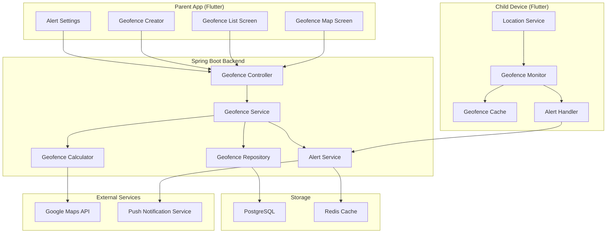
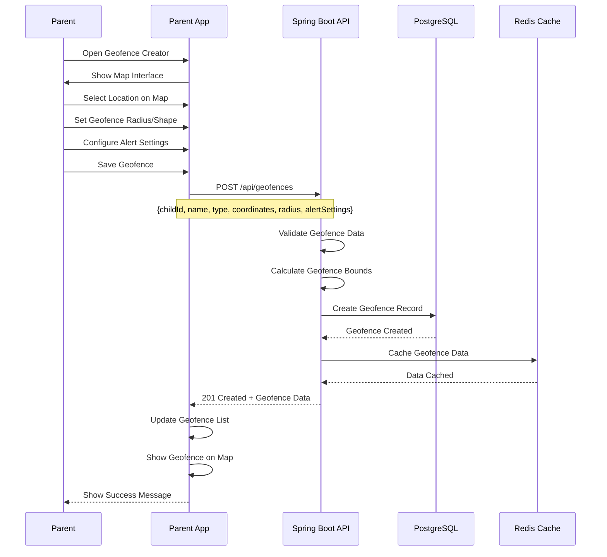
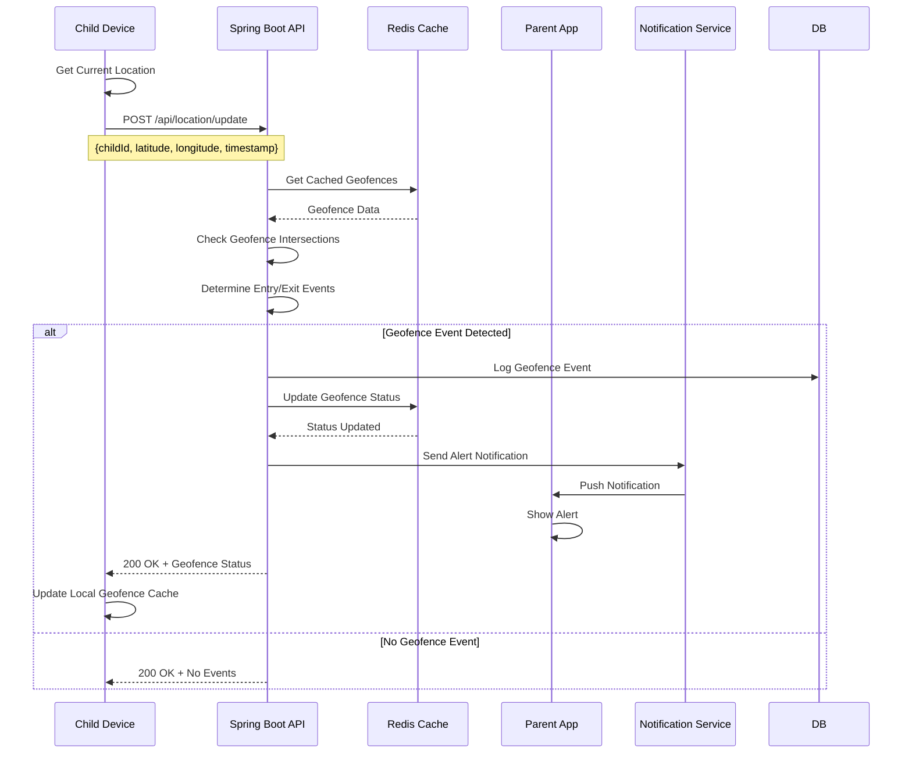
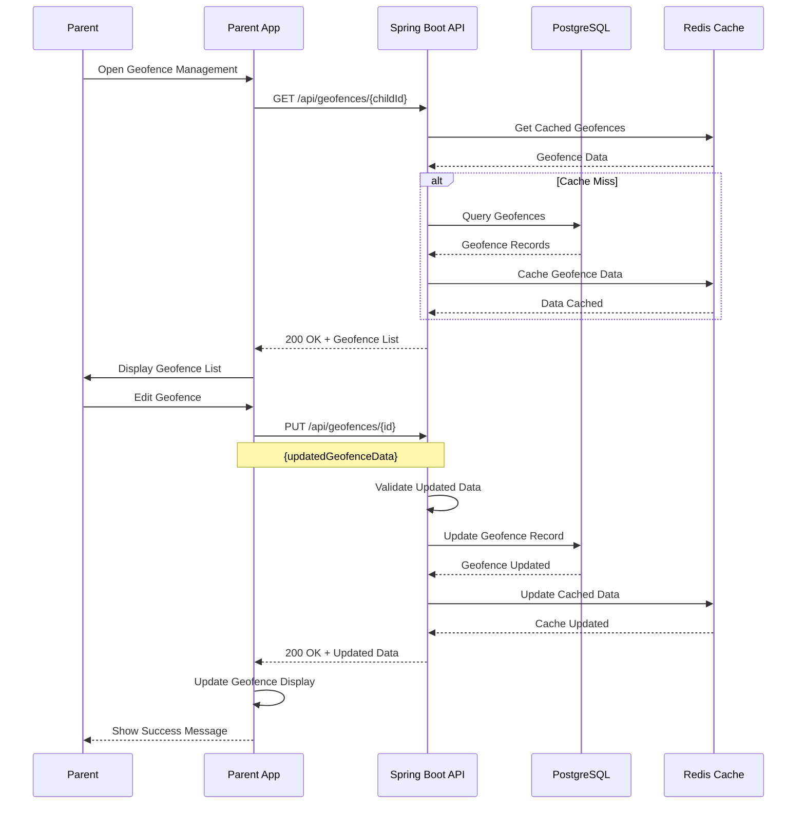

# Feature 04: Geofencing & Safe Zones

## Overview
This feature allows parents to create virtual boundaries (geofences) around specific locations and receive alerts when children enter or exit these zones. It provides customizable safe zones with different alert types and notification preferences.

## Table of Contents
1. [Feature Requirements](#feature-requirements)
2. [System Architecture](#system-architecture)
3. [Sequence Diagrams](#sequence-diagrams)
4. [API Specifications](#api-specifications)
5. [Database Design](#database-design)
6. [Frontend Implementation](#frontend-implementation)
7. [Backend Implementation](#backend-implementation)

---

## Feature Requirements

### Functional Requirements
- **FR-01**: Parents can create circular geofences around specific locations
- **FR-02**: Parents can create polygonal geofences with custom shapes
- **FR-03**: System detects when child enters a geofence
- **FR-04**: System detects when child exits a geofence
- **FR-05**: Parents can set different alert types for each geofence
- **FR-06**: Parents can configure notification preferences
- **FR-07**: System supports multiple geofences per child
- **FR-08**: Parents can edit or delete existing geofences
- **FR-09**: System provides geofence status dashboard
- **FR-10**: Parents can set geofence activation schedules

### Non-Functional Requirements
- **NFR-01**: Geofence detection accuracy within 50 meters
- **NFR-02**: Alert delivery time < 30 seconds
- **NFR-03**: System supports up to 20 geofences per child
- **NFR-04**: Geofence calculations optimized for battery life
- **NFR-05**: Offline geofence detection capability
- **NFR-06**: Real-time geofence status updates

---

## System Architecture

### Component Diagram


---

## Sequence Diagrams

### Geofence Creation Flow


### Geofence Detection Flow


### Geofence Management Flow


---

## API Specifications

### Endpoints Table
| Method | Endpoint | Description | Request Body | Response | Status Codes | Auth Required |
|--------|----------|-------------|--------------|----------|--------------|---------------|
| GET | `/api/geofences/{childId}` | Get geofences for child | None | `List<GeofenceResponse>` | 200, 401 | Yes |
| POST | `/api/geofences` | Create new geofence | `CreateGeofenceRequest` | `GeofenceResponse` | 201, 400, 401 | Yes |
| PUT | `/api/geofences/{id}` | Update geofence | `UpdateGeofenceRequest` | `GeofenceResponse` | 200, 400, 404, 401 | Yes |
| DELETE | `/api/geofences/{id}` | Delete geofence | None | `MessageResponse` | 200, 404, 401 | Yes |
| GET | `/api/geofences/{id}/status` | Get geofence status | None | `GeofenceStatusResponse` | 200, 404, 401 | Yes |
| POST | `/api/geofences/{id}/test` | Test geofence with location | `TestGeofenceRequest` | `GeofenceTestResponse` | 200, 400, 401 | Yes |
| GET | `/api/geofences/events` | Get geofence events | Query params | `List<GeofenceEventResponse>` | 200, 401 | Yes |

### Request/Response Models

#### CreateGeofenceRequest
```json
{
  "childId": "string",
  "name": "string",
  "description": "string",
  "type": "CIRCULAR | POLYGON",
  "coordinates": {
    "center": {
      "latitude": "number",
      "longitude": "number"
    },
    "radius": "number",
    "polygon": [
      {
        "latitude": "number",
        "longitude": "number"
      }
    ]
  },
  "alertSettings": {
    "entryAlert": "boolean",
    "exitAlert": "boolean",
    "alertType": "PUSH | SMS | EMAIL",
    "alertMessage": "string",
    "quietHours": {
      "enabled": "boolean",
      "startTime": "string",
      "endTime": "string"
    }
  },
  "schedule": {
    "enabled": "boolean",
    "daysOfWeek": ["MONDAY", "TUESDAY", "WEDNESDAY"],
    "startTime": "string",
    "endTime": "string"
  }
}
```

#### GeofenceResponse
```json
{
  "id": "string",
  "childId": "string",
  "name": "string",
  "description": "string",
  "type": "string",
  "coordinates": {
    "center": {
      "latitude": "number",
      "longitude": "number"
    },
    "radius": "number",
    "polygon": [
      {
        "latitude": "number",
        "longitude": "number"
      }
    ]
  },
  "alertSettings": {
    "entryAlert": "boolean",
    "exitAlert": "boolean",
    "alertType": "string",
    "alertMessage": "string",
    "quietHours": {
      "enabled": "boolean",
      "startTime": "string",
      "endTime": "string"
    }
  },
  "schedule": {
    "enabled": "boolean",
    "daysOfWeek": ["string"],
    "startTime": "string",
    "endTime": "string"
  },
  "isActive": "boolean",
  "createdAt": "datetime",
  "updatedAt": "datetime"
}
```

#### GeofenceEventResponse
```json
{
  "id": "string",
  "geofenceId": "string",
  "childId": "string",
  "eventType": "ENTRY | EXIT",
  "location": {
    "latitude": "number",
    "longitude": "number"
  },
  "timestamp": "datetime",
  "alertSent": "boolean",
  "alertType": "string"
}
```

---

## Database Design

### Geofences Table
```sql
CREATE TABLE geofences (
    id BIGSERIAL PRIMARY KEY,
    child_id BIGINT NOT NULL REFERENCES children(id) ON DELETE CASCADE,
    name VARCHAR(100) NOT NULL,
    description TEXT,
    type VARCHAR(20) NOT NULL CHECK (type IN ('CIRCULAR', 'POLYGON')),
    center_latitude DECIMAL(10, 8),
    center_longitude DECIMAL(11, 8),
    radius_meters INTEGER,
    polygon_coordinates JSONB,
    entry_alert BOOLEAN NOT NULL DEFAULT true,
    exit_alert BOOLEAN NOT NULL DEFAULT true,
    alert_type VARCHAR(20) NOT NULL DEFAULT 'PUSH',
    alert_message TEXT,
    quiet_hours_enabled BOOLEAN NOT NULL DEFAULT false,
    quiet_hours_start TIME,
    quiet_hours_end TIME,
    schedule_enabled BOOLEAN NOT NULL DEFAULT false,
    schedule_days JSONB,
    schedule_start_time TIME,
    schedule_end_time TIME,
    is_active BOOLEAN NOT NULL DEFAULT true,
    created_at TIMESTAMP NOT NULL DEFAULT CURRENT_TIMESTAMP,
    updated_at TIMESTAMP NOT NULL DEFAULT CURRENT_TIMESTAMP
);

CREATE INDEX idx_geofences_child_id ON geofences(child_id);
CREATE INDEX idx_geofences_active ON geofences(is_active);
CREATE INDEX idx_geofences_location ON geofences(center_latitude, center_longitude);
```

### Geofence Events Table
```sql
CREATE TABLE geofence_events (
    id BIGSERIAL PRIMARY KEY,
    geofence_id BIGINT NOT NULL REFERENCES geofences(id) ON DELETE CASCADE,
    child_id BIGINT NOT NULL REFERENCES children(id) ON DELETE CASCADE,
    event_type VARCHAR(10) NOT NULL CHECK (event_type IN ('ENTRY', 'EXIT')),
    latitude DECIMAL(10, 8) NOT NULL,
    longitude DECIMAL(11, 8) NOT NULL,
    timestamp TIMESTAMP NOT NULL,
    alert_sent BOOLEAN NOT NULL DEFAULT false,
    alert_type VARCHAR(20),
    created_at TIMESTAMP NOT NULL DEFAULT CURRENT_TIMESTAMP
);

CREATE INDEX idx_geofence_events_geofence_id ON geofence_events(geofence_id);
CREATE INDEX idx_geofence_events_child_id ON geofence_events(child_id);
CREATE INDEX idx_geofence_events_timestamp ON geofence_events(timestamp);
CREATE INDEX idx_geofence_events_type ON geofence_events(event_type);
```

### Geofence Status Table
```sql
CREATE TABLE geofence_status (
    id BIGSERIAL PRIMARY KEY,
    geofence_id BIGINT NOT NULL REFERENCES geofences(id) ON DELETE CASCADE,
    child_id BIGINT NOT NULL REFERENCES children(id) ON DELETE CASCADE,
    is_inside BOOLEAN NOT NULL DEFAULT false,
    last_location_latitude DECIMAL(10, 8),
    last_location_longitude DECIMAL(11, 8),
    last_check_timestamp TIMESTAMP NOT NULL,
    updated_at TIMESTAMP NOT NULL DEFAULT CURRENT_TIMESTAMP
);

CREATE UNIQUE INDEX idx_geofence_status_geofence_child ON geofence_status(geofence_id, child_id);
CREATE INDEX idx_geofence_status_child_id ON geofence_status(child_id);
```

---

## Frontend Implementation (Flutter)

### Project Structure
```
lib/features/geofencing/
├── data/
│   ├── datasources/
│   │   ├── geofence_local_datasource.dart
│   │   └── geofence_remote_datasource.dart
│   ├── models/
│   │   ├── geofence_model.dart
│   │   └── geofence_event_model.dart
│   └── repositories/
│       └── geofence_repository_impl.dart
├── domain/
│   ├── entities/
│   │   ├── geofence.dart
│   │   └── geofence_event.dart
│   ├── repositories/
│   │   └── geofence_repository.dart
│   └── usecases/
│       ├── create_geofence_usecase.dart
│       ├── update_geofence_usecase.dart
│       └── delete_geofence_usecase.dart
└── presentation/
    ├── pages/
    │   ├── geofence_map_page.dart
    │   ├── geofence_list_page.dart
    │   ├── create_geofence_page.dart
    │   └── geofence_settings_page.dart
    ├── widgets/
    │   ├── geofence_map_widget.dart
    │   ├── geofence_creator_widget.dart
    │   └── geofence_card.dart
    └── providers/
        └── geofence_provider.dart
```

### Key Dependencies
```yaml
dependencies:
  # Maps and location
  google_maps_flutter: ^2.5.0
  geolocator: ^10.1.0
  
  # Geofencing
  geofence: ^2.0.0
  
  # State management
  flutter_riverpod: ^2.4.0
  
  # UI components
  flutter_form_builder: ^9.1.1
  form_builder_validators: ^9.1.0
```

### Core Implementation

#### Geofence Provider (Riverpod)
```dart
class GeofenceNotifier extends StateNotifier<GeofenceState> {
  final CreateGeofenceUsecase _createGeofenceUsecase;
  final UpdateGeofenceUsecase _updateGeofenceUsecase;
  final DeleteGeofenceUsecase _deleteGeofenceUsecase;
  final WebSocketChannel _webSocketChannel;

  GeofenceNotifier(
    this._createGeofenceUsecase,
    this._updateGeofenceUsecase,
    this._deleteGeofenceUsecase,
  ) : super(GeofenceInitial()) {
    _initializeWebSocket();
  }

  void _initializeWebSocket() {
    _webSocketChannel = WebSocketChannel.connect(
      Uri.parse('ws://your-api-domain.com/ws/geofences'),
    );

    _webSocketChannel.stream.listen((data) {
      final eventData = jsonDecode(data);
      _handleGeofenceEvent(eventData);
    });
  }

  void _handleGeofenceEvent(Map<String, dynamic> data) {
    if (state is GeofenceLoaded) {
      final currentState = state as GeofenceLoaded;
      final updatedGeofences = List<Geofence>.from(currentState.geofences);
      
      // Update geofence status
      final geofenceIndex = updatedGeofences.indexWhere(
        (geofence) => geofence.id == data['geofenceId'],
      );
      
      if (geofenceIndex != -1) {
        updatedGeofences[geofenceIndex] = updatedGeofences[geofenceIndex].copyWith(
          isActive: data['isActive'],
          lastEvent: GeofenceEvent.fromJson(data),
        );
        
        state = GeofenceLoaded(updatedGeofences);
      }
    }
  }

  Future<void> createGeofence(CreateGeofenceParams params) async {
    state = GeofenceLoading();
    
    final result = await _createGeofenceUsecase(params);

    result.fold(
      (failure) => state = GeofenceError(failure.message),
      (geofence) {
        if (state is GeofenceLoaded) {
          final currentState = state as GeofenceLoaded;
          final updatedGeofences = List<Geofence>.from(currentState.geofences);
          updatedGeofences.add(geofence);
          state = GeofenceLoaded(updatedGeofences);
        } else {
          state = GeofenceLoaded([geofence]);
        }
      },
    );
  }

  Future<void> updateGeofence(UpdateGeofenceParams params) async {
    state = GeofenceLoading();
    
    final result = await _updateGeofenceUsecase(params);

    result.fold(
      (failure) => state = GeofenceError(failure.message),
      (geofence) => _refreshGeofencesList(),
    );
  }

  Future<void> deleteGeofence(String geofenceId) async {
    state = GeofenceLoading();
    
    final result = await _deleteGeofenceUsecase(DeleteGeofenceParams(geofenceId: geofenceId));

    result.fold(
      (failure) => state = GeofenceError(failure.message),
      (_) => _refreshGeofencesList(),
    );
  }

  Future<void> _refreshGeofencesList() async {
    // Refresh geofences list logic
  }

  @override
  void dispose() {
    _webSocketChannel.sink.close();
    super.dispose();
  }
}
```

#### Geofence Creator Widget
```dart
class GeofenceCreatorWidget extends ConsumerStatefulWidget {
  final String childId;
  final Function(Geofence) onGeofenceCreated;

  const GeofenceCreatorWidget({
    Key? key,
    required this.childId,
    required this.onGeofenceCreated,
  }) : super(key: key);

  @override
  ConsumerState<GeofenceCreatorWidget> createState() => _GeofenceCreatorWidgetState();
}

class _GeofenceCreatorWidgetState extends ConsumerState<GeofenceCreatorWidget> {
  GoogleMapController? _mapController;
  Set<Marker> _markers = {};
  Set<Circle> _circles = {};
  Set<Polygon> _polygons = {};
  GeofenceType _selectedType = GeofenceType.circular;
  List<LatLng> _polygonPoints = [];
  LatLng? _centerPoint;
  double _radius = 100.0; // meters

  @override
  Widget build(BuildContext context) {
    return Column(
      children: [
        // Map
        Expanded(
          flex: 3,
          child: GoogleMap(
            onMapCreated: (GoogleMapController controller) {
              _mapController = controller;
            },
            onTap: _handleMapTap,
            initialCameraPosition: const CameraPosition(
              target: LatLng(0.0, 0.0),
              zoom: 15.0,
            ),
            markers: _markers,
            circles: _circles,
            polygons: _polygons,
            myLocationEnabled: true,
            myLocationButtonEnabled: true,
          ),
        ),
        
        // Controls
        Expanded(
          flex: 2,
          child: Padding(
            padding: const EdgeInsets.all(16.0),
            child: Column(
              children: [
                // Geofence Type Selection
                Row(
                  children: [
                    Expanded(
                      child: RadioListTile<GeofenceType>(
                        title: const Text('Circular'),
                        value: GeofenceType.circular,
                        groupValue: _selectedType,
                        onChanged: (value) => setState(() => _selectedType = value!),
                      ),
                    ),
                    Expanded(
                      child: RadioListTile<GeofenceType>(
                        title: const Text('Polygon'),
                        value: GeofenceType.polygon,
                        groupValue: _selectedType,
                        onChanged: (value) => setState(() => _selectedType = value!),
                      ),
                    ),
                  ],
                ),
                
                // Radius Slider (for circular geofences)
                if (_selectedType == GeofenceType.circular) ...[
                  Text('Radius: ${_radius.round()}m'),
                  Slider(
                    value: _radius,
                    min: 50.0,
                    max: 1000.0,
                    divisions: 95,
                    onChanged: (value) => setState(() {
                      _radius = value;
                      _updateCircularGeofence();
                    }),
                  ),
                ],
                
                // Polygon Instructions (for polygonal geofences)
                if (_selectedType == GeofenceType.polygon) ...[
                  const Text('Tap on the map to create polygon points'),
                  const Text('Tap the first point again to close the polygon'),
                ],
                
                // Action Buttons
                Row(
                  children: [
                    Expanded(
                      child: ElevatedButton(
                        onPressed: _clearGeofence,
                        child: const Text('Clear'),
                      ),
                    ),
                    const SizedBox(width: 16),
                    Expanded(
                      child: ElevatedButton(
                        onPressed: _canCreateGeofence() ? _createGeofence : null,
                        child: const Text('Create Geofence'),
                      ),
                    ),
                  ],
                ),
              ],
            ),
          ),
        ),
      ],
    );
  }

  void _handleMapTap(LatLng position) {
    if (_selectedType == GeofenceType.circular) {
      _centerPoint = position;
      _updateCircularGeofence();
    } else if (_selectedType == GeofenceType.polygon) {
      _addPolygonPoint(position);
    }
  }

  void _updateCircularGeofence() {
    if (_centerPoint != null) {
      setState(() {
        _markers.clear();
        _circles.clear();
        _polygons.clear();
        
        _markers.add(
          Marker(
            markerId: const MarkerId('center'),
            position: _centerPoint!,
            infoWindow: const InfoWindow(title: 'Geofence Center'),
          ),
        );
        
        _circles.add(
          Circle(
            circleId: const CircleId('geofence'),
            center: _centerPoint!,
            radius: _radius,
            strokeColor: Colors.blue,
            strokeWidth: 2,
            fillColor: Colors.blue.withOpacity(0.2),
          ),
        );
      });
    }
  }

  void _addPolygonPoint(LatLng point) {
    setState(() {
      _polygonPoints.add(point);
      _updatePolygonGeofence();
    });
  }

  void _updatePolygonGeofence() {
    setState(() {
      _markers.clear();
      _circles.clear();
      _polygons.clear();
      
      // Add markers for each point
      for (int i = 0; i < _polygonPoints.length; i++) {
        _markers.add(
          Marker(
            markerId: MarkerId('point_$i'),
            position: _polygonPoints[i],
            infoWindow: InfoWindow(title: 'Point ${i + 1}'),
          ),
        );
      }
      
      // Add polygon if we have at least 3 points
      if (_polygonPoints.length >= 3) {
        _polygons.add(
          Polygon(
            polygonId: const PolygonId('geofence'),
            points: _polygonPoints,
            strokeColor: Colors.blue,
            strokeWidth: 2,
            fillColor: Colors.blue.withOpacity(0.2),
          ),
        );
      }
    });
  }

  void _clearGeofence() {
    setState(() {
      _markers.clear();
      _circles.clear();
      _polygons.clear();
      _polygonPoints.clear();
      _centerPoint = null;
    });
  }

  bool _canCreateGeofence() {
    if (_selectedType == GeofenceType.circular) {
      return _centerPoint != null;
    } else {
      return _polygonPoints.length >= 3;
    }
  }

  void _createGeofence() {
    if (!_canCreateGeofence()) return;
    
    final geofence = Geofence(
      id: '',
      childId: widget.childId,
      name: 'New Geofence',
      description: '',
      type: _selectedType == GeofenceType.circular ? 'CIRCULAR' : 'POLYGON',
      coordinates: _selectedType == GeofenceType.circular
          ? GeofenceCoordinates(
              center: _centerPoint!,
              radius: _radius,
            )
          : GeofenceCoordinates(
              polygon: _polygonPoints,
            ),
      alertSettings: AlertSettings(
        entryAlert: true,
        exitAlert: true,
        alertType: 'PUSH',
        alertMessage: 'Child entered/left geofence',
      ),
      isActive: true,
    );
    
    widget.onGeofenceCreated(geofence);
  }
}

enum GeofenceType { circular, polygon }
```

---

## Backend Implementation (Spring Boot)

### Project Structure
```
src/main/java/com/safeguard/parentapp/geofencing/
├── controller/
│   └── GeofenceController.java
├── dto/
│   ├── request/
│   │   ├── CreateGeofenceRequest.java
│   │   └── UpdateGeofenceRequest.java
│   └── response/
│       ├── GeofenceResponse.java
│       └── GeofenceEventResponse.java
├── entity/
│   ├── Geofence.java
│   ├── GeofenceEvent.java
│   └── GeofenceStatus.java
├── repository/
│   ├── GeofenceRepository.java
│   ├── GeofenceEventRepository.java
│   └── GeofenceStatusRepository.java
├── service/
│   ├── GeofenceService.java
│   ├── GeofenceCalculatorService.java
│   └── GeofenceAlertService.java
└── websocket/
    └── GeofenceWebSocketHandler.java
```

### Core Implementation

#### Geofence Service
```java
@Service
@RequiredArgsConstructor
@Transactional
public class GeofenceService {
    
    private final GeofenceRepository geofenceRepository;
    private final GeofenceEventRepository geofenceEventRepository;
    private final GeofenceStatusRepository geofenceStatusRepository;
    private final GeofenceCalculatorService calculatorService;
    private final GeofenceAlertService alertService;
    private final JwtService jwtService;
    
    public GeofenceResponse createGeofence(CreateGeofenceRequest request, String token) {
        Long parentId = jwtService.getUserIdFromToken(token);
        
        // Verify child belongs to parent
        if (!isChildOwnedByParent(request.getChildId(), parentId)) {
            throw new RuntimeException("Child not found or access denied");
        }
        
        // Check geofence limit
        long geofenceCount = geofenceRepository.countByChildIdAndIsActiveTrue(request.getChildId());
        if (geofenceCount >= 20) {
            throw new RuntimeException("Maximum number of geofences reached");
        }
        
        // Create geofence
        Geofence geofence = Geofence.builder()
                .childId(request.getChildId())
                .name(request.getName())
                .description(request.getDescription())
                .type(request.getType())
                .centerLatitude(request.getCoordinates().getCenter().getLatitude())
                .centerLongitude(request.getCoordinates().getCenter().getLongitude())
                .radiusMeters(request.getCoordinates().getRadius())
                .polygonCoordinates(JsonUtils.toJson(request.getCoordinates().getPolygon()))
                .entryAlert(request.getAlertSettings().getEntryAlert())
                .exitAlert(request.getAlertSettings().getExitAlert())
                .alertType(request.getAlertSettings().getAlertType())
                .alertMessage(request.getAlertSettings().getAlertMessage())
                .quietHoursEnabled(request.getAlertSettings().getQuietHours().getEnabled())
                .quietHoursStart(request.getAlertSettings().getQuietHours().getStartTime())
                .quietHoursEnd(request.getAlertSettings().getQuietHours().getEndTime())
                .scheduleEnabled(request.getSchedule().getEnabled())
                .scheduleDays(JsonUtils.toJson(request.getSchedule().getDaysOfWeek()))
                .scheduleStartTime(request.getSchedule().getStartTime())
                .scheduleEndTime(request.getSchedule().getEndTime())
                .isActive(true)
                .build();
        
        Geofence savedGeofence = geofenceRepository.save(geofence);
        
        // Initialize geofence status
        GeofenceStatus status = GeofenceStatus.builder()
                .geofenceId(savedGeofence.getId())
                .childId(savedGeofence.getChildId())
                .isInside(false)
                .lastCheckTimestamp(LocalDateTime.now())
                .build();
        
        geofenceStatusRepository.save(status);
        
        return mapToGeofenceResponse(savedGeofence);
    }
    
    public GeofenceResponse updateGeofence(Long id, UpdateGeofenceRequest request, String token) {
        Long parentId = jwtService.getUserIdFromToken(token);
        
        Geofence geofence = geofenceRepository.findByIdAndChildIdAndIsActiveTrue(id, request.getChildId())
                .orElseThrow(() -> new RuntimeException("Geofence not found"));
        
        // Verify child belongs to parent
        if (!isChildOwnedByParent(geofence.getChildId(), parentId)) {
            throw new RuntimeException("Access denied");
        }
        
        // Update geofence
        geofence.setName(request.getName());
        geofence.setDescription(request.getDescription());
        geofence.setEntryAlert(request.getAlertSettings().getEntryAlert());
        geofence.setExitAlert(request.getAlertSettings().getExitAlert());
        geofence.setAlertType(request.getAlertSettings().getAlertType());
        geofence.setAlertMessage(request.getAlertSettings().getAlertMessage());
        geofence.setQuietHoursEnabled(request.getAlertSettings().getQuietHours().getEnabled());
        geofence.setQuietHoursStart(request.getAlertSettings().getQuietHours().getStartTime());
        geofence.setQuietHoursEnd(request.getAlertSettings().getQuietHours().getEndTime());
        geofence.setScheduleEnabled(request.getSchedule().getEnabled());
        geofence.setScheduleDays(JsonUtils.toJson(request.getSchedule().getDaysOfWeek()));
        geofence.setScheduleStartTime(request.getSchedule().getStartTime());
        geofence.setScheduleEndTime(request.getSchedule().getEndTime());
        
        Geofence updatedGeofence = geofenceRepository.save(geofence);
        
        return mapToGeofenceResponse(updatedGeofence);
    }
    
    public MessageResponse deleteGeofence(Long id, String token) {
        Long parentId = jwtService.getUserIdFromToken(token);
        
        Geofence geofence = geofenceRepository.findById(id)
                .orElseThrow(() -> new RuntimeException("Geofence not found"));
        
        // Verify child belongs to parent
        if (!isChildOwnedByParent(geofence.getChildId(), parentId)) {
            throw new RuntimeException("Access denied");
        }
        
        // Soft delete
        geofence.setIsActive(false);
        geofenceRepository.save(geofence);
        
        return MessageResponse.builder()
                .success(true)
                .message("Geofence deleted successfully")
                .timestamp(LocalDateTime.now())
                .build();
    }
    
    public List<GeofenceResponse> getGeofencesForChild(Long childId, String token) {
        Long parentId = jwtService.getUserIdFromToken(token);
        
        if (!isChildOwnedByParent(childId, parentId)) {
            throw new RuntimeException("Access denied");
        }
        
        List<Geofence> geofences = geofenceRepository.findByChildIdAndIsActiveTrueOrderByCreatedAtDesc(childId);
        
        return geofences.stream()
                .map(this::mapToGeofenceResponse)
                .collect(Collectors.toList());
    }
    
    public void checkGeofenceIntersections(Long childId, Double latitude, Double longitude) {
        List<Geofence> geofences = geofenceRepository.findByChildIdAndIsActiveTrue(childId);
        
        for (Geofence geofence : geofences) {
            boolean isInside = calculatorService.isPointInsideGeofence(
                    latitude, longitude, geofence);
            
            GeofenceStatus status = geofenceStatusRepository
                    .findByGeofenceIdAndChildId(geofence.getId(), childId)
                    .orElse(GeofenceStatus.builder()
                            .geofenceId(geofence.getId())
                            .childId(childId)
                            .isInside(false)
                            .build());
            
            // Check for entry/exit events
            if (isInside && !status.getIsInside()) {
                // Entry event
                _handleGeofenceEvent(geofence, childId, latitude, longitude, "ENTRY");
                status.setIsInside(true);
            } else if (!isInside && status.getIsInside()) {
                // Exit event
                _handleGeofenceEvent(geofence, childId, latitude, longitude, "EXIT");
                status.setIsInside(false);
            }
            
            // Update status
            status.setLastLocationLatitude(latitude);
            status.setLastLocationLongitude(longitude);
            status.setLastCheckTimestamp(LocalDateTime.now());
            geofenceStatusRepository.save(status);
        }
    }
    
    private void _handleGeofenceEvent(Geofence geofence, Long childId, 
                                    Double latitude, Double longitude, String eventType) {
        // Check if alerts should be sent
        boolean shouldSendAlert = _shouldSendAlert(geofence, eventType);
        
        // Create geofence event
        GeofenceEvent event = GeofenceEvent.builder()
                .geofenceId(geofence.getId())
                .childId(childId)
                .eventType(eventType)
                .latitude(latitude)
                .longitude(longitude)
                .timestamp(LocalDateTime.now())
                .alertSent(shouldSendAlert)
                .alertType(geofence.getAlertType())
                .build();
        
        geofenceEventRepository.save(event);
        
        // Send alert if needed
        if (shouldSendAlert) {
            alertService.sendGeofenceAlert(geofence, childId, eventType, latitude, longitude);
        }
    }
    
    private boolean _shouldSendAlert(Geofence geofence, String eventType) {
        // Check if geofence is active
        if (!geofence.getIsActive()) {
            return false;
        }
        
        // Check schedule
        if (geofence.getScheduleEnabled() && !_isWithinSchedule(geofence)) {
            return false;
        }
        
        // Check quiet hours
        if (geofence.getQuietHoursEnabled() && _isWithinQuietHours(geofence)) {
            return false;
        }
        
        // Check alert settings
        if ("ENTRY".equals(eventType) && !geofence.getEntryAlert()) {
            return false;
        }
        
        if ("EXIT".equals(eventType) && !geofence.getExitAlert()) {
            return false;
        }
        
        return true;
    }
    
    private boolean _isWithinSchedule(Geofence geofence) {
        // Implementation to check if current time is within schedule
        return true; // Placeholder
    }
    
    private boolean _isWithinQuietHours(Geofence geofence) {
        // Implementation to check if current time is within quiet hours
        return false; // Placeholder
    }
    
    private boolean isChildOwnedByParent(Long childId, Long parentId) {
        // Implementation to check if child belongs to parent
        return true; // Placeholder
    }
    
    private GeofenceResponse mapToGeofenceResponse(Geofence geofence) {
        return GeofenceResponse.builder()
                .id(geofence.getId())
                .childId(geofence.getChildId())
                .name(geofence.getName())
                .description(geofence.getDescription())
                .type(geofence.getType())
                .coordinates(GeofenceCoordinates.builder()
                        .center(GeofenceCenter.builder()
                                .latitude(geofence.getCenterLatitude())
                                .longitude(geofence.getCenterLongitude())
                                .build())
                        .radius(geofence.getRadiusMeters())
                        .polygon(JsonUtils.fromJson(geofence.getPolygonCoordinates(), List.class))
                        .build())
                .alertSettings(AlertSettings.builder()
                        .entryAlert(geofence.getEntryAlert())
                        .exitAlert(geofence.getExitAlert())
                        .alertType(geofence.getAlertType())
                        .alertMessage(geofence.getAlertMessage())
                        .quietHours(QuietHours.builder()
                                .enabled(geofence.getQuietHoursEnabled())
                                .startTime(geofence.getQuietHoursStart())
                                .endTime(geofence.getQuietHoursEnd())
                                .build())
                        .build())
                .schedule(Schedule.builder()
                        .enabled(geofence.getScheduleEnabled())
                        .daysOfWeek(JsonUtils.fromJson(geofence.getScheduleDays(), List.class))
                        .startTime(geofence.getScheduleStartTime())
                        .endTime(geofence.getScheduleEndTime())
                        .build())
                .isActive(geofence.getIsActive())
                .createdAt(geofence.getCreatedAt())
                .updatedAt(geofence.getUpdatedAt())
                .build();
    }
}
```

#### Geofence Calculator Service
```java
@Service
@RequiredArgsConstructor
public class GeofenceCalculatorService {
    
    private static final double EARTH_RADIUS_KM = 6371.0;
    
    public boolean isPointInsideGeofence(Double latitude, Double longitude, Geofence geofence) {
        if ("CIRCULAR".equals(geofence.getType())) {
            return _isPointInsideCircularGeofence(latitude, longitude, geofence);
        } else if ("POLYGON".equals(geofence.getType())) {
            return _isPointInsidePolygonGeofence(latitude, longitude, geofence);
        }
        
        return false;
    }
    
    private boolean _isPointInsideCircularGeofence(Double latitude, Double longitude, Geofence geofence) {
        double distance = _calculateDistance(
                latitude, longitude,
                geofence.getCenterLatitude(), geofence.getCenterLongitude()
        );
        
        return distance <= (geofence.getRadiusMeters() / 1000.0); // Convert meters to kilometers
    }
    
    private boolean _isPointInsidePolygonGeofence(Double latitude, Double longitude, Geofence geofence) {
        List<Map<String, Double>> polygon = JsonUtils.fromJson(
                geofence.getPolygonCoordinates(), List.class);
        
        if (polygon == null || polygon.size() < 3) {
            return false;
        }
        
        return _pointInPolygon(latitude, longitude, polygon);
    }
    
    private double _calculateDistance(double lat1, double lon1, double lat2, double lon2) {
        double dLat = Math.toRadians(lat2 - lat1);
        double dLon = Math.toRadians(lon2 - lon1);
        
        double a = Math.sin(dLat / 2) * Math.sin(dLat / 2) +
                Math.cos(Math.toRadians(lat1)) * Math.cos(Math.toRadians(lat2)) *
                Math.sin(dLon / 2) * Math.sin(dLon / 2);
        
        double c = 2 * Math.atan2(Math.sqrt(a), Math.sqrt(1 - a));
        
        return EARTH_RADIUS_KM * c;
    }
    
    private boolean _pointInPolygon(double latitude, double longitude, List<Map<String, Double>> polygon) {
        boolean inside = false;
        int j = polygon.size() - 1;
        
        for (int i = 0; i < polygon.size(); i++) {
            double latI = polygon.get(i).get("latitude");
            double lonI = polygon.get(i).get("longitude");
            double latJ = polygon.get(j).get("latitude");
            double lonJ = polygon.get(j).get("longitude");
            
            if (((latI > latitude) != (latJ > latitude)) &&
                (longitude < (lonJ - lonI) * (latitude - latI) / (latJ - latI) + lonI)) {
                inside = !inside;
            }
            j = i;
        }
        
        return inside;
    }
}
```

---

## Security Considerations

### Geofence Data Protection
- **Access Control**: Parents can only manage their children's geofences
- **Data Validation**: All geofence coordinates validated for accuracy
- **Rate Limiting**: Limit geofence creation and updates
- **Audit Logging**: Track all geofence modifications

### Privacy Compliance
- **Location Privacy**: Geofence data encrypted and secured
- **Data Retention**: Geofence events automatically purged after 90 days
- **Consent Management**: Clear consent for geofence monitoring
- **Right to Delete**: Parents can delete geofence data

---

## Testing Strategy

### Unit Tests
- **Service Layer**: Test geofence management business logic
- **Calculator Service**: Test geofence intersection calculations
- **Alert Service**: Test alert sending functionality

### Integration Tests
- **API Endpoints**: Test geofence CRUD operations
- **WebSocket**: Test real-time geofence updates
- **Database**: Test geofence data persistence

### Performance Tests
- **Geofence Calculations**: Test intersection calculations with large datasets
- **Real-time Updates**: Test geofence detection performance
- **Database Queries**: Test geofence query performance

This comprehensive feature documentation provides everything needed to implement the Geofencing & Safe Zones feature for the SafeGuard Parent App.
