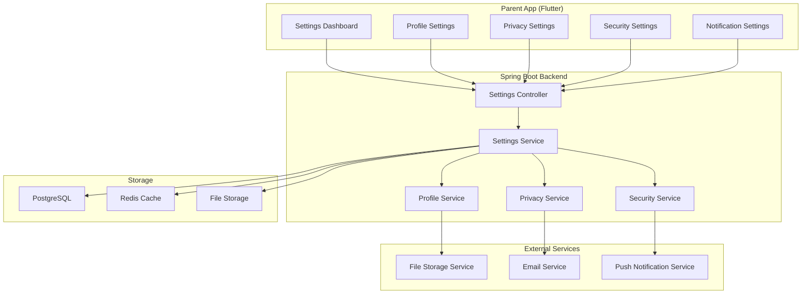
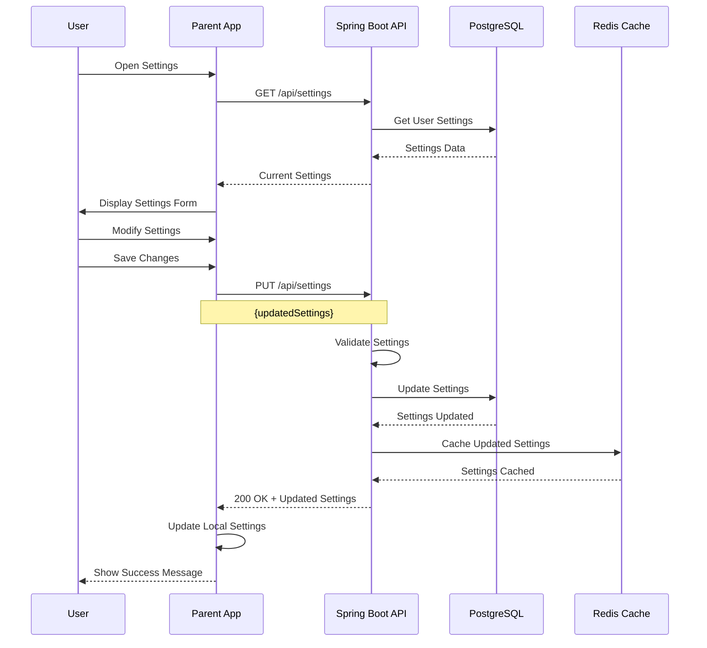
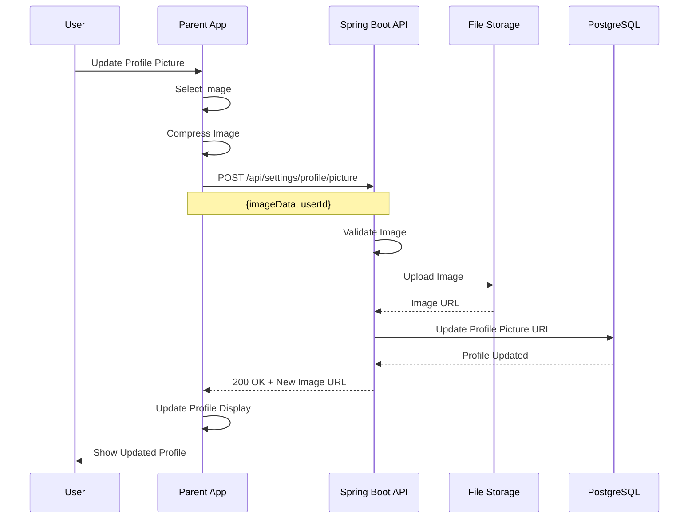
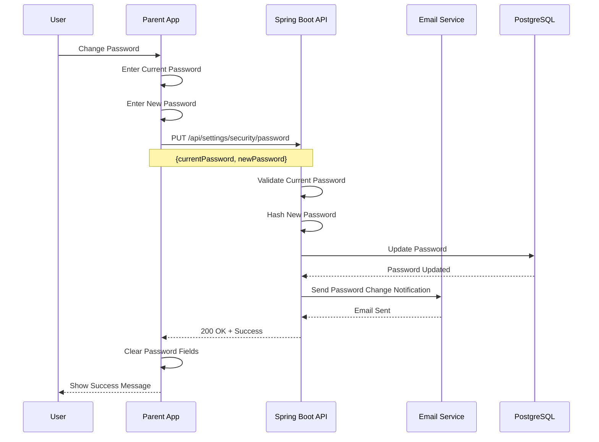

# Feature 08: Settings & Configuration

## Overview
This feature provides comprehensive settings and configuration management for the SafeGuard Parent App. It handles user preferences, app settings, privacy controls, security settings, and system configuration options.

## Table of Contents
1. [Feature Requirements](#feature-requirements)
2. [System Architecture](#system-architecture)
3. [Sequence Diagrams](#sequence-diagrams)
4. [API Specifications](#api-specifications)
5. [Database Design](#database-design)
6. [Frontend Implementation](#frontend-implementation)
7. [Backend Implementation](#backend-implementation)

---

## Feature Requirements

### Functional Requirements
- **FR-01**: Users can manage their profile information and preferences
- **FR-02**: Users can configure app-wide settings and preferences
- **FR-03**: Users can manage privacy and security settings
- **FR-04**: Users can configure notification preferences
- **FR-05**: Users can manage data and storage settings
- **FR-06**: Users can configure location and tracking settings
- **FR-07**: Users can manage account security and authentication
- **FR-08**: Users can export and backup their data
- **FR-09**: Users can manage app permissions and access controls
- **FR-10**: Users can configure system and performance settings

### Non-Functional Requirements
- **NFR-01**: Settings changes applied immediately
- **NFR-02**: Settings data synchronized across devices
- **NFR-03**: Settings changes logged for audit purposes
- **NFR-04**: Settings data encrypted and secured
- **NFR-05**: System supports settings backup and restore
- **NFR-06**: Settings validation and error handling

---

## System Architecture

### Component Diagram


---

## Sequence Diagrams

### Settings Update Flow


### Profile Update Flow


### Security Settings Flow


---

## API Specifications

### Endpoints Table
| Method | Endpoint | Description | Request Body | Response | Status Codes | Auth Required |
|--------|----------|-------------|--------------|----------|--------------|---------------|
| GET | `/api/settings` | Get user settings | None | `SettingsResponse` | 200, 401 | Yes |
| PUT | `/api/settings` | Update user settings | `SettingsRequest` | `MessageResponse` | 200, 400, 401 | Yes |
| GET | `/api/settings/profile` | Get profile settings | None | `ProfileResponse` | 200, 401 | Yes |
| PUT | `/api/settings/profile` | Update profile settings | `ProfileRequest` | `MessageResponse` | 200, 400, 401 | Yes |
| POST | `/api/settings/profile/picture` | Upload profile picture | `MultipartFile` | `ProfilePictureResponse` | 200, 400, 401 | Yes |
| GET | `/api/settings/privacy` | Get privacy settings | None | `PrivacyResponse` | 200, 401 | Yes |
| PUT | `/api/settings/privacy` | Update privacy settings | `PrivacyRequest` | `MessageResponse` | 200, 400, 401 | Yes |
| GET | `/api/settings/security` | Get security settings | None | `SecurityResponse` | 200, 401 | Yes |
| PUT | `/api/settings/security/password` | Change password | `PasswordChangeRequest` | `MessageResponse` | 200, 400, 401 | Yes |
| PUT | `/api/settings/security/2fa` | Enable/disable 2FA | `TwoFactorRequest` | `MessageResponse` | 200, 400, 401 | Yes |
| GET | `/api/settings/export` | Export user data | None | `DataExportResponse` | 200, 401 | Yes |
| DELETE | `/api/settings/account` | Delete account | `AccountDeletionRequest` | `MessageResponse` | 200, 400, 401 | Yes |

### Request/Response Models

#### SettingsRequest
```json
{
  "appSettings": {
    "theme": "LIGHT | DARK | SYSTEM",
    "language": "string",
    "timezone": "string",
    "dateFormat": "string",
    "timeFormat": "12H | 24H",
    "autoSync": "boolean",
    "syncFrequency": "number"
  },
  "notificationSettings": {
    "pushEnabled": "boolean",
    "emailEnabled": "boolean",
    "smsEnabled": "boolean",
    "quietHours": {
      "enabled": "boolean",
      "startTime": "string",
      "endTime": "string",
      "daysOfWeek": ["string"]
    }
  },
  "locationSettings": {
    "trackingEnabled": "boolean",
    "accuracyLevel": "LOW | MEDIUM | HIGH",
    "updateFrequency": "number",
    "backgroundTracking": "boolean"
  },
  "privacySettings": {
    "dataSharing": "boolean",
    "analyticsEnabled": "boolean",
    "crashReporting": "boolean",
    "adPersonalization": "boolean"
  }
}
```

#### ProfileRequest
```json
{
  "firstName": "string",
  "lastName": "string",
  "email": "string",
  "phone": "string",
  "dateOfBirth": "date",
  "gender": "MALE | FEMALE | OTHER",
  "address": {
    "street": "string",
    "city": "string",
    "state": "string",
    "country": "string",
    "postalCode": "string"
  },
  "emergencyContacts": [
    {
      "name": "string",
      "phone": "string",
      "relationship": "string"
    }
  ]
}
```

#### SecurityResponse
```json
{
  "twoFactorEnabled": "boolean",
  "twoFactorMethod": "SMS | EMAIL | AUTHENTICATOR",
  "lastPasswordChange": "datetime",
  "loginHistory": [
    {
      "timestamp": "datetime",
      "ipAddress": "string",
      "device": "string",
      "location": "string"
    }
  ],
  "activeSessions": [
    {
      "sessionId": "string",
      "device": "string",
      "ipAddress": "string",
      "lastActive": "datetime"
    }
  ],
  "securityQuestions": [
    {
      "question": "string",
      "isSet": "boolean"
    }
  ]
}
```

---

## Database Design

### User Settings Table
```sql
CREATE TABLE user_settings (
    id BIGSERIAL PRIMARY KEY,
    user_id BIGINT NOT NULL REFERENCES users(id) ON DELETE CASCADE,
    theme VARCHAR(10) NOT NULL DEFAULT 'SYSTEM',
    language VARCHAR(10) NOT NULL DEFAULT 'en',
    timezone VARCHAR(50) NOT NULL DEFAULT 'UTC',
    date_format VARCHAR(20) NOT NULL DEFAULT 'MM/DD/YYYY',
    time_format VARCHAR(5) NOT NULL DEFAULT '12H',
    auto_sync BOOLEAN NOT NULL DEFAULT true,
    sync_frequency INTEGER NOT NULL DEFAULT 300,
    push_enabled BOOLEAN NOT NULL DEFAULT true,
    email_enabled BOOLEAN NOT NULL DEFAULT true,
    sms_enabled BOOLEAN NOT NULL DEFAULT false,
    quiet_hours_enabled BOOLEAN NOT NULL DEFAULT false,
    quiet_hours_start TIME,
    quiet_hours_end TIME,
    quiet_hours_days JSONB,
    tracking_enabled BOOLEAN NOT NULL DEFAULT true,
    accuracy_level VARCHAR(10) NOT NULL DEFAULT 'MEDIUM',
    update_frequency INTEGER NOT NULL DEFAULT 30,
    background_tracking BOOLEAN NOT NULL DEFAULT true,
    data_sharing BOOLEAN NOT NULL DEFAULT false,
    analytics_enabled BOOLEAN NOT NULL DEFAULT true,
    crash_reporting BOOLEAN NOT NULL DEFAULT true,
    ad_personalization BOOLEAN NOT NULL DEFAULT false,
    created_at TIMESTAMP NOT NULL DEFAULT CURRENT_TIMESTAMP,
    updated_at TIMESTAMP NOT NULL DEFAULT CURRENT_TIMESTAMP
);

CREATE UNIQUE INDEX idx_user_settings_user_id ON user_settings(user_id);
```

### User Profiles Table
```sql
CREATE TABLE user_profiles (
    id BIGSERIAL PRIMARY KEY,
    user_id BIGINT NOT NULL REFERENCES users(id) ON DELETE CASCADE,
    first_name VARCHAR(100),
    last_name VARCHAR(100),
    profile_picture_url VARCHAR(500),
    date_of_birth DATE,
    gender VARCHAR(10) CHECK (gender IN ('MALE', 'FEMALE', 'OTHER')),
    address_street VARCHAR(255),
    address_city VARCHAR(100),
    address_state VARCHAR(100),
    address_country VARCHAR(100),
    address_postal_code VARCHAR(20),
    bio TEXT,
    created_at TIMESTAMP NOT NULL DEFAULT CURRENT_TIMESTAMP,
    updated_at TIMESTAMP NOT NULL DEFAULT CURRENT_TIMESTAMP
);

CREATE UNIQUE INDEX idx_user_profiles_user_id ON user_profiles(user_id);
```

### Security Settings Table
```sql
CREATE TABLE security_settings (
    id BIGSERIAL PRIMARY KEY,
    user_id BIGINT NOT NULL REFERENCES users(id) ON DELETE CASCADE,
    two_factor_enabled BOOLEAN NOT NULL DEFAULT false,
    two_factor_method VARCHAR(20),
    two_factor_secret VARCHAR(255),
    last_password_change TIMESTAMP,
    password_reset_token VARCHAR(255),
    password_reset_expires TIMESTAMP,
    failed_login_attempts INTEGER NOT NULL DEFAULT 0,
    account_locked_until TIMESTAMP,
    created_at TIMESTAMP NOT NULL DEFAULT CURRENT_TIMESTAMP,
    updated_at TIMESTAMP NOT NULL DEFAULT CURRENT_TIMESTAMP
);

CREATE UNIQUE INDEX idx_security_settings_user_id ON security_settings(user_id);
```

### Login History Table
```sql
CREATE TABLE login_history (
    id BIGSERIAL PRIMARY KEY,
    user_id BIGINT NOT NULL REFERENCES users(id) ON DELETE CASCADE,
    login_timestamp TIMESTAMP NOT NULL,
    ip_address VARCHAR(45) NOT NULL,
    user_agent TEXT,
    device_type VARCHAR(20),
    location VARCHAR(100),
    success BOOLEAN NOT NULL DEFAULT true,
    failure_reason VARCHAR(100),
    created_at TIMESTAMP NOT NULL DEFAULT CURRENT_TIMESTAMP
);

CREATE INDEX idx_login_history_user_id ON login_history(user_id);
CREATE INDEX idx_login_history_timestamp ON login_history(login_timestamp);
CREATE INDEX idx_login_history_ip ON login_history(ip_address);
```

### Emergency Contacts Table
```sql
CREATE TABLE emergency_contacts (
    id BIGSERIAL PRIMARY KEY,
    user_id BIGINT NOT NULL REFERENCES users(id) ON DELETE CASCADE,
    name VARCHAR(100) NOT NULL,
    phone VARCHAR(20) NOT NULL,
    email VARCHAR(255),
    relationship VARCHAR(50) NOT NULL,
    is_primary BOOLEAN NOT NULL DEFAULT false,
    created_at TIMESTAMP NOT NULL DEFAULT CURRENT_TIMESTAMP
);

CREATE INDEX idx_emergency_contacts_user_id ON emergency_contacts(user_id);
```

---

## Frontend Implementation (Flutter)

### Project Structure
```
lib/features/settings/
├── data/
│   ├── datasources/
│   │   ├── settings_local_datasource.dart
│   │   └── settings_remote_datasource.dart
│   ├── models/
│   │   ├── settings_model.dart
│   │   ├── profile_model.dart
│   │   └── security_model.dart
│   └── repositories/
│       └── settings_repository_impl.dart
├── domain/
│   ├── entities/
│   │   ├── settings.dart
│   │   ├── profile.dart
│   │   └── security.dart
│   ├── repositories/
│   │   └── settings_repository.dart
│   └── usecases/
│       ├── update_settings_usecase.dart
│       ├── update_profile_usecase.dart
│       └── change_password_usecase.dart
└── presentation/
    ├── pages/
    │   ├── settings_page.dart
    │   ├── profile_settings_page.dart
    │   ├── privacy_settings_page.dart
    │   ├── security_settings_page.dart
    │   └── data_export_page.dart
    ├── widgets/
    │   ├── settings_section.dart
    │   ├── settings_tile.dart
    │   └── profile_picture_widget.dart
    └── providers/
        └── settings_provider.dart
```

### Key Dependencies
```yaml
dependencies:
  # State management
  flutter_riverpod: ^2.4.0
  
  # UI components
  flutter_form_builder: ^9.1.1
  form_builder_validators: ^9.1.0
  
  # Image handling
  image_picker: ^1.0.4
  cached_network_image: ^3.3.0
  
  # HTTP client
  dio: ^5.3.2
  
  # Local storage
  shared_preferences: ^2.2.2
  
  # File handling
  path_provider: ^2.1.1
```

### Core Implementation

#### Settings Provider (Riverpod)
```dart
class SettingsNotifier extends StateNotifier<SettingsState> {
  final UpdateSettingsUsecase _updateSettingsUsecase;
  final UpdateProfileUsecase _updateProfileUsecase;
  final ChangePasswordUsecase _changePasswordUsecase;

  SettingsNotifier(
    this._updateSettingsUsecase,
    this._updateProfileUsecase,
    this._changePasswordUsecase,
  ) : super(SettingsInitial());

  Future<void> updateSettings(Settings settings) async {
    state = SettingsLoading();
    
    final result = await _updateSettingsUsecase(UpdateSettingsParams(settings: settings));

    result.fold(
      (failure) => state = SettingsError(failure.message),
      (updatedSettings) => state = SettingsLoaded(updatedSettings),
    );
  }

  Future<void> updateProfile(Profile profile) async {
    state = SettingsLoading();
    
    final result = await _updateProfileUsecase(UpdateProfileParams(profile: profile));

    result.fold(
      (failure) => state = SettingsError(failure.message),
      (updatedProfile) {
        if (state is SettingsLoaded) {
          final currentState = state as SettingsLoaded;
          state = SettingsLoaded(
            settings: currentState.settings,
            profile: updatedProfile,
            security: currentState.security,
          );
        }
      },
    );
  }

  Future<void> changePassword(String currentPassword, String newPassword) async {
    state = SettingsLoading();
    
    final result = await _changePasswordUsecase(ChangePasswordParams(
      currentPassword: currentPassword,
      newPassword: newPassword,
    ));

    result.fold(
      (failure) => state = SettingsError(failure.message),
      (_) => _refreshSettings(),
    );
  }

  Future<void> _refreshSettings() async {
    // Refresh settings logic
  }
}
```

#### Settings Page Widget
```dart
class SettingsPage extends ConsumerWidget {
  const SettingsPage({Key? key}) : super(key: key);

  @override
  Widget build(BuildContext context, WidgetRef ref) {
    final settingsState = ref.watch(settingsProvider);

    return Scaffold(
      appBar: AppBar(
        title: const Text('Settings'),
        actions: [
          IconButton(
            icon: const Icon(Icons.help_outline),
            onPressed: () => _showHelp(context),
          ),
        ],
      ),
      body: _buildBody(settingsState),
    );
  }

  Widget _buildBody(SettingsState state) {
    if (state is SettingsLoading) {
      return const Center(child: CircularProgressIndicator());
    }
    
    if (state is SettingsError) {
      return Center(
        child: Column(
          mainAxisAlignment: MainAxisAlignment.center,
          children: [
            Icon(Icons.error, size: 64, color: Colors.red.shade300),
            const SizedBox(height: 16),
            Text(
              'Error loading settings',
              style: Theme.of(context).textTheme.headlineSmall,
            ),
            const SizedBox(height: 8),
            Text(
              state.message,
              style: Theme.of(context).textTheme.bodyMedium,
              textAlign: TextAlign.center,
            ),
          ],
        ),
      );
    }
    
    if (state is SettingsLoaded) {
      return ListView(
        children: [
          // Profile Section
          SettingsSection(
            title: 'Profile',
            children: [
              SettingsTile(
                leading: CircleAvatar(
                  backgroundImage: state.profile.profilePictureUrl != null
                      ? CachedNetworkImageProvider(state.profile.profilePictureUrl!)
                      : null,
                  child: state.profile.profilePictureUrl == null
                      ? Text(state.profile.firstName.substring(0, 1).toUpperCase())
                      : null,
                ),
                title: '${state.profile.firstName} ${state.profile.lastName}',
                subtitle: state.profile.email,
                trailing: const Icon(Icons.chevron_right),
                onTap: () => _openProfileSettings(context),
              ),
            ],
          ),
          
          // App Settings Section
          SettingsSection(
            title: 'App Settings',
            children: [
              SettingsTile(
                leading: const Icon(Icons.palette),
                title: 'Theme',
                subtitle: state.settings.appSettings.theme,
                trailing: const Icon(Icons.chevron_right),
                onTap: () => _openThemeSettings(context),
              ),
              SettingsTile(
                leading: const Icon(Icons.language),
                title: 'Language',
                subtitle: state.settings.appSettings.language,
                trailing: const Icon(Icons.chevron_right),
                onTap: () => _openLanguageSettings(context),
              ),
              SettingsTile(
                leading: const Icon(Icons.sync),
                title: 'Auto Sync',
                subtitle: state.settings.appSettings.autoSync ? 'Enabled' : 'Disabled',
                trailing: Switch(
                  value: state.settings.appSettings.autoSync,
                  onChanged: (value) => _toggleAutoSync(value),
                ),
              ),
            ],
          ),
          
          // Notification Settings Section
          SettingsSection(
            title: 'Notifications',
            children: [
              SettingsTile(
                leading: const Icon(Icons.notifications),
                title: 'Push Notifications',
                subtitle: state.settings.notificationSettings.pushEnabled ? 'Enabled' : 'Disabled',
                trailing: Switch(
                  value: state.settings.notificationSettings.pushEnabled,
                  onChanged: (value) => _togglePushNotifications(value),
                ),
              ),
              SettingsTile(
                leading: const Icon(Icons.email),
                title: 'Email Notifications',
                subtitle: state.settings.notificationSettings.emailEnabled ? 'Enabled' : 'Disabled',
                trailing: Switch(
                  value: state.settings.notificationSettings.emailEnabled,
                  onChanged: (value) => _toggleEmailNotifications(value),
                ),
              ),
              SettingsTile(
                leading: const Icon(Icons.schedule),
                title: 'Quiet Hours',
                subtitle: state.settings.notificationSettings.quietHours.enabled ? 'Enabled' : 'Disabled',
                trailing: const Icon(Icons.chevron_right),
                onTap: () => _openQuietHoursSettings(context),
              ),
            ],
          ),
          
          // Privacy Settings Section
          SettingsSection(
            title: 'Privacy & Security',
            children: [
              SettingsTile(
                leading: const Icon(Icons.privacy_tip),
                title: 'Privacy Settings',
                trailing: const Icon(Icons.chevron_right),
                onTap: () => _openPrivacySettings(context),
              ),
              SettingsTile(
                leading: const Icon(Icons.security),
                title: 'Security Settings',
                trailing: const Icon(Icons.chevron_right),
                onTap: () => _openSecuritySettings(context),
              ),
              SettingsTile(
                leading: const Icon(Icons.location_on),
                title: 'Location Settings',
                subtitle: state.settings.locationSettings.trackingEnabled ? 'Enabled' : 'Disabled',
                trailing: Switch(
                  value: state.settings.locationSettings.trackingEnabled,
                  onChanged: (value) => _toggleLocationTracking(value),
                ),
              ),
            ],
          ),
          
          // Data Management Section
          SettingsSection(
            title: 'Data Management',
            children: [
              SettingsTile(
                leading: const Icon(Icons.download),
                title: 'Export Data',
                trailing: const Icon(Icons.chevron_right),
                onTap: () => _openDataExport(context),
              ),
              SettingsTile(
                leading: const Icon(Icons.backup),
                title: 'Backup Settings',
                trailing: const Icon(Icons.chevron_right),
                onTap: () => _openBackupSettings(context),
              ),
              SettingsTile(
                leading: const Icon(Icons.delete_forever),
                title: 'Delete Account',
                trailing: const Icon(Icons.chevron_right),
                onTap: () => _showDeleteAccountDialog(context),
              ),
            ],
          ),
          
          // Support Section
          SettingsSection(
            title: 'Support',
            children: [
              SettingsTile(
                leading: const Icon(Icons.help),
                title: 'Help & Support',
                trailing: const Icon(Icons.chevron_right),
                onTap: () => _openHelp(context),
              ),
              SettingsTile(
                leading: const Icon(Icons.info),
                title: 'About',
                trailing: const Icon(Icons.chevron_right),
                onTap: () => _openAbout(context),
              ),
              SettingsTile(
                leading: const Icon(Icons.bug_report),
                title: 'Report Bug',
                trailing: const Icon(Icons.chevron_right),
                onTap: () => _openBugReport(context),
              ),
            ],
          ),
        ],
      ),
    );
  }

  void _openProfileSettings(BuildContext context) {
    Navigator.push(
      context,
      MaterialPageRoute(
        builder: (context) => const ProfileSettingsPage(),
      ),
    );
  }

  void _openThemeSettings(BuildContext context) {
    showDialog(
      context: context,
      builder: (context) => ThemeSettingsDialog(),
    );
  }

  void _openLanguageSettings(BuildContext context) {
    showDialog(
      context: context,
      builder: (context) => LanguageSettingsDialog(),
    );
  }

  void _openQuietHoursSettings(BuildContext context) {
    Navigator.push(
      context,
      MaterialPageRoute(
        builder: (context) => const QuietHoursSettingsPage(),
      ),
    );
  }

  void _openPrivacySettings(BuildContext context) {
    Navigator.push(
      context,
      MaterialPageRoute(
        builder: (context) => const PrivacySettingsPage(),
      ),
    );
  }

  void _openSecuritySettings(BuildContext context) {
    Navigator.push(
      context,
      MaterialPageRoute(
        builder: (context) => const SecuritySettingsPage(),
      ),
    );
  }

  void _openDataExport(BuildContext context) {
    Navigator.push(
      context,
      MaterialPageRoute(
        builder: (context) => const DataExportPage(),
      ),
    );
  }

  void _openBackupSettings(BuildContext context) {
    // Open backup settings
  }

  void _openHelp(BuildContext context) {
    // Open help
  }

  void _openAbout(BuildContext context) {
    showAboutDialog(
      context: context,
      applicationName: 'SafeGuard Parent App',
      applicationVersion: '1.0.0',
      applicationIcon: const Icon(Icons.security),
    );
  }

  void _openBugReport(BuildContext context) {
    // Open bug report
  }

  void _showDeleteAccountDialog(BuildContext context) {
    showDialog(
      context: context,
      builder: (context) => AlertDialog(
        title: const Text('Delete Account'),
        content: const Text(
          'Are you sure you want to delete your account? This action cannot be undone.',
        ),
        actions: [
          TextButton(
            onPressed: () => Navigator.pop(context),
            child: const Text('Cancel'),
          ),
          TextButton(
            onPressed: () {
              Navigator.pop(context);
              _deleteAccount();
            },
            child: const Text('Delete', style: TextStyle(color: Colors.red)),
          ),
        ],
      ),
    );
  }

  void _toggleAutoSync(bool value) {
    // Toggle auto sync
  }

  void _togglePushNotifications(bool value) {
    // Toggle push notifications
  }

  void _toggleEmailNotifications(bool value) {
    // Toggle email notifications
  }

  void _toggleLocationTracking(bool value) {
    // Toggle location tracking
  }

  void _deleteAccount() {
    // Delete account
  }

  void _showHelp(BuildContext context) {
    // Show help
  }
}
```

---

## Backend Implementation (Spring Boot)

### Project Structure
```
src/main/java/com/safeguard/parentapp/settings/
├── controller/
│   └── SettingsController.java
├── dto/
│   ├── request/
│   │   ├── SettingsRequest.java
│   │   └── ProfileRequest.java
│   └── response/
│       ├── SettingsResponse.java
│       └── ProfileResponse.java
├── entity/
│   ├── UserSettings.java
│   ├── UserProfile.java
│   └── SecuritySettings.java
├── repository/
│   ├── UserSettingsRepository.java
│   ├── UserProfileRepository.java
│   └── SecuritySettingsRepository.java
├── service/
│   ├── SettingsService.java
│   ├── ProfileService.java
│   ├── SecurityService.java
│   └── DataExportService.java
└── config/
    └── SecurityConfig.java
```

### Core Implementation

#### Settings Service
```java
@Service
@RequiredArgsConstructor
@Transactional
public class SettingsService {
    
    private final UserSettingsRepository settingsRepository;
    private final UserProfileRepository profileRepository;
    private final SecuritySettingsRepository securityRepository;
    private final FileStorageService fileStorageService;
    private final JwtService jwtService;
    
    public SettingsResponse getSettings(String token) {
        Long userId = jwtService.getUserIdFromToken(token);
        
        UserSettings settings = settingsRepository.findByUserId(userId)
                .orElse(getDefaultSettings(userId));
        
        UserProfile profile = profileRepository.findByUserId(userId)
                .orElse(getDefaultProfile(userId));
        
        SecuritySettings security = securityRepository.findByUserId(userId)
                .orElse(getDefaultSecuritySettings(userId));
        
        return SettingsResponse.builder()
                .appSettings(mapToAppSettings(settings))
                .notificationSettings(mapToNotificationSettings(settings))
                .locationSettings(mapToLocationSettings(settings))
                .privacySettings(mapToPrivacySettings(settings))
                .profile(mapToProfileResponse(profile))
                .security(mapToSecurityResponse(security))
                .build();
    }
    
    public MessageResponse updateSettings(SettingsRequest request, String token) {
        Long userId = jwtService.getUserIdFromToken(token);
        
        UserSettings settings = settingsRepository.findByUserId(userId)
                .orElse(UserSettings.builder().userId(userId).build());
        
        // Update app settings
        if (request.getAppSettings() != null) {
            settings.setTheme(request.getAppSettings().getTheme());
            settings.setLanguage(request.getAppSettings().getLanguage());
            settings.setTimezone(request.getAppSettings().getTimezone());
            settings.setDateFormat(request.getAppSettings().getDateFormat());
            settings.setTimeFormat(request.getAppSettings().getTimeFormat());
            settings.setAutoSync(request.getAppSettings().getAutoSync());
            settings.setSyncFrequency(request.getAppSettings().getSyncFrequency());
        }
        
        // Update notification settings
        if (request.getNotificationSettings() != null) {
            settings.setPushEnabled(request.getNotificationSettings().getPushEnabled());
            settings.setEmailEnabled(request.getNotificationSettings().getEmailEnabled());
            settings.setSmsEnabled(request.getNotificationSettings().getSmsEnabled());
            
            if (request.getNotificationSettings().getQuietHours() != null) {
                settings.setQuietHoursEnabled(request.getNotificationSettings().getQuietHours().getEnabled());
                settings.setQuietHoursStart(request.getNotificationSettings().getQuietHours().getStartTime());
                settings.setQuietHoursEnd(request.getNotificationSettings().getQuietHours().getEndTime());
                settings.setQuietHoursDays(request.getNotificationSettings().getQuietHours().getDaysOfWeek());
            }
        }
        
        // Update location settings
        if (request.getLocationSettings() != null) {
            settings.setTrackingEnabled(request.getLocationSettings().getTrackingEnabled());
            settings.setAccuracyLevel(request.getLocationSettings().getAccuracyLevel());
            settings.setUpdateFrequency(request.getLocationSettings().getUpdateFrequency());
            settings.setBackgroundTracking(request.getLocationSettings().getBackgroundTracking());
        }
        
        // Update privacy settings
        if (request.getPrivacySettings() != null) {
            settings.setDataSharing(request.getPrivacySettings().getDataSharing());
            settings.setAnalyticsEnabled(request.getPrivacySettings().getAnalyticsEnabled());
            settings.setCrashReporting(request.getPrivacySettings().getCrashReporting());
            settings.setAdPersonalization(request.getPrivacySettings().getAdPersonalization());
        }
        
        settingsRepository.save(settings);
        
        return MessageResponse.builder()
                .success(true)
                .message("Settings updated successfully")
                .timestamp(LocalDateTime.now())
                .build();
    }
    
    public MessageResponse updateProfile(ProfileRequest request, String token) {
        Long userId = jwtService.getUserIdFromToken(token);
        
        UserProfile profile = profileRepository.findByUserId(userId)
                .orElse(UserProfile.builder().userId(userId).build());
        
        // Update profile information
        profile.setFirstName(request.getFirstName());
        profile.setLastName(request.getLastName());
        profile.setDateOfBirth(request.getDateOfBirth());
        profile.setGender(request.getGender());
        
        if (request.getAddress() != null) {
            profile.setAddressStreet(request.getAddress().getStreet());
            profile.setAddressCity(request.getAddress().getCity());
            profile.setAddressState(request.getAddress().getState());
            profile.setAddressCountry(request.getAddress().getCountry());
            profile.setAddressPostalCode(request.getAddress().getPostalCode());
        }
        
        profileRepository.save(profile);
        
        // Update emergency contacts
        if (request.getEmergencyContacts() != null) {
            updateEmergencyContacts(userId, request.getEmergencyContacts());
        }
        
        return MessageResponse.builder()
                .success(true)
                .message("Profile updated successfully")
                .timestamp(LocalDateTime.now())
                .build();
    }
    
    public ProfilePictureResponse uploadProfilePicture(MultipartFile file, String token) {
        Long userId = jwtService.getUserIdFromToken(token);
        
        // Validate file
        if (file.isEmpty()) {
            throw new RuntimeException("File is empty");
        }
        
        if (file.getSize() > 5 * 1024 * 1024) { // 5MB limit
            throw new RuntimeException("File size too large");
        }
        
        String contentType = file.getContentType();
        if (contentType == null || (!contentType.equals("image/jpeg") && !contentType.equals("image/png"))) {
            throw new RuntimeException("Invalid file type");
        }
        
        // Upload file
        String fileName = "profile_" + userId + "_" + System.currentTimeMillis() + ".jpg";
        String fileUrl = fileStorageService.uploadFile(file, fileName);
        
        // Update profile
        UserProfile profile = profileRepository.findByUserId(userId)
                .orElse(UserProfile.builder().userId(userId).build());
        
        profile.setProfilePictureUrl(fileUrl);
        profileRepository.save(profile);
        
        return ProfilePictureResponse.builder()
                .success(true)
                .message("Profile picture updated successfully")
                .profilePictureUrl(fileUrl)
                .build();
    }
    
    public MessageResponse changePassword(PasswordChangeRequest request, String token) {
        Long userId = jwtService.getUserIdFromToken(token);
        
        User user = userRepository.findById(userId)
                .orElseThrow(() -> new RuntimeException("User not found"));
        
        // Verify current password
        if (!passwordEncoder.matches(request.getCurrentPassword(), user.getPassword())) {
            throw new RuntimeException("Current password is incorrect");
        }
        
        // Validate new password
        if (request.getNewPassword().length() < 8) {
            throw new RuntimeException("New password must be at least 8 characters long");
        }
        
        // Update password
        user.setPassword(passwordEncoder.encode(request.getNewPassword()));
        userRepository.save(user);
        
        // Update security settings
        SecuritySettings security = securityRepository.findByUserId(userId)
                .orElse(SecuritySettings.builder().userId(userId).build());
        
        security.setLastPasswordChange(LocalDateTime.now());
        securityRepository.save(security);
        
        // Send password change notification
        sendPasswordChangeNotification(user);
        
        return MessageResponse.builder()
                .success(true)
                .message("Password changed successfully")
                .timestamp(LocalDateTime.now())
                .build();
    }
    
    public DataExportResponse exportUserData(String token) {
        Long userId = jwtService.getUserIdFromToken(token);
        
        // Get all user data
        User user = userRepository.findById(userId)
                .orElseThrow(() -> new RuntimeException("User not found"));
        
        UserProfile profile = profileRepository.findByUserId(userId).orElse(null);
        UserSettings settings = settingsRepository.findByUserId(userId).orElse(null);
        SecuritySettings security = securityRepository.findByUserId(userId).orElse(null);
        
        // Create export data
        Map<String, Object> exportData = new HashMap<>();
        exportData.put("user", user);
        exportData.put("profile", profile);
        exportData.put("settings", settings);
        exportData.put("security", security);
        exportData.put("exportDate", LocalDateTime.now());
        
        // Generate export file
        String fileName = "user_data_export_" + userId + "_" + System.currentTimeMillis() + ".json";
        String fileUrl = fileStorageService.uploadJsonFile(exportData, fileName);
        
        return DataExportResponse.builder()
                .success(true)
                .message("Data export completed")
                .downloadUrl(fileUrl)
                .expiresAt(LocalDateTime.now().plusDays(7))
                .build();
    }
    
    public MessageResponse deleteAccount(AccountDeletionRequest request, String token) {
        Long userId = jwtService.getUserIdFromToken(token);
        
        User user = userRepository.findById(userId)
                .orElseThrow(() -> new RuntimeException("User not found"));
        
        // Verify password
        if (!passwordEncoder.matches(request.getPassword(), user.getPassword())) {
            throw new RuntimeException("Password is incorrect");
        }
        
        // Soft delete user
        user.setIsActive(false);
        user.setDeletedAt(LocalDateTime.now());
        userRepository.save(user);
        
        // Send account deletion notification
        sendAccountDeletionNotification(user);
        
        return MessageResponse.builder()
                .success(true)
                .message("Account deleted successfully")
                .timestamp(LocalDateTime.now())
                .build();
    }
    
    private void updateEmergencyContacts(Long userId, List<EmergencyContactRequest> contacts) {
        // Implementation to update emergency contacts
    }
    
    private void sendPasswordChangeNotification(User user) {
        // Implementation to send password change notification
    }
    
    private void sendAccountDeletionNotification(User user) {
        // Implementation to send account deletion notification
    }
    
    private UserSettings getDefaultSettings(Long userId) {
        return UserSettings.builder()
                .userId(userId)
                .theme("SYSTEM")
                .language("en")
                .timezone("UTC")
                .dateFormat("MM/DD/YYYY")
                .timeFormat("12H")
                .autoSync(true)
                .syncFrequency(300)
                .pushEnabled(true)
                .emailEnabled(true)
                .smsEnabled(false)
                .quietHoursEnabled(false)
                .trackingEnabled(true)
                .accuracyLevel("MEDIUM")
                .updateFrequency(30)
                .backgroundTracking(true)
                .dataSharing(false)
                .analyticsEnabled(true)
                .crashReporting(true)
                .adPersonalization(false)
                .build();
    }
    
    private UserProfile getDefaultProfile(Long userId) {
        return UserProfile.builder()
                .userId(userId)
                .build();
    }
    
    private SecuritySettings getDefaultSecuritySettings(Long userId) {
        return SecuritySettings.builder()
                .userId(userId)
                .twoFactorEnabled(false)
                .failedLoginAttempts(0)
                .build();
    }
    
    // Mapping methods
    private AppSettings mapToAppSettings(UserSettings settings) {
        return AppSettings.builder()
                .theme(settings.getTheme())
                .language(settings.getLanguage())
                .timezone(settings.getTimezone())
                .dateFormat(settings.getDateFormat())
                .timeFormat(settings.getTimeFormat())
                .autoSync(settings.getAutoSync())
                .syncFrequency(settings.getSyncFrequency())
                .build();
    }
    
    private NotificationSettings mapToNotificationSettings(UserSettings settings) {
        return NotificationSettings.builder()
                .pushEnabled(settings.getPushEnabled())
                .emailEnabled(settings.getEmailEnabled())
                .smsEnabled(settings.getSmsEnabled())
                .quietHours(QuietHours.builder()
                        .enabled(settings.getQuietHoursEnabled())
                        .startTime(settings.getQuietHoursStart())
                        .endTime(settings.getQuietHoursEnd())
                        .daysOfWeek(settings.getQuietHoursDays())
                        .build())
                .build();
    }
    
    private LocationSettings mapToLocationSettings(UserSettings settings) {
        return LocationSettings.builder()
                .trackingEnabled(settings.getTrackingEnabled())
                .accuracyLevel(settings.getAccuracyLevel())
                .updateFrequency(settings.getUpdateFrequency())
                .backgroundTracking(settings.getBackgroundTracking())
                .build();
    }
    
    private PrivacySettings mapToPrivacySettings(UserSettings settings) {
        return PrivacySettings.builder()
                .dataSharing(settings.getDataSharing())
                .analyticsEnabled(settings.getAnalyticsEnabled())
                .crashReporting(settings.getCrashReporting())
                .adPersonalization(settings.getAdPersonalization())
                .build();
    }
    
    private ProfileResponse mapToProfileResponse(UserProfile profile) {
        return ProfileResponse.builder()
                .firstName(profile.getFirstName())
                .lastName(profile.getLastName())
                .email(profile.getUser().getEmail())
                .phone(profile.getUser().getPhone())
                .profilePictureUrl(profile.getProfilePictureUrl())
                .dateOfBirth(profile.getDateOfBirth())
                .gender(profile.getGender())
                .address(Address.builder()
                        .street(profile.getAddressStreet())
                        .city(profile.getAddressCity())
                        .state(profile.getAddressState())
                        .country(profile.getAddressCountry())
                        .postalCode(profile.getAddressPostalCode())
                        .build())
                .bio(profile.getBio())
                .build();
    }
    
    private SecurityResponse mapToSecurityResponse(SecuritySettings security) {
        return SecurityResponse.builder()
                .twoFactorEnabled(security.getTwoFactorEnabled())
                .twoFactorMethod(security.getTwoFactorMethod())
                .lastPasswordChange(security.getLastPasswordChange())
                .build();
    }
}
```

---

## Security Considerations

### Settings Security
- **Data Encryption**: Settings data encrypted in transit and at rest
- **Access Control**: Users can only access their own settings
- **Audit Logging**: Track all settings changes
- **Validation**: All settings validated before saving

### Privacy Compliance
- **Data Minimization**: Only necessary settings collected
- **Consent Management**: Clear consent for data collection
- **Right to Delete**: Users can delete their settings
- **Transparency**: Clear information about settings usage

---

## Testing Strategy

### Unit Tests
- **Service Layer**: Test settings management business logic
- **Validation**: Test settings validation and constraints
- **Security**: Test security settings functionality

### Integration Tests
- **API Endpoints**: Test settings CRUD operations
- **File Upload**: Test profile picture upload
- **Data Export**: Test data export functionality

### Performance Tests
- **Settings Load**: Test settings loading performance
- **File Upload**: Test profile picture upload performance
- **Data Export**: Test large data export performance

This comprehensive feature documentation provides everything needed to implement the Settings & Configuration feature for the SafeGuard Parent App.
