# SafeGuard Parent App - Authentication Design Document

## Project Overview
This document provides comprehensive design diagrams for the authentication system of the SafeGuard Parent App, including user registration, login, and forgot password functionality. The diagrams ensure proper flow understanding and system integration for the graduation doctoral project.

---

## Table of Contents
1. [System Architecture Overview](#system-architecture-overview)
2. [User Registration Flow](#user-registration-flow)
3. [User Login Flow](#user-login-flow)
4. [Forgot Password Flow](#forgot-password-flow)
5. [Activity Diagrams](#activity-diagrams)
6. [State Diagrams](#state-diagrams)
7. [Class Diagrams](#class-diagrams)
8. [API Design](#api-design)
9. [Security Considerations](#security-considerations)
10. [Error Handling](#error-handling)

---

## System Architecture Overview

### High-Level Architecture
```
┌─────────────────┐    ┌─────────────────┐    ┌─────────────────┐
│   Parent App    │    │   Backend API   │    │   Database      │
│   (Flutter)     │◄──►│   (Spring Boot) │◄──►│   (PostgreSQL)  │
└─────────────────┘    └─────────────────┘    └─────────────────┘
         │                       │                       │
         │                       │                       │
         ▼                       ▼                       ▼
┌─────────────────┐    ┌─────────────────┐    ┌─────────────────┐
│   Child App     │    │   Auth Service  │    │   Redis Cache   │
│   (Flutter)     │    │   (JWT/OAuth)   │    │   (Sessions)    │
└─────────────────┘    └─────────────────┘    └─────────────────┘
```

---

## User Registration Flow

### Sequence Diagram - User Registration

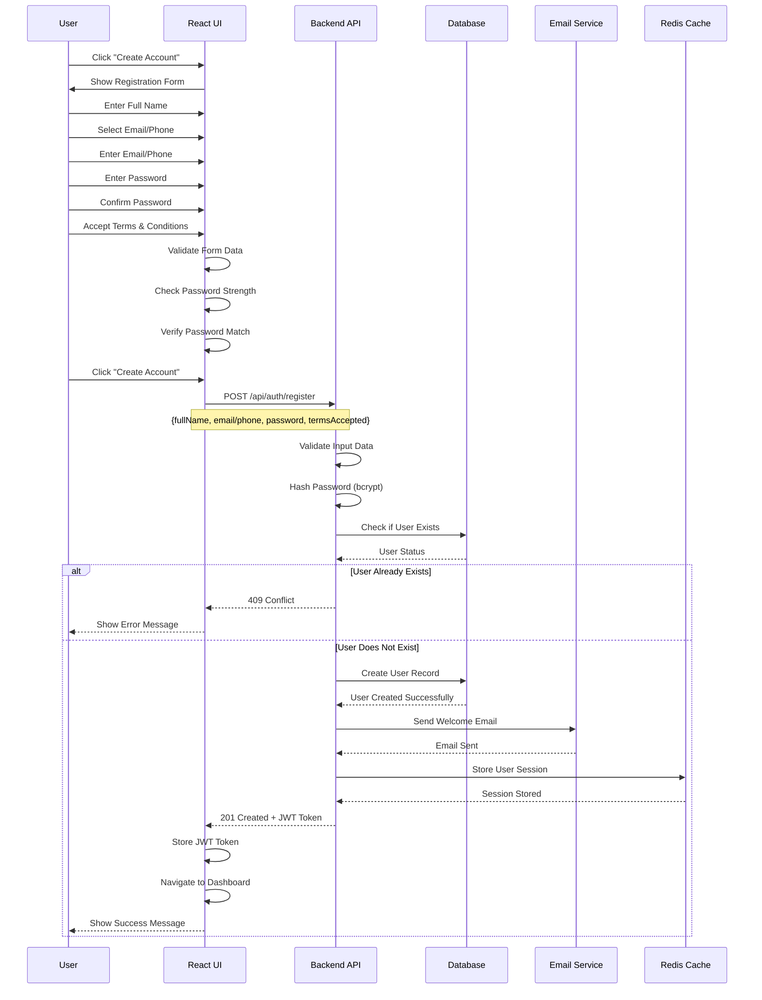

### Activity Diagram - User Registration

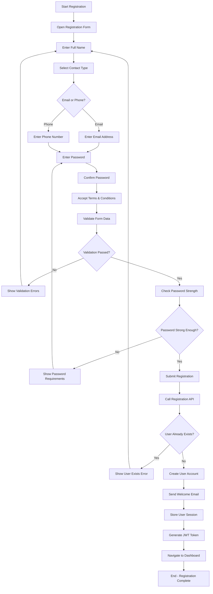

---

## User Login Flow

### Sequence Diagram - User Login

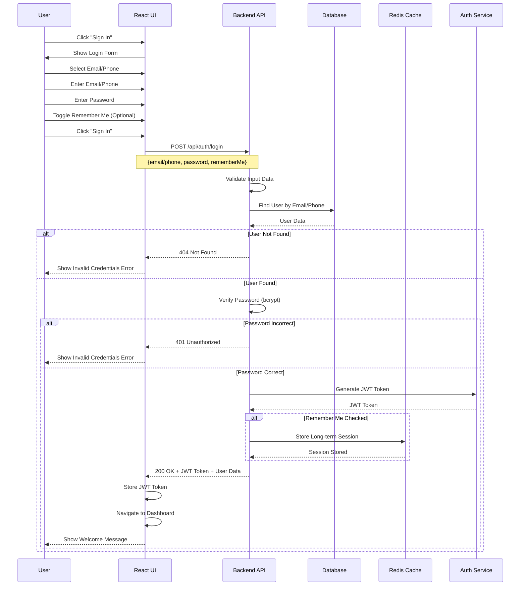

### Activity Diagram - User Login

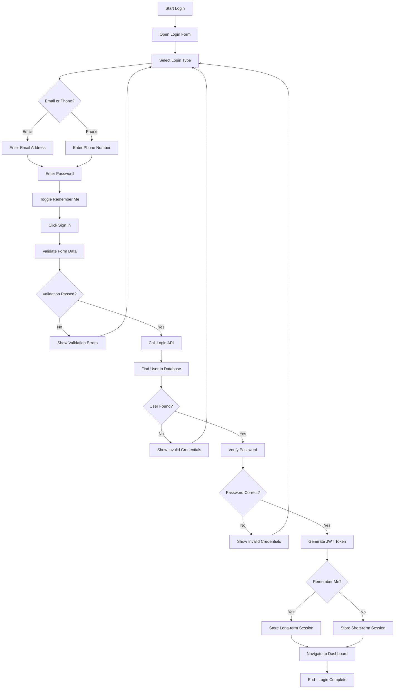

---

## Forgot Password Flow

### Sequence Diagram - Forgot Password

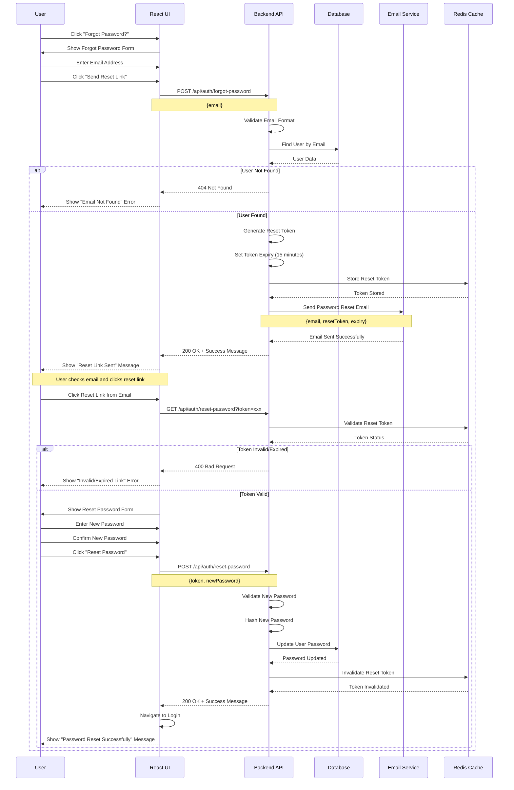

### Activity Diagram - Forgot Password

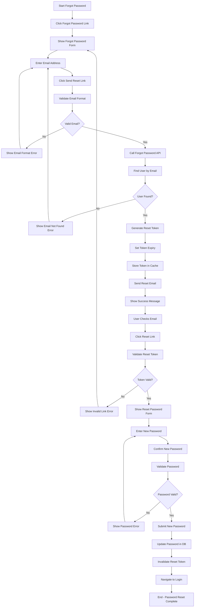

---

## State Diagrams

### Authentication State Diagram

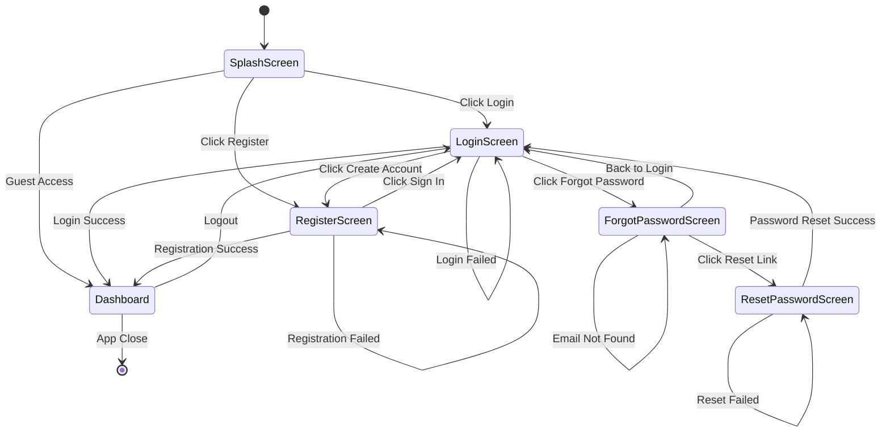

### User Session State Diagram

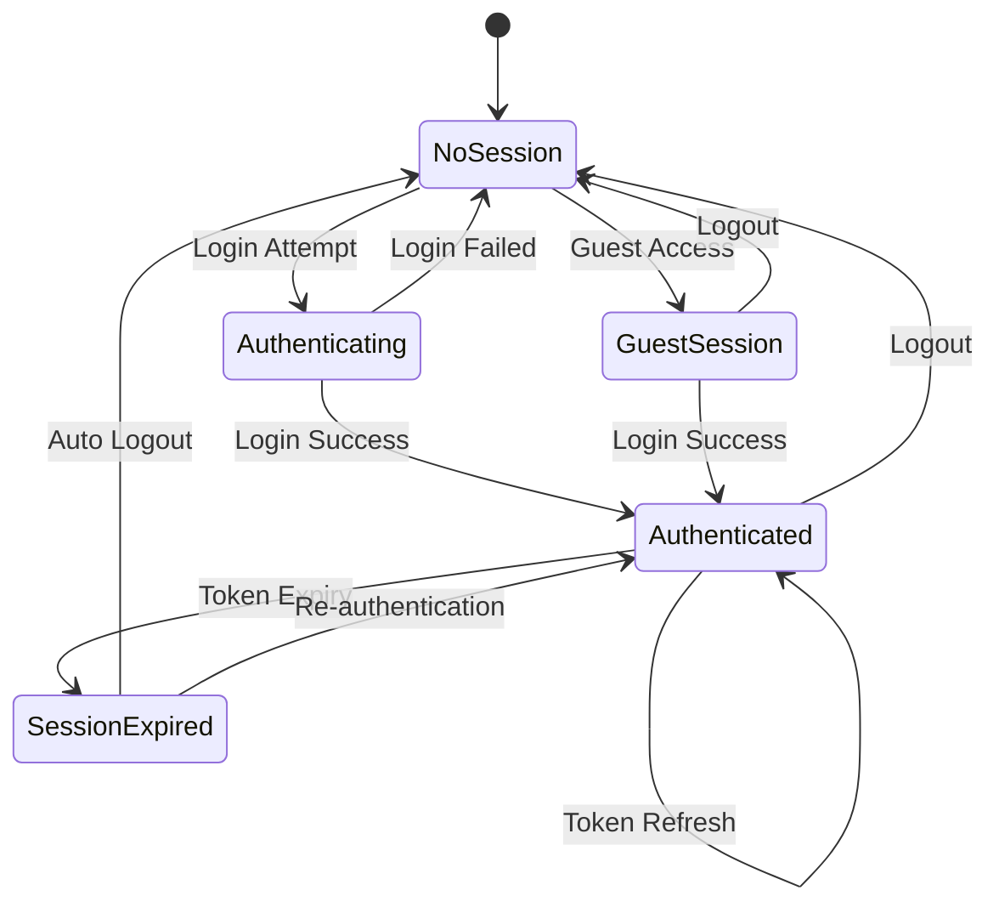

---

## Class Diagrams

### Authentication Classes

```mermaid
classDiagram
    class User {
        +String id
        +String fullName
        +String email
        +String phone
        +String passwordHash
        +DateTime createdAt
        +DateTime updatedAt
        +Boolean isActive
        +Boolean emailVerified
        +Boolean phoneVerified
        +validateEmail()
        +validatePhone()
        +hashPassword()
        +verifyPassword()
    }
    
    class AuthService {
        +registerUser(userData)
        +loginUser(credentials)
        +forgotPassword(email)
        +resetPassword(token, newPassword)
        +validateToken(token)
        +refreshToken(refreshToken)
        +logoutUser(userId)
    }
    
    class JWTService {
        +generateToken(payload)
        +verifyToken(token)
        +decodeToken(token)
        +refreshToken(token)
        +revokeToken(token)
    }
    
    class PasswordService {
        +hashPassword(password)
        +verifyPassword(password, hash)
        +generateResetToken()
        +validatePasswordStrength(password)
    }
    
    class EmailService {
        +sendWelcomeEmail(user)
        +sendResetEmail(email, token)
        +sendVerificationEmail(email, token)
    }
    
    class SessionService {
        +createSession(userId, rememberMe)
        +validateSession(sessionId)
        +refreshSession(sessionId)
        +destroySession(sessionId)
    }
    
    class LoginComponent {
        +String email
        +String password
        +Boolean rememberMe
        +Boolean isLoading
        +handleLogin()
        +handleForgotPassword()
        +validateForm()
    }
    
    class RegisterComponent {
        +String fullName
        +String email
        +String password
        +String confirmPassword
        +Boolean agreeToTerms
        +Boolean isLoading
        +handleRegister()
        +validateForm()
        +checkPasswordStrength()
    }
    
    class ForgotPasswordComponent {
        +String email
        +Boolean isLoading
        +handleSubmit()
        +validateEmail()
    }
    
    class ResetPasswordComponent {
        +String token
        +String newPassword
        +String confirmPassword
        +Boolean isLoading
        +handleReset()
        +validateForm()
    }
    
    User ||--o{ AuthService : uses
    AuthService ||--o{ JWTService : uses
    AuthService ||--o{ PasswordService : uses
    AuthService ||--o{ EmailService : uses
    AuthService ||--o{ SessionService : uses
    LoginComponent ||--o{ AuthService : calls
    RegisterComponent ||--o{ AuthService : calls
    ForgotPasswordComponent ||--o{ AuthService : calls
    ResetPasswordComponent ||--o{ AuthService : calls
```

---

## API Design

### Authentication Endpoints

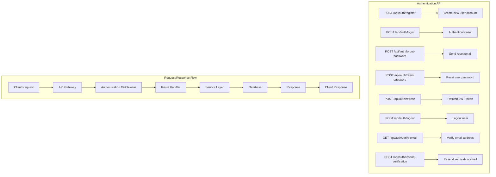

### Complete API Reference Table

| Method | Endpoint | Description | Request Body | Response | Status Codes | Authentication |
|--------|----------|-------------|--------------|----------|--------------|----------------|
| **POST** | `/api/auth/register` | Register new user | `RegisterRequest` | `AuthResponse` | 201, 400, 409 | None |
| **POST** | `/api/auth/login` | User login | `LoginRequest` | `AuthResponse` | 200, 401, 400 | None |
| **POST** | `/api/auth/forgot-password` | Send password reset email | `ForgotPasswordRequest` | `MessageResponse` | 200, 404, 400 | None |
| **POST** | `/api/auth/reset-password` | Reset user password | `ResetPasswordRequest` | `MessageResponse` | 200, 400, 401 | None |
| **POST** | `/api/auth/refresh` | Refresh JWT token | `RefreshTokenRequest` | `TokenResponse` | 200, 401 | None |
| **POST** | `/api/auth/logout` | User logout | `LogoutRequest` | `MessageResponse` | 200, 401 | Required |
| **GET** | `/api/auth/verify-email` | Verify email address | Query: `token` | `MessageResponse` | 200, 400 | None |
| **POST** | `/api/auth/resend-verification` | Resend verification email | `ResendVerificationRequest` | `MessageResponse` | 200, 400 | None |
| **GET** | `/api/auth/profile` | Get user profile | None | `UserProfileResponse` | 200, 401 | Required |
| **PUT** | `/api/auth/profile` | Update user profile | `UpdateProfileRequest` | `UserProfileResponse` | 200, 400, 401 | Required |
| **POST** | `/api/auth/change-password` | Change password | `ChangePasswordRequest` | `MessageResponse` | 200, 400, 401 | Required |
| **POST** | `/api/auth/verify-phone` | Verify phone number | `VerifyPhoneRequest` | `MessageResponse` | 200, 400, 401 | Required |
| **GET** | `/api/auth/sessions` | Get active sessions | None | `SessionsResponse` | 200, 401 | Required |
| **DELETE** | `/api/auth/sessions/{sessionId}` | Revoke session | None | `MessageResponse` | 200, 401, 404 | Required |

### Request/Response Models

#### RegisterRequest
```json
{
  "fullName": "string",
  "email": "string",
  "phone": "string",
  "password": "string",
  "contactType": "EMAIL | PHONE",
  "termsAccepted": boolean
}
```

#### LoginRequest
```json
{
  "email": "string",
  "phone": "string",
  "password": "string",
  "loginType": "EMAIL | PHONE",
  "rememberMe": boolean
}
```

#### ForgotPasswordRequest
```json
{
  "email": "string"
}
```

#### ResetPasswordRequest
```json
{
  "token": "string",
  "newPassword": "string"
}
```

#### AuthResponse
```json
{
  "success": boolean,
  "message": "string",
  "data": {
    "user": {
      "id": "string",
      "fullName": "string",
      "email": "string",
      "phone": "string",
      "isActive": boolean,
      "emailVerified": boolean,
      "phoneVerified": boolean,
      "createdAt": "datetime",
      "lastLoginAt": "datetime"
    },
    "token": "string",
    "refreshToken": "string",
    "expiresIn": number,
    "tokenType": "Bearer"
  }
}
```

#### MessageResponse
```json
{
  "success": boolean,
  "message": "string",
  "timestamp": "datetime"
}
```

#### ErrorResponse
```json
{
  "success": false,
  "error": {
    "code": "string",
    "message": "string",
    "details": [
      {
        "field": "string",
        "message": "string"
      }
    ]
  },
  "timestamp": "datetime",
  "requestId": "string"
}
```

### API Request/Response Examples

#### Registration Request
```json
POST /api/auth/register
{
  "fullName": "John Doe",
  "email": "john.doe@example.com",
  "password": "SecurePass123!",
  "contactType": "email",
  "termsAccepted": true
}
```

#### Registration Response
```json
{
  "success": true,
  "message": "Account created successfully",
  "data": {
    "user": {
      "id": "user_123",
      "fullName": "John Doe",
      "email": "john.doe@example.com",
      "isActive": true,
      "emailVerified": false
    },
    "token": "eyJhbGciOiJIUzI1NiIsInR5cCI6IkpXVCJ9...",
    "refreshToken": "refresh_token_123"
  }
}
```

#### Login Request
```json
POST /api/auth/login
{
  "email": "john.doe@example.com",
  "password": "SecurePass123!",
  "rememberMe": true
}
```

#### Login Response
```json
{
  "success": true,
  "message": "Login successful",
  "data": {
    "user": {
      "id": "user_123",
      "fullName": "John Doe",
      "email": "john.doe@example.com",
      "isActive": true,
      "emailVerified": true
    },
    "token": "eyJhbGciOiJIUzI1NiIsInR5cCI6IkpXVCJ9...",
    "refreshToken": "refresh_token_123",
    "expiresIn": 3600
  }
}
```

---

## Security Considerations

### Security Flow Diagram

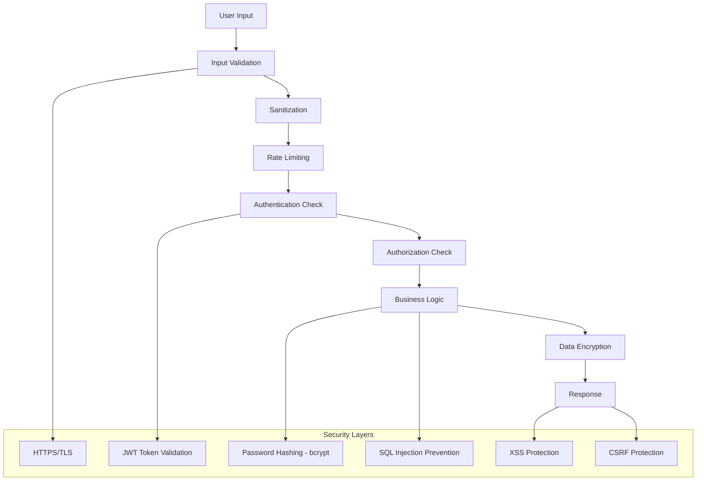

### Security Checklist

- [ ] **Input Validation**: All user inputs are validated and sanitized
- [ ] **Password Security**: Passwords are hashed using bcrypt with salt
- [ ] **JWT Security**: Tokens are signed with secure secret and have expiration
- [ ] **Rate Limiting**: API endpoints are protected against brute force attacks
- [ ] **HTTPS**: All communications are encrypted in transit
- [ ] **SQL Injection**: Parameterized queries prevent SQL injection
- [ ] **XSS Protection**: Output encoding prevents cross-site scripting
- [ ] **CSRF Protection**: CSRF tokens prevent cross-site request forgery
- [ ] **Session Management**: Secure session handling with proper expiration
- [ ] **Error Handling**: Generic error messages prevent information leakage

---

## Error Handling

### Error Flow Diagram

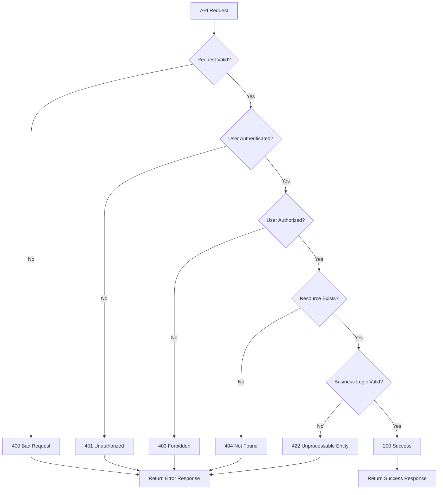

### Error Response Format

```json
{
  "success": false,
  "error": {
    "code": "VALIDATION_ERROR",
    "message": "Invalid input data",
    "details": [
      {
        "field": "email",
        "message": "Email format is invalid"
      },
      {
        "field": "password",
        "message": "Password must be at least 8 characters"
      }
    ]
  },
  "timestamp": "2024-01-15T10:30:00Z",
  "requestId": "req_123456"
}
```

---

## Implementation Notes

### Frontend Implementation (Flutter)
- **State Management**: Provider/Riverpod for state management
- **Form Validation**: FormBuilder with real-time validation
- **Error Handling**: SnackBar and Dialog for user-friendly error messages
- **Loading States**: CircularProgressIndicator during API calls
- **Responsive Design**: Adaptive design for different screen sizes
- **Navigation**: Navigator 2.0 with named routes
- **HTTP Client**: Dio for API communication
- **Local Storage**: SharedPreferences for token storage

### Backend Implementation (Spring Boot)
- **Spring Boot**: RESTful API with Spring Security
- **JWT Authentication**: Spring Security JWT for token-based authentication
- **Password Hashing**: BCryptPasswordEncoder for secure password storage
- **Database**: JPA/Hibernate with PostgreSQL
- **Caching**: Spring Cache with Redis
- **Validation**: Bean Validation (JSR-303)
- **Exception Handling**: Global exception handler

### Testing Strategy
- **Unit Tests**: Test individual components and functions
- **Integration Tests**: Test API endpoints and database interactions
- **E2E Tests**: Test complete user flows
- **Security Tests**: Test for vulnerabilities and security issues

---

## Conclusion

This authentication design document provides comprehensive diagrams and specifications for implementing a secure, user-friendly authentication system for the SafeGuard Parent App. The design ensures:

1. **Security**: Multiple layers of security protection
2. **Usability**: Intuitive user flows and clear error handling
3. **Scalability**: Architecture that can handle growth
4. **Maintainability**: Clean code structure and proper documentation
5. **Compliance**: Following security best practices and standards

The diagrams and specifications in this document serve as a complete guide for implementing the authentication system in your graduation doctoral project.
